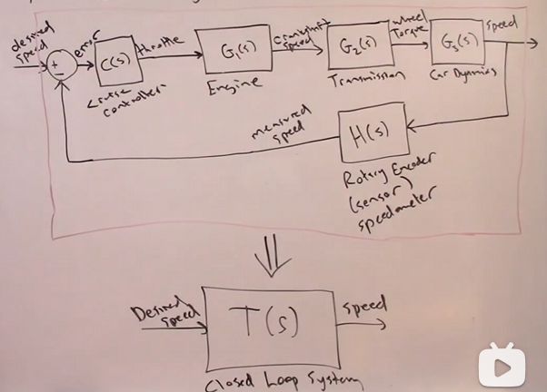

# 1. Transfer Function
- definition of LTI system:
TF of a LTI system is defined as the Laplace transform of the output over input assuming all initial conditions are zero.

Example:
a general LTI system:
$$
u(t)  = \text{input},
y(t) = \text{output}
$$
$$
a_n \frac{d^n y(t)}{dt^n}+a_{n-1} \frac{d^{n-1} y(t)}{dt^{n-1}}+...+a_1 \frac{dy(t)}{dt}+a_0 y(t) = b_m \frac{d^m u(t)}{dt^m}+b_{m-1} \frac{d^{m-1} u(t)}{dt^{m-1}}+...+b_1 \frac{du(t)}{dt}+b_0 u(t) \tag{1}
$$

$$
G(s) =  \frac{L[output]}{L[input]}\bigg|_{ICs=0} = \frac{Y(s)}{U(s)}\bigg|_{ICs=0}
$$
> why do we need to set ICs to zero?
> $\mathcal{L}[\frac{d^n}{dt^n}f(t)] = s^nF(s) - s^{n-1}f(0)...-f^{(n-1)}(0)$

for equation (1), we can take the Laplace transform of both sides:(assuming all initial conditions are zero)
$$
a_n s^n Y(s) + a_{n-1} s^{n-1} Y(s) + ... + a_1 s Y(s) + a_0 Y(s) = b_m s^m U(s) + b_{m-1} s^{m-1} U(s) + ... + b_1 s U(s) + b_0 U(s)
$$

$$
G(s) = \frac{Y(s)}{U(s)} = \frac{b_m s^m + b_{m-1} s^{m-1} + ... + b_1 s + b_0}{a_n s^n + a_{n-1} s^{n-1} + ... + a_1 s + a_0}
$$
- normally, $n\geq m$


## properties of transfer function
1. mathimatical model that relates the output anf input 
2. TF is the property of the system, not the input
3. TF involves only the system input\output, not the system internals
4. If TF is known, then output to a sign can be predicted 
5. If TF is unknown, we can experimentally determine it by applying a known input and measuring the output


Example:a mass-spring-damper system
$$
m, k , c , u(t), y(t) \text{ are the mass, spring constant, damping constant, input, and output, respectively}
$$
differentiate the equation of motion:
$$
m \ddot{y} + c \dot{y} + k y = u(t)
$$
take the Laplace transform of both sides:
$$
\mathcal{L}[m \ddot{y} + c \dot{y} + k y] = \mathcal{L}[u(t)]
$$
$$
m \mathcal{L}[\ddot{y}] + c \mathcal{L}[\dot{y}] + k \mathcal{L}[y] = U(s)
$$
- initial conditions are zero, so:
$$
m s^2 Y(s) + c s Y(s) + k Y(s) = U(s)
$$
- the transfer function is:
$$
G(s) = \frac{Y(s)}{U(s)} = \frac{1}{ms^2 + cs + k}
$$
> assume: $m=1, c=3, k=5$

$$
u(t)\rightarrow  |G(s)|\rightarrow y(t)
$$

# 2. Block Diagrams

Example: drive control system


- this part is about the transfer of block diagram, and I believe I have already known it. So I will skip this part.


## 2.1 Using matlab to show the pole zero cancellation
$$
G(s) = 
\frac{(s+z_1)(s+z_2)... }{(s+p_1)(s+p_2)...}
$$

Example:
$$
G_1(s) = \frac{s^2+3s+2}{s^3+2s^2-11s-12} = \frac{s^2+3s+2}{(s+4)(s+3)(s-1)} = \frac{s+2}{(s+4)(s+3)}
$$

```matlab
% 定义传递函数
num = [1 3 2];          % s^2 + 3s + 2
den = [1 2 -11 -12];    % s^3 + 2s^2 - 11s - 12

% 创建传递函数对象
G1 = tf(num, den);

% 显示传递函数
disp('原始传递函数:');
G1

% 零极点消除后的简化传递函数
num_simplified = [1 2];          % s + 2
den_simplified = [1 7 12];       % (s+4)(s+3)

% 创建简化传递函数对象
G1_simplified = tf(num_simplified, den_simplified);

% 显示简化后的传递函数
disp('零极点消除后的传递函数:');
G1_simplified

% 绘制极点零点图
figure(1);
pzmap(G1);
title('原始传递函数的零极点图');
grid on;

figure(2);
pzmap(G1_simplified);
title('简化后传递函数的零极点图');
grid on;

% 对比阶跃响应
figure(3);
step(G1, 'b', G1_simplified, 'r--', 10);
legend('原始传递函数', '简化后传递函数');
title('阶跃响应对比');


```
# 3. Final Value Theorem

Theorem: 
if f(t) and $\frac{d}{dt}f(t)$ are both Laplace transformable and if $\lim_{t\to\infty} f(t)$ exists, then
$$
\lim_{s\to 0} sF(s) = \lim_{t\to\infty} f(t)
$$

Proof :
$$
\mathcal{L}[f'(t)] =s F(s) - f(0)
$$
Recall defination of Laplace transform:
$$
\int_0^{\infty} e^{-st} f'(t) dt = s F(s) - f(0)
$$
take the limit as $s\to 0$:
$$
\lim_{s\to 0} \int_0^{\infty} e^{-st} f'(t) dt = \lim_{s\to 0} s F(s) - f(0)
$$
$$
\int_0^{\infty} f'(t) dt = \lim_{s\to 0} s F(s) - f(0)
$$
$$
f(\infty) - f(0) = \lim_{s\to 0} s F(s) - f(0)
$$
so
$$
\lim_{s\to 0} s F(s) = \lim_{t\to\infty} f(t)
$$

Note : Only applys if the limit exists.(steady state)
This results that $sF(s)$ has all pole strictly in the left half plane.(not on the imaginary axis)

## 3.1 Example1:
mass-spring-damper system:
k, m,t,u,x
ODE\EOM
$$
\ddot{x(t)} + \frac{t}{m}\dot{x(t)}  + \frac{k}{m} x(t) = \frac{1}{m}u(t)
$$
- case1: apply step input
- case2: apply ramp input
1. case1 :
$u(t) = 1(t) = 1$
EOM:
$$
\ddot{x(t)} + \frac{t}{m}\dot{x(t)}  + \frac{k}{m} x(t) = \frac{1}{m}
$$
LAplac transform:
$$
[s^2 X(s)-sX(0) -\dot{x}(0) ]+ \frac{t}{m}[sX(s)-x(0)] + \frac{k}{m}X(s) = \frac{1}{m}\frac{1}{s}
$$
SO
$$
X(s) = \frac{m \frac{1}{s} + sX(0) + \dot{x}(0) + \frac{t}{m}x(0)}{s^2 + \frac{t}{m}s + \frac{k}{m}}
$$
> it will stop
   - check sX(s) has poles in LHP

soLVE:
$$
\begin{cases}
s_1 = -\frac{-(b+\sqrt{b^2-km})}{2m}\\
s_2 = -\frac{-(b-\sqrt{b^2-km})}{2m}
\end{cases}
$$

Apply FVT
$$
\lim_{s\to 0} sX(s) = \lim_{t\to\infty} x(t)
$$
$$
X_{ss} = \frac{1}{k}
$$
> not related to the initial conditions, spring constant, or mass

2. case2:
$u(t) = t$
$$ 
\ddot{x(t)} + \frac{t}{m}\dot{x(t)}  + \frac{k}{m} x(t) = \frac{t}{m}
$$
Laplace transform:
$$
X(s) = \frac{1}{ms^2(s^2 + \frac{t}{m}s + \frac{k}{m})}
$$
$$
sX(s) = \frac{1}{ms(s^2 + \frac{t}{m}s + \frac{k}{m})}
$$
pole:
$$
\begin{cases}
s_1 = 0\\
s_2 = -\frac{-(b+\sqrt{b^2-km})}{2m}\\
s_3 = -\frac{-(b-\sqrt{b^2-km})}{2m}
\end{cases}
$$
- $s_1$ is a pole at the origin, so it is **not** in the LHP
- so cannot apply FVT


# 4. Time Domain Analysis
- input: $u(t)$
- output: $y(t)$

fOR
$$
p = x +yi
$$
more negative x means faster decay, 
more positive x means faster growing
more |y| means more oscillation

## Example1:
$$
a\dot{y} + by(t)= cr(t)
$$
TF of the system:
$$
G(s) = \frac{Y(s)}{R(s)} = \frac{c}{as+b} \star
$$
> it neslects the initial conditions

NOte: DC gain:
$$
G(0) = \frac{c}{b}
$$

Steady State Error:
$$
e_{ss} = \lim_{t\to\infty} e(t) = (1-G(0)A) = (1-\frac{c}{b}A)
$$
### Settling Time(TS) 
Ts = time required for the response to reach and stay within a certain percentage of the final value

> a picture here 

$$
y(Ts) = y(0) + (1-\delta)\Delta y\\
= y(0) + (1-\delta)(y_{ss}-y(0))\\
= \delta y_{ss} + (1-\delta)y(0)
$$
> assume $y(0) = 0$

$$ 
y(t) = \frac{Ac}{b} (1-e^{-\frac{b}{a}t})
$$

> note: $ y_ss = lim_{t\to\infty} y(t) = \frac{Ac}{b}$

$$
e^{-\frac{b}{a}Ts} = \delta
$$

$$
Ts =- \frac{a}{b}ln{\delta}, delta \in (0,1)
$$

### Rise Time(TR)
$$
Tr = -\frac{a}{b}ln(1-\delta_R), \delta_R \in (0,1)
$$

## Example2:
- ramp input
- $r(t) = At$

$$
Y(S) = G(s)\frac{A}{s^2}
$$
$$
y(t) = \frac{Ac}{b}t - \frac{A_{ac}}{b^2} + \frac{Ac}{b}e^{-\frac{b}{a}t}\\
y_ss(t) = \frac{Ac}{b}t - \frac{A_{ac}}{b^2}
$$
$$
e_ss = (A-A\frac{c}{b})t - \frac{aAc}{b^2}
$$

SO
$$
DC_{gain} = \frac{c}{b} = G(0)
$$

## Example3:
- Themal system
> skip it


# 5. Performance of 2nd Order Systems
AKA: 
- time domain analysis of 2nd order system
- Performance matrics

------

$$
\ddot{y} + 2\zeta\omega_n\dot{y} + \omega_n^2 y = \omega_n^2 u
$$
no initial conditions 
$$
G(s) = \frac{Y(s)}{R(s)} = \frac{\omega_n^2}{s^2 + 2\zeta\omega_n s + \omega_n^2}
$$
> $\zeta>0$ is the damping ratio, $\omega_n >0 $ is the natural frequency

Particular input is a step of magnitude $A$:
$$
R(s) = \frac{A}{s}
$$
$$
Y(s) = G(s)R(s)= \frac{\omega_n^2 }{s^2 + 2\zeta\omega_n s + \omega_n^2 }\frac{A}{S}
$$
Laplace transform:
$$
y(t) = \mathcal{L}^{-1}[Y(s)] = \mathcal{L}^{-1}[\frac{\omega_n^2 A}{s(s^2 + 2\zeta\omega_n s + \omega_n^2)}]
$$

>> some mathmatical steps here

$$
y(t) = A + e^{-\sigma t }(ae^{\omega t} + be^{-\omega t})\\
a = (\frac{A\zeta}{\sqrt{1-\zeta^2}}-\frac{1}{2}A  )\\
b = (\frac{A\zeta}{\sqrt{1-\zeta^2}}+\frac{1}{2}A  )\\
$$
SO 
$$
y(t) = A + e^{-\sigma t }(ae^{\sqrt{\zeta^2 -1 }  \omega_nt} + be^{\sqrt{\zeta^2 -1} \omega_nt})
$$
> note: $\sqrt{\zeta^2 -1} = \sqrt{-1(1-\zeta^2)} = i\sqrt{1-\zeta^2}$

$$
y(t) = A + e^{-\sigma t }(ae^{i\sqrt{1-\zeta^2} \omega_nt} + be^{-i\sqrt{1-\zeta^2} \omega_nt})
$$
> $e^{i\theta} = cos(\theta) + i sin(\theta)$

$$
y(t) = A - A e^{-\zeta \omega_n t }(cos(\sqrt{1-\zeta^2} \omega_nt) + \frac{\zeta}{\sqrt{1-\zeta^2}} sin(\sqrt{1-\zeta^2} \omega_nt))
$$
> $\sqrt{1-\zeta^2}\omega_n $ is $\omega_{\alpha} $
 
$$
\Rightarrow y(t) = A - A e^{-\sigma t }[cos(\omega_{\alpha}t)+\frac{\zeta}{\sqrt{1-\zeta^2}}sin(\omega_{\alpha}t)] 
$$
where $\sigma = \zeta \omega_n$

- First Peak Time:
$$
T_p = \frac{\pi}{\sqrt{1-\zeta^2}\omega_n}
$$
- Maximum Peak Time:
$$
M_{pt} = A(1+e^{\frac{- \pi \zeta}{\sqrt{1-\zeta^2}}})
$$
- Percent Overshoot:
$$
PO = (\frac{M_{pt}-y_{ss}}{y_{ss}})\times 100\% = e^{\frac{- \pi \zeta}{\sqrt{1-\zeta^2}}} \times 100\%
$$
> note: y_ss = A

SO :
$$
PO = e^{\frac{- \pi \zeta}{\sqrt{1-\zeta^2}}} \times 100\%
$$


> 包线;

## 6. Matlab Tools to Analyze 2nd Order System
Example:
Mass-spring-damper system:
$ k. m, c, u(t), y(t) $
$$
m\ddot{x(t)} = k(u(t) - x(t)) + c(\dot{x}(t))\\
\ddot{x(t)} + \frac{c}{m}\dot{x}(t) + \frac{k}{m}x(t) = \frac{k}{m}u(t)\\
$$
Laplace transform:
$$
s^2X(s) + \frac{c}{m}sX(s) + \frac{k}{m}X(s) = \frac{k}{m}U(s)
$$
Transfer function:
$$
G(s) = \frac{X(s)}{U(s)} = \frac{\frac{k}{m}}{s^2 + \frac{c}{m}s + \frac{k}{m}}
$$
Write in standard form:
$$
G(s) = \frac{\omega_n^2}{s^2 + 2\zeta\omega_n s + \omega_n^2}
$$
where $\omega_n = \sqrt{\frac{k}{m}}$ and $\zeta = \sqrt{\frac{k}{m}}$

$$ 
m=2, k = 50, b = 4\rightarrow \omega_n = \sqrt{\frac{50}{2}} = 5, \zeta = \frac{1}{5}
$$
Choose a step of mag A = 1.5,

$$
\text{DC Gain = }G(0) = \frac{\omega_n^2}{\omega_n^2} = 1\\
e_{ss} = (1-G(0)A) = (1-1A) = 0\\
T_p = \frac{\pi}{\sqrt{1-\zeta^2}\omega_n} = 0.64sec
M_{pt} = A(1+e^{\frac{- \pi \zeta}{\sqrt{1-\zeta^2}}}) = 0.64A\\
PO = e^{\frac{- \pi \zeta}{\sqrt{1-\zeta^2}}} \times 100\% = 52.66\%\\
\tilde{T_s} = \frac{ln(\delta)}{\zeta \omega_n} = 3.91sec\\
$$
```matlab
