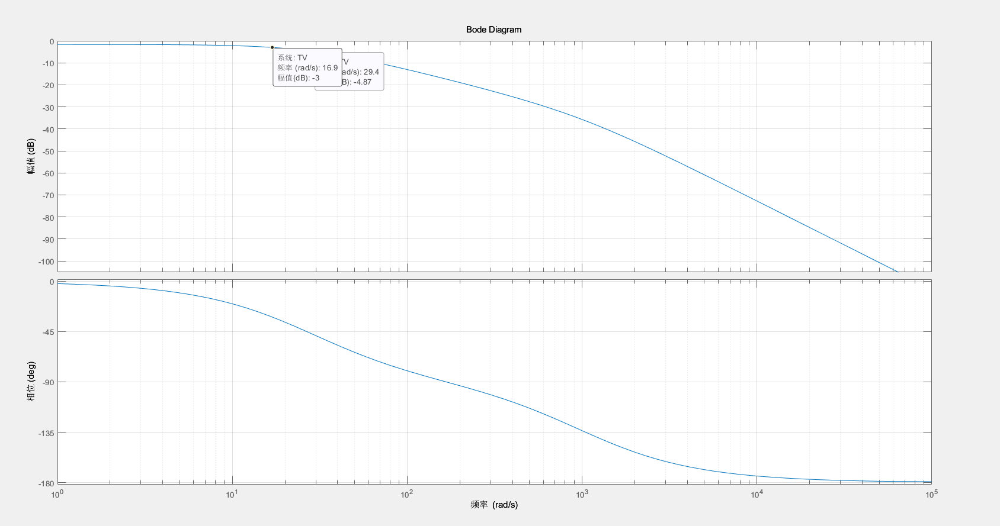
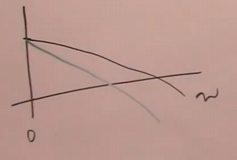
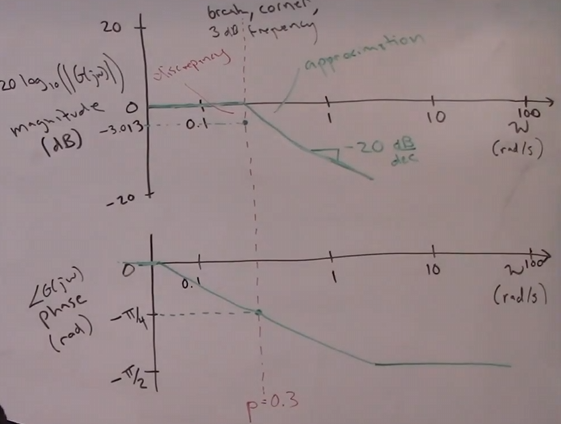
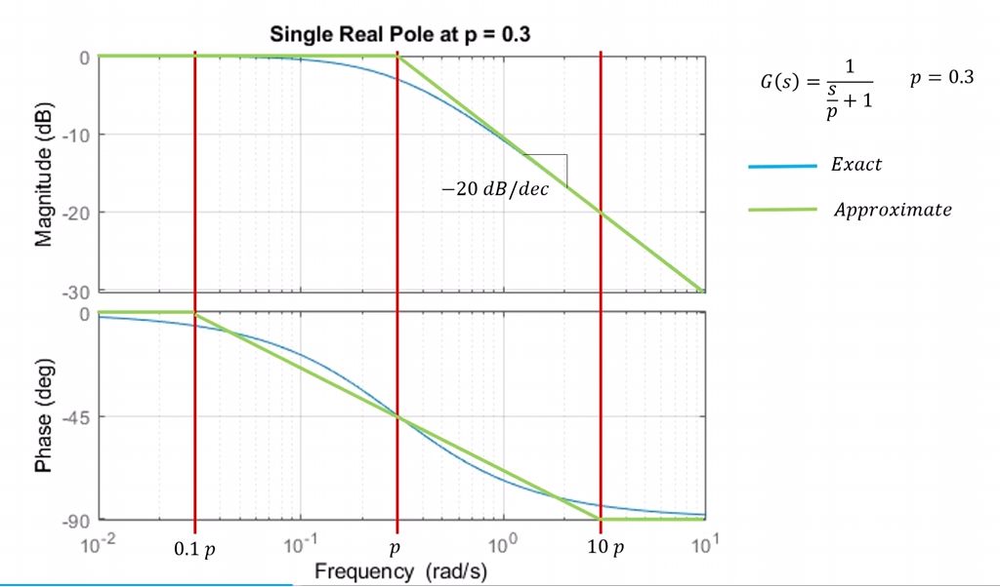
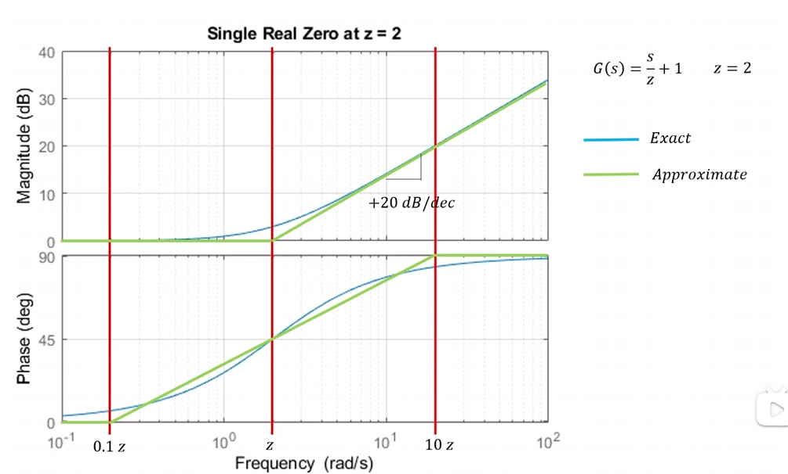
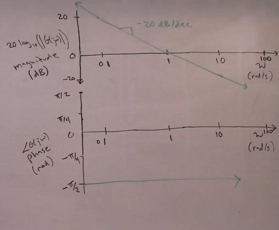
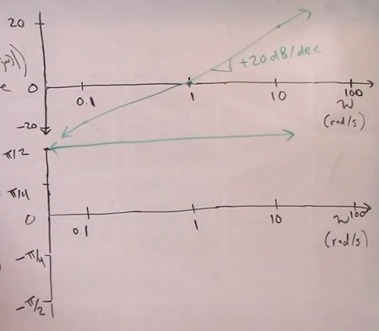
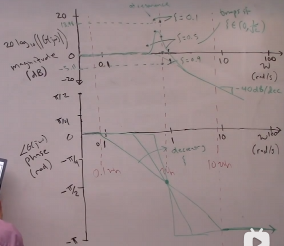

# 8. DC-Gain
- constant input to the system
- steady-state output

DC-Gain = 
$$
\frac{\lim_{t\rightarrow \infin} y(t)   }{A} = \frac{y_{ss}}{A}
$$

Compute DC-Gain using the transfer function:
$$
y_{ss} = \lim_{t\rightarrow \infin} y(t) = \lim_{s\rightarrow 0} sY(s) = 
$$

> note: $Y(s) = G(s)R(s)$
> note: $R(s) = $ step input of magnitude A


$$
= \lim_{s\rightarrow 0} sG(s)R(s) = \lim_{s\rightarrow 0} sG(s)\frac{A}{s}
$$
so 
$$
y_{ss} = G(0)A
$$

DC-Gain = $\frac{y_{ss}}{A} = G(0)$

### Steady-state error

$$
e_{ss} \\
= 1 -y_{ss} \\
= (1 - G(0))A
$$
> to minimize steady-state error, we need to make sure DC-Gain = 1

example:
- mass-spring-damper system with a step input of magnitude A

$G(s) = \frac{1}{ms^2 + bs + k} = \frac{1}{s^2 + \frac{b}{m}s + \frac{k}{m}}$

- $m = 1$, $b = \frac{1}{10}$, $k = 5$


# 9. Bandwidth

$$
\text{BW} = \frac{\omega_{3dB}}{2\pi}
$$
= frequency of input before system response drops 3DB from the DC-Gain


EXAMPLE:
> his dog

Example2:
- Linear system , velocity of a DC_motor 

$$
G_v(s) = \frac{\Theta(s)}{V_a(s)}\\ 
= \text{a fucking long equation} \\
= \frac{46163}{s^2 + 1021s + 4845} \\
$$


- Choose $C_v(s)$ = K
$$
T_v(s) = \frac{\dot{\Theta}(s)}{w_d(s)} = \frac{46163K}{s^2 + 1021s + (46163+4845)} \\
$$

  - Choose $K = 0.5$

$$
T_v(s) = \frac{46163}{2s^2 +2042s + 55853} \\
$$
```matlab
clc;
clear all ;

GV_num = [46163];
GV_den = [1 1021 4845];

GV = tf(GV_num, GV_den);

K = 0.5;

CV_num = [K];
CV_den = [1];

CV = tf(CV_num, CV_den)

% compute the closed loop transfunction TV(s)

TV = minreal((CV*GV)/(1+CV*GV))

% plot
figure
bode(TV)
grid on;

```



# 10. Bode Plots
$u(t) = A\sin(\omega t) \rightarrow$
$$
|\text{Dynamic System(LTI,G(s))} |
$$
$\rightarrow$ $y(t) = A|G(j\omega)| \sin(\omega t + \phi)$
- $|G(j\omega)|= (R_e [G(j\omega)]^2 + [I_m[G(j\omega)]^2)^{1/2}$
- $\theta = \angle G(j\omega)= atan2(I_m[G(j\omega)], R_e[G(j\omega)]) = atan2(y,x)$

### difinition of Bode plot
BODE PLOT is a plot of  $G(j\omega)$ and $\theta$.
- Bode plot visializes how amplification and attenuation of the system changes with frequency $\omega$.
- x axis(frequency,$\omega$) is drown in semi-log scale($\log_{10}(\omega)$)
- y axis for amplificaton/attenuation is in dB scale($20\log_{10}(|G(j\omega)|)$)
    - dB>0: amplification
    - dB<0: attenuation
> in matlab,log is based on e, so we need to convert to log10 by dividing by log(10)  


Example:
- mass-spring-damper system with a step input of magnitude A

$$
G(s) = \frac{1}{ms^2 + bs + k} = \frac{1}{s^2 + \frac{b}{m}s + \frac{k}{m}}
$$
$$
G(s) = \frac{3}{s^2 + \frac{1}{2}s + 4} \\
$$
$$
G(j\omega) = \alpha + \beta i\\ 
\alpha = R_l[G(j\omega)] = \frac{12-3\omega^2}{16-\frac{31\omega^2}{4}+\omega^4} \\
\beta = I_m[G(j\omega)] = \frac{-\frac{3\omega}{2}}{16-\frac{31\omega^2}{4}+\omega^4} \\
$$
So 
- $20\log_{10}(|G(j\omega)|) = 20\log_{10}(\sqrt{\alpha^2 + \beta^2})$
- $\theta = atan2(\beta, \alpha)$

TO generate Bode plot, we need to compute $G(j\omega)$ for a range of $\omega$ values.
1. list frequency values in a vector $\omega$ (in rad/s)
2. compute the amplification/attenuation and phase shift for each frequency value$\omega$
3. convert the amplification/attenuation to dB scale using $20\log_{10}(|G(j\omega)|)$
4. plot on a $log_10$ X-axis 


```matlab
clear all;
clc;
close all;

w = logspace(-1,2,300);

alpha = (12-3*w.^2)./(16-(31/4)*w.^2 +w.^4); %real
beta = ((-3/2).*w)./(16-(31/4)*w.^2 +w.^4); %im

magGjw = (alpha.^2+beta.^2).^(1/2);
angleGjw = atan2(beta,alpha);

magGjw_dB = 20*log10(magGjw);
angleGjw_deg = rad2deg(angleGjw);

figure
subplot(2,1,1);
semilogx(w,magGjw_dB);
grid on;
ylabel('Magnitude(dB)')

subplot(2,1,2);
semilogx(w,angleGjw_deg)
grid on;
ylabel('Phase (deg)')
xlabel('\omega (rad/s)')
%% use bode

num = [3];
den = [1 (1/2) 4]

G = tf(num,den);

figure;
bode(G)
```

# 11. Resonant of dynamic system
COnsider a 2nd order system with a transfer function of the for
$$
G(s) = \frac{\omega_n^2}{s^2 + 2\zeta\omega_n s + \omega_n^2}
$$
subject sys to $ u(t) = A sin(\omega t)$ input
$$
G(j\omega) = \frac{\omega_n^2}{(j\omega)^2 + 2\zeta\omega_n (j\omega) + \omega_n^2} \\
= \alpha + \beta i\\
\alpha = \frac{\omega_n^4 - \omega^2\omega_n^2}{\omega^4 - 2\omega_n^2\omega^2 + 4\zeta^2\omega_n^2 + \omega_n^4} \\
\beta = \frac{2\zeta\omega_n^2\omega}{\omega^4 - 2\omega_n^2\omega^2 + 4\zeta^2\omega_n^2 + \omega_n^4} \\
$$
$$
|G(j\omega)| = \sqrt{\alpha^2 + \beta^2} \\
=  f(\omega,\omega_n,\zeta) 
$$
> cauclate in mathmatica

**Resonant frequency** $\omega_r$ is the frequency at which the system has the largest response to a sinusoidal input.
$$
\omega_r = \omega_n{\sqrt{1-2\zeta^2}} \\
$$
In order to for $\omega_r$ to real, 
we need to have $0<\zeta<\frac{1}{\sqrt{2}}$
> critical damping $\zeta = \frac{1}{\sqrt{2}}$


Ex ample:
- mass-spring-damper system with a step input of magnitude A
- m = 1/3, k = 4//3, c = 1/6
$$
G(s) = \frac{3}{s^2 + \frac{1}{2}s + 4} \\
$$
rescale the output
$$
\tilde{G(s)} = \frac{4}{s^2 + \frac{1}{2}s + 4} \\
= \frac{\omega_n^2}{s^2 + 2\zeta\omega_n s + \omega_n^2} \\
\omega_n = 2 , \zeta = \frac{1}{8} \\
$$
so $\omega_r = 2\frac{\sqrt{\frac{31}{2}}}{2} = 1.9685$rad/s
$\omega_n = 2$rad/s
$\omega_d = \omega_n\sqrt{1-\zeta^2} = 1.9843$rad/s
so 
$$
\omega \neq \omega_d \neq \omega_r \\
$$
> $\omega_r$ is valid defination for any system
> $\omega_d$ is only valid for underdamped 2nd order system
> $\omega_n$ is only valid for 2nd order system


- if $\zeta = \frac{1}{\sqrt{2}}$, 
then $\omega_r = \omega_n$ 
- if $\zeta>\frac{1}{\sqrt{2}}$, then $\omega_r$ is complex number, so no resonant frequency exists.
- 


# 12. Bode plot

$$
u(t) = A\sin(\omega t) \Rightarrow \\
|G(s)|\Rightarrow \\
y(t) = A|G(j\omega)|\sin(\omega t + \theta) \\
$$
where $|G(j\omega)| = \sqrt{R_e[G(j\omega)]^2 + I_m[G(j\omega)]^2}$
$\theta = \angle G(j\omega) = atan2(I_m[G(j\omega)], R_e[G(j\omega)])$

Brute force for Bode plot:
1. compute $G(j\omega)$
2. get real part and imaginary part of $\alpha$ and $\beta$
3. compute $|G(j\omega)| = \sqrt{\alpha^2 + \beta^2}$
4. $\angle G(j\omega) = atan2(\beta, \alpha)$
5. plot with appropriate axis scaling


Q:estimate the bode plot without using brute force method

- Analyse 7 different components
1. single real pole 
2. single real zero
3. pole at origin
4. zero at origin
5. a pair of complex conjugate poles
6. a pair of **complex conjugate** zeros
7. constant gain

## 12.1. single real pole
$$
G(s) = \frac{1}{1+\frac{s}{p}} \\
$$
- note:
  - DC gain = 1
  - pole at $s = -p$

Frequency response:
$$
G(j\omega) = \frac{1}{1+\frac{j\omega}{p}} \\
G(j\omega) = \alpha + \beta i \\
$$
SO 
$$
\alpha = \frac{1}{1+(\frac{\omega}{p})^2} = Re[G(j\omega)] \\
\beta = \frac{-\frac{\omega}{p}}{1+(\frac{\omega}{p})^2} = Im[G(j\omega)] \\
$$
$$
|G(j\omega)| = \sqrt{\alpha^2 + \beta^2} \\
\dots \\
= \frac{1}{\sqrt{1+(\frac{\omega}{p})^2}} \\
$$
> recall: bode plot is in dB scale, so we need to convert to dB scale using $20\log_{10}(|G(j\omega)|)$

$$
20\log_{10}(|G(j\omega)|) =\\
\dots \\
= -10\log_{10}(1+(\frac{\omega}{p})^2) \tag{1.3}
$$

Prase of $G(j\omega)$:
$$
\angle G(j\omega)\\ = tan^{-1}(\frac{\beta}{\alpha}) \\
= tan^{-1}(-\frac{\omega}{p}) \\\tag{1.4}
$$

---
use (1.3) and (1.4) to plot the bode plot of a single real pole:
#### eXAMPLE:
1. small frequency $\omega << p$
2. At break frequency $\omega = p$
3. large frequency $\omega >> p$

- estimate :
  1. Small frequency $\omega << p$
$$
20\log_{10}(|G(j\omega)|) = -10\log_{10}(1+(\frac{\omega}{p})^2) \\
\approx -10\log_{10}(1) \\
= 0 \\
$$
$$
G(j\omega)  = tan^{-1}(-\frac{\omega}{p}) \\
\approx tan^{-1}(0) \\
= 0 \\
$$
  2. At break frequency $\omega = p$
$$
20\log_{10}(|G(j\omega)|) = -10\log_{10}(1+(\frac{\omega}{p})^2) \\ = -10\log_{10}(2) \\
= -3.01(dB) \\
$$
    > so it is called -3dB frequency,break frequency, or corner frequency

$$
G(j\omega)  = tan^{-1}(-\frac{\omega}{p}) \\
= tan^{-1}(-1) \\
= -\frac{\pi}{4} \\
$$

  3. large frequency $\omega >> p$
$$
20\log_{10}(|G(j\omega)|) = -10\log_{10}(1+(\frac{\omega}{p})^2) \\
\approx -10\log_{10}((\frac{\omega}{p})^2) \\
= -20\log_{10}(\frac{\omega}{p}) \\
= -20\log_{10}(\omega) + 20\log_{10}(p) \\
\approx mx+b
$$
$$
\angle G(j\omega)\\ = tan^{-1}(\frac{\beta}{\alpha}) \\
\approx tan^{-1}(\infty) = -\frac{\pi}{2} \\
$$


so: 
- Magnitude Plot(db): remain at 0 dB until break frequency($\omega = p$) and then linerly decrease with slope -20dB/decade
- Phase Plot(degree): remain at 0 degree until 1 decade before break frequency and then linerly decrease to -90% at 1 decade after break frequency
Note this goes through the 45 degree or $\frac{\pi}{4}$ line at $\omega = p$



## 12.2. single real zero
$$
G(s) = \frac{s}{z}+1
$$
Note : 
- DC gain = 1
- zero at $s = - z$

Frequency response:
$$
G(j\omega) = \frac{j\omega}{z}+1 \\
G(j\omega) = \alpha + \beta i \\
$$
where $\alpha = 1$ and $\beta = \frac{\omega}{z}$
$$
|G(j\omega)| = \sqrt{\alpha^2 + \beta^2} 
= \sqrt{1+\frac{\omega^2}{z^2}} 
$$
$$
\angle G(j\omega)\\ = tan^{-1}(\frac{\beta}{\alpha}) 
= tan^{-1}(\frac{\omega}{z}) 
$$
> compare with (1.3) and (1.4)

$$
20 \log_{10}(|G(j\omega)|) = - 10\log_{10}(1+\frac{\omega^2}{z^2}) \\
= 10\log_{10}(1+\frac{\omega^2}{z^2}) \tag{2.3and2.4}  \\ 
\angle G(j\omega) = tan^{-1}(\frac{\beta}{\alpha}) \\
= tan^{-1}(\frac{\omega}{z}) 
$$

> familiar with (1.3) and (1.4)


---
1. small frequency $\omega << z$
$$
20\log_{10}(|G(j\omega)|) = 10\log_{10}(1+\frac{\omega^2}{z^2}) \\
\approx 10\log_{10}(1) = 0
$$
$$
\angle G(j\omega) \approx 0
$$
2. At break frequency $\omega = z$
$$
20\log_{10}(|G(j\omega)|) = 10\log_{10}(1+\frac{\omega^2}{z^2}) \\
= 10\log_{10}(2) = 3.01(dB)
$$
$$
\angle G(j\omega) = tan^{-1}(\frac{\omega}{z}) \\
= tan^{-1}(1) = \frac{\pi}{4} \\
$$
3. large frequency $\omega >> z$
$$
20\log_{10}(|G(j\omega)|) = \\20\log_{10}(\omega) -20\log_{10}(z) \\
$$
$$
\angle G(j\omega) = tan^{-1}(\frac{\beta}{\alpha}) \\
= tan^{-1}{\infty} = \frac{\pi}{2} \\
$$
> as reflaction of single real pole



## 12.3 pole at origin
$$
G(s) = \frac{1}{s} \\
$$
fRequency response:
$$
G(j\omega) = \frac{1}{j\omega} \\
G(j\omega) = \alpha + \beta i \\
$$

$$
\alpha = 0 \\
\beta = - \frac{1}{\omega} \\
G(j\omega) = \sqrt{\alpha^2 + \beta^2} 
= \frac{1}{\omega} \\
$$

$$
20\log_{10}(|G(j\omega)|) = -20\log_{10}(\omega) \tag{3.1}
$$
$$
\angle G(j\omega) = tan^{-1}(\frac{\beta}{\alpha}) \\
= tan^{-1}(-\infty) = -\frac{\pi}{2} \tag{3.2}
$$
estimate:
$\omega = 1$
$-20\log_{10}(1) = 0$

SO:
- Magnitude Plot(db): line slope -20dB/decade, goes through 0dB at $\omega = 1$
- Phase Plot(degree): a constant -90 degree phase shift for all frequencies

example:
$$
u = A\sin(\omega t) \Rightarrow \\
G(s) = \frac{1}{s} \Rightarrow \\
y
$$
$$
y(t) = \int_0^t u(t)dt \\
= \int_0^t A\sin(\omega t)dt \\
= A (\frac{-\cos{\omega t}}{\omega})
$$
- a sin wave in, a cos wave out,with a phase shift of -90 degrees

## 12.4 zero at origin
$$
G(s) = s \\
$$
$$
g(j\omega) = j\omega \\
= \alpha + \beta i \\
$$
$$
\alpha = 0 \\
\beta = \omega \\
$$	

Frequency response:
$$
20\log_{10}(|G(j\omega)|) = 20\log_{10}(\omega) \tag{4.1}
$$
$$
\angle G(j\omega) = tan^{-1}(\frac{\beta}{\alpha}) \\
\approx tan^{-1}(\infty) = \frac{\pi}{2} \tag{4.2}
$$

> it is a differentiator

example:
$$
u(t) = A\sin(\omega t) \Rightarrow \\
G(s) = s \Rightarrow \\
y(t)
$$

$$
y(t) = \frac{d}{dt}u(t) \\
= \frac{d}{dt}A\sin(\omega t) \\
= A\omega\cos(\omega t) \\
= A\omega\sin(\omega t + \frac{\pi}{2}) \\
$$

## 12.5 Pair complex conjugate poles
$$
G(s) = \frac{\omega_n^2}{s^2 + 2\zeta\omega_n s + \omega_n^2} \\ 
= \frac{1}{\frac{1}{\omega_n^2}s^2 + \frac{2\zeta}{\omega_n}s + 1} \\
$$
Note: 
- DC gain = 1
- pair of poles at s = $-\zeta\omega_n \pm \sqrt{1-\zeta^2}$

Frequency response:
$$
G(j\omega) = \alpha + \beta j \\
$$
where 
```mathmatica
```

Finally:
$$
20 \log_{10}(|G(j\omega)|) = -10\log_{10}((\frac{\omega}{\omega_n})^4 + 2(2\zeta^2 -1) (\frac{\omega}{\omega_n})^2 + 1) \\
\angle G(j\omega) = atan2(\frac{\beta}{\alpha}) \tag{5.1,5.2}
$$
Case:
1. small frequency $\omega << \omega_n$
$$
20\log_{10}(|G(j\omega)|) = -10\log_{10}(1) \\
\approx 0 \\
\angle G(j\omega) = tan^{-1}(0) \\
\approx 0 \\
$$
2. At break frequency $\omega = \omega_n$
$$
20\log_{10}(|G(j\omega)|) = -10 \log_{10}((2\zeta)^2)\\= -20 \log_{10}(2\zeta) \\
$$
> note: $\zeta$ is a damping ratio, so $0<\zeta<1$

SO 
$$
-20\log_{10}(|G(j\omega)|) = -20\log_{10}(2\zeta)= \\
\begin{cases}
\zeta = 0 ,
-20\log_{10}(0) = \infty \\
 \zeta = 1 ,
-20\log_{10}(2) = -6.02(dB) \\
 \zeta = \frac{1}{2} ,
-20\log_{10}(1) = 0(dB) \\
\end{cases}
$$
$$
\angle G(j\omega) = tan^{-1}(\frac{\beta}{\alpha}) \\
= tan^{-1}(\frac{\frac{-1}{2\zeta}}{0}) \\
= tan^{-1}(-\infty) \\
\approx -\frac{\pi}{2} \\
$$

3. $\omega = \omega_r$
> recall: $\omega_r = \omega_n\sqrt{1-2\zeta^2}$

$$
20 \log_{10}(|G(j\omega)|) = -10\log_{10}(-4\zeta^2 (\zeta^2 -1)) \\
$$
we want to evaluate this location where there is a maximum 
> only in underdamped system($0<\zeta<\frac{1}{\sqrt{2}}$)

$$  
20 \log_{10}(|G(j\omega)|) = 
\begin{cases}
\zeta = 0 , \infty \\
\zeta = 0.1 , 14.0 \\
\zeta = \frac{1}{2}=0.707 , 0 \\
\end{cases}
$$

4. large frequency $\omega >> \omega_n$
$$
20\log_{10}(|G(j\omega)|) \approx -10 \log_{10}((\frac{\omega}{\omega_n})^4) \\
= -40\log_{10}(\frac{\omega}{\omega_n}) \\ 
= -40\log_{10}(\omega) + 40\log_{10}(\omega_n) \\
=  mx+b \\
$$
$$
\angle G(j\omega) \approx -\pi
$$

