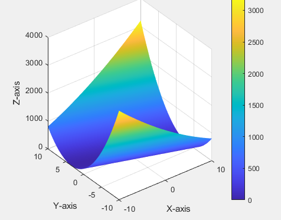

## 26. symmetric matrices
special point:
1. eigenvalues are **real**
2. eigenvectors are **orthogonal**/**perpendicular**

Usual case of A:
$$
A = S \Lambda S^{-1}
$$
where $S$ is orthogonal matrix, and $\Lambda$ is diagonal matrix.

Symmetric matrix:
$$
A = Q \Lambda Q^T
$$
where $S$ is orthogonal matrix, and $\Lambda$ is diagonal matrix.
> spectral theorem: every symmetric matrix can be diagonalized by an orthogonal matrix.

Q: Why REAL eigenvalues?
$$ 
A x = \lambda x \text{always}\rightarrow \bar{A} \bar{x} = \bar{\lambda} \bar{x}\rightarrow \bar{x^T}\bar{A^T} = \bar{\lambda} \bar{x^T} 
$$
> $\overline{a+ib} = a-ib$

if A is semitric, then $A^T = A$
PROOF:
$$
\bar{x^T} A x= \lambda \bar{x^T} x \rightarrow , \bar{x^T}Ax= \bar{x^T}\bar{\lambda}x
$$
SO
$$
\lambda \bar{x^T} x = \bar{\lambda}\bar{x^T}x
$$
$$
\lambda = \bar{\lambda}
$$
> $\lambda$ is real

$$
x^T x \star
$$
$$=
\begin{bmatrix}
\bar{x_1} & \bar{x_2} & \cdots & \bar{x_n}\\
\end{bmatrix}
\begin{bmatrix}
x_1 \\
x_2 \\
\vdots \\
x_n
\end{bmatrix} = 
\bar{x_1}x_1 + \bar{x_2}x_2 + \cdots + \bar{x_n}x_n 
$$
$$=
(a+ib)(a-ib) \cdots = a^2 + b^2 
$$
> all positive, so it is real, equal to the length of x

Good matrics: Real $\lambda$, perpendicular x's
- normal matrics:means $A = A^T$
- symmetric matrics:means $A = \bar{A^T}$

$$
A = Q \Lambda Q^T =
\begin{bmatrix}
q_1 & q_2 & \cdots & q_n
\end{bmatrix}
\begin{bmatrix}
\lambda_1 & 0 & \cdots & 0 \\
0 & \lambda_2 & \cdots & 0 \\
\vdots & \vdots & \ddots & \vdots \\
0 & 0 & \cdots & \lambda_n
\end{bmatrix}
\begin{bmatrix}
q_1^T \\
q_2^T \\
\vdots \\
q_n^T
\end{bmatrix}= 
\lambda_1 q_1 q_1^T + \lambda_2 q_2 q_2^T + \cdots + \lambda_n q_n q_n^T
$$

$$
aa^T :\text{Projection matrix}
$$
so every symmetric matrix is a combination of perpendicular projection matrices.
- signs of pivots same as signs of $\lambda$'s, the number of pivots = number of positive $\lambda$'s

### positive definite matrix
- what is positive definite matrix?
    - all are symmetric 
    - all eigenvalues are positive
    - all pivots are positive

Example:
$$
\begin{bmatrix}
5 & 2 \\
2 & 3 
\end{bmatrix}
$$
1. first pivot is 5, second pivot is $\frac{11}{5}$ , so it is positive definite.(product of pivots = determinant = 13)
2. eigenvalues are $4 \pm \sqrt{5}$

Example2:
$$
\begin{bmatrix}
-1 & 0 \\
0 & -3
\end{bmatrix}
$$
det = 3>0, so it is positive definite.
- all subdeteminants are positive
means :
$$
\begin{bmatrix}
-1
\end{bmatrix}\text{and}
\begin{bmatrix}
-1 & 0 \\
0 & -3
\end{bmatrix}
$$
are positive.

## 27. complex numbers and complex matrices
- and FFT

### Length
$$
z = 
\begin{bmatrix}
z_1 \\
z_2 \\
\vdots \\
z_n
\end{bmatrix}
$$
it is in $C^n$,means n-dimensional complex space, instead of $R^n$
$Z^T Z$ is not good, because if $z_1 = i$, then $z_1^2 = -1$, so it is not real.
so we use $\overline{z_1}z_1 = |z_1|^2$
SO 
$$
\overline{z}^T z = 
\begin{bmatrix}
1 & -i
\end{bmatrix}
\begin{bmatrix}
1 \\
i
\end{bmatrix} = 1 + 1 = 2
$$
is real, and it is the length of z.
$$
z^H 
$$
> hermitian transpose(no sound for "h")

Linear product:
$$
\overline{y}^T x = y^H x
$$

Symmitric matrix:
- Normal(real) matrix: $A = A^T$
- Hermitian matrix: $A = \bar{A}^H$
$$
A = 
\begin{bmatrix}
2 & 3+i \\
3-i & 5
\end{bmatrix}
$$

Perpendicular:
$$
q_1, q_2, \cdots, q_n
$$
$$
\bar{q_i}^T q_j = 
\begin{cases}
1 & i = j \\
0 & i \neq j
\end{cases}
$$
$$
Q = \begin{bmatrix}
q_1 & q_2 & \cdots & q_n
\end{bmatrix}, Q^T Q = I = Q^H Q(\text{Complex space})
$$

#### orthogonal matrix>unitary matrix（酉矩阵）
- unitary matrix: 
  - orthogonal matrix in complex space

### Fourier matrix
$$
F_n = 
\begin{bmatrix}
1 & 1 & 1 & \cdots & 1 \\
1 & w & w^2 & \cdots & w^{n-1} \\
1 & w^2 & w^4 & \cdots & w^{2(n-1)} \\
\vdots & \vdots & \vdots & \ddots & \vdots \\
1 & w^{n-1} & w^{2(n-1)} & \cdots & w^{(n-1)(n-1)}
\end{bmatrix}
$$
where $w = e^{2\pi i/n}= \cos(2\pi/n) + i \sin(2\pi/n)$

> first column is **0** column, last column is **n-1** column

$$
F_4 = \frac{1}{2}
\begin{bmatrix}
1 & 1 & 1 & 1 \\
1 & i & i^2 & i^3 \\
1 & i^2 & i^4 & i^6 \\
1 & i^3 & i^6 & i^9
\end{bmatrix} = \frac{1}{2}
\begin{bmatrix}
1 & 1 & 1 & 1 \\
1 & i & -1 & -i \\
1 & -1 & 1 & -1 \\
1 & -i & -1 & i
\end{bmatrix}
$$
- inner product of columns 2 and 4 = 0
$$ 
F_4^H F_4 = I
$$

### FFT
Example:
$$
\begin{bmatrix}
F_{64} \\
\end{bmatrix}= 
\begin{bmatrix}
I & D \\
I & -D    
\end{bmatrix}
\begin{bmatrix}
F_{32} & 0 \\
0 & F_{32}
\end{bmatrix}
\begin{bmatrix}
1 & 0 & 0 & 0 & \cdots & 0 \\
0 & 1 & 0 & 0 & \cdots & 0 \\
0 & 0 & 1 & 0 & \cdots & 0 \\
0 & 0 & 0 & 1 & \cdots & 0 \\
\vdots & \vdots & \vdots & \vdots & \ddots & \vdots \\
0 & 0 & 0 & 0 & \cdots & 1 \\
1 & 0 & 0 & 0 & \cdots & 0 \\
0 & 1 & 0 & 0 & \cdots & 0 \\
0 & 0 & 1 & 0 & \cdots & 0 \\
0 & 0 & 0 & 1 & \cdots & 0 \\
\vdots & \vdots & \vdots & \vdots & \ddots & \vdots \\
0 & 0 & 0 & 0 & \cdots & 1
\end{bmatrix}\text{permutation matrices}
$$

$$
D = 
\begin{bmatrix}
1 & 0 & 0 & 0 \\
0 & w & 0 & 0 \\
0 & 0 & w^2 & 0 \\
0 & 0 & 0 & w^3
\end{bmatrix}
$$

> caculate times: 64^2 $\rightarrow 2*（32）^2 +$fix(32) $\rightarrow 2*（16）^2 +$fix(16) $\rightarrow 2*（8）^2 +$fix(8) $\rightarrow 2*（4）^2 +$fix(4) $\rightarrow 2*（2）^2 +$fix(2) $\rightarrow 2*（1）^2 +$fix(1) $\rightarrow 0$
## 28. Computational Complexity Analysis

### Mathematical Derivation

We can formulate the operation count mathematically:
$$
T(n) = 2T(n/2) + cn
$$

Where $c$ is a constant for the combining operations. Solving this recurrence relation:
$$
\begin{align}
T(n) &= 2T(n/2) + cn \\
&= 2[2T(n/4) + c(n/2)] + cn \\
&= 4T(n/4) + cn + cn \\
&= 4T(n/4) + 2cn \\
&= 8T(n/8) + 3cn \\
&\vdots \\
&= nT(1) + cn\log_2 n \\
&= O(n\log n)
\end{align}
$$

### Butterfly Diagram Structure

The matrix factorization reveals the "butterfly" computation pattern:
$$
\begin{bmatrix} y_0 \\ y_1 \end{bmatrix} =
\begin{bmatrix} 1 & w^k \\ 1 & -w^k \end{bmatrix}
\begin{bmatrix} x_0 \\ x_1 \end{bmatrix}
$$

This structure repeats at each stage of the computation:

## 29. Positive Definite Matrices and Minima
Example:
$$
A =
\begin{bmatrix}
a & b \\
b & c
\end{bmatrix}
$$
1. $ \lambda_1> 0, \lambda_2 > 0 \rightarrow$ 
2. $ a>0, ac-b^2>0 \rightarrow$ 
3. pivot = a>0, det =$\frac{ac-b^2}{a}>0$
4. $x^T A x>0$

Example2:
$$
A =
\begin{bmatrix}
2 & 6 \\
6 & 18
\end{bmatrix}
$$
- not positive definite, because $det = 0$,it is positive semi-definite.
- it is singular

Example3:
$$ 
\begin{bmatrix}
x_1 & x_2
\end{bmatrix}
\begin{bmatrix}
2 & 6 \\
6 & 18
\end{bmatrix}
\begin{bmatrix}
x_1 \\
x_2
\end{bmatrix} = 2x_1^2 + 12x_1x_2 + 18x_2^2
$$
$$ 
= ax^2 + 2bxy + cy^2
$$
it is a quadratic form, is it always positive?

BUT, if turn 18 to 7, it is not positive definite.

--- 
$$
f(x,y) = 2x^2 + 12xy + 20y^2
$$
$$
= 2(x+3y)^2 + 2y^2
$$
so it is positive 
> those  numbers come from elimination
> pivots inside the matrix, and multipliers outside the matrix

$$
A:
\begin{bmatrix}
2 & 6 \\
6 & 20
\end{bmatrix}\rightarrow u
\begin{bmatrix}
2 & 6 \\
0 & 2
\end{bmatrix}, L
\begin{bmatrix}
1 & 0 \\
3 & 1
\end{bmatrix}
$$

SO:
$$
\begin{bmatrix}
f_{xx}  & f_{xy} \\
f_{yx} & f_{yy}
\end{bmatrix}
$$

3 by 3 Example:
$$
A = 
\begin{bmatrix}
2 & -1 & 0 \\
-1 & 2 & -1 \\
0 & -1 & 2
\end{bmatrix}
$$
is it positive definite?
1. dets are 2, 3, 4
2. pivots are 2, 3/2, 4/3
> product of pivots = det
3. eigenvalues are $2-\sqrt{2}, 2, 2+\sqrt{2}$

$$
x^T A x = 2x_1^2 - 2x_1x_2 + 2x_2^2 - 2x_2x_3 + 2x_3^2
$$
$$
= 2(x_1-x_2)^2 + 2(x_2-x_3)^2
$$
it is positive! a lop-sided paraboloid

- it have 3 axis,and they are in the direction of eigenvectors,
- the length of the axis is determined by the eigenvalues

also can be written as:
$$
Q^T \Lambda Q
$$
#### the principle rules
 

