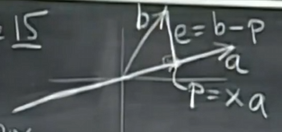
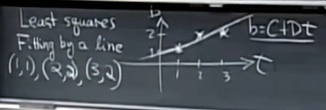

## 11. Matrix Spaces
$M$ = all 3 by 3 matrices,**dimension** = 9
subspace of $M$:
1. symmetric matrices 3 by 3,dimension = 6
2. upper triangular matrices 3 by 3, dimension = 6

**Basis** for $M$ = all 3 by 3 matrices 
$$
\begin{bmatrix}
1 & 0 & 0 \\
0 & 0 & 0 \\
0 & 0 & 0
\end{bmatrix}
$$
$$
\begin{bmatrix}
0 & 1 & 0 \\
0 & 0 & 0 \\
0 & 0 & 0
\end{bmatrix},
\begin{bmatrix}
0 & 0 & 1 \\
0 & 0 & 0 \\
0 & 0 & 0
\end{bmatrix}....
\begin{bmatrix}
0 & 0 & 0 \\
0 & 0 & 0 \\
0 & 0 & 1
\end{bmatrix}
$$
 
- $S\cup U $ = symmetric matrices + upper triangular = diagonal matrices 3 by 3, dimension{$S \cup U $} = 3
- $S \cap U $ is not a subspace of $M$
- $S + U $ = any elements of $S$ + any elements of $U$ ,it is a vector space = **all** 3 by 3 matrices,
dim($S + U$) = 9 = dim($M$)
- dim($S$) + dim($U$) = 6+6= 12 = dim($S$ + $U$) + dim($S$ $\cup$ $U$)= 9+3=12

#### differential equations:
$$
\frac{d^2y}{dx^2} +y = 0,
$$
$$
y = cosx, sinx, e^{ix}
$$ 
The complete solution is a **vector space** : 
$$
y = c_1cosx + c_2sinx 
$$
one of the basis of the vector space is $cosx, sinx$,dim(solution space) = 2,but $e^{ix}$ and $e^{-ix}$ are also solutions.
> the future of differential equations

$$
\begin{bmatrix}
1 & 4 & 5 \\
2 & 8 & 10 \\
\end{bmatrix}
$$
dimC(A) = 1 = dimC($A^T$) = 1
rank(A) = 1
$$
A = 
\begin{bmatrix}
1  \\
2  \\
\end{bmatrix}
\begin{bmatrix}
1 & 4 & 5 \\
\end{bmatrix}
$$
$$
A = U V^T
$$
- every matrix can be written as a product of some rank(1)matrix

**example**:a 5 by 17 rank(4) matrix can be written as a product of 4 rank(1) matrix

$M$ is all 5 by 17 matrix

subset of a rank 1 matrix is not a subspace 

In $R^4$,
$$
v =
\begin{bmatrix}
v_1 \\
v_2 \\
v_3 \\
v_4 \\
\end{bmatrix} 
$$
S = all vectors in $R^4$ with $v_1 + v_2 + v_3 + v_4 = 0$, 
rank = 1 ,dim = 3  
S = nullspace of A,$Av=0$,A =
$$
\begin{bmatrix}
1 & 1 & 1 & 1 \\
\end{bmatrix}
$$
n = 4, rank(A) = 1,dim(A) = 3
Basis for S =
$$
\begin{bmatrix}
-1 \\
1 \\
0 \\
0 \\
\end{bmatrix},
\begin{bmatrix}
-1 \\
0 \\
1 \\
0 \\
\end{bmatrix},
\begin{bmatrix}
-1 \\
0 \\
0 \\
1 \\
\end{bmatrix}
$$

- column space for A :
  - r = 1, C(A) = $R^1$ 
  - 3+1=4 = n
  - 1+0=1 = m
  - N($A^T$)={0}

#### small world graphs
- Graph = {nodes,edges} 

## 12. Graphs and Networks ,Incidence Matrices,Lirchhoff's Law

- nodes = n = 4
- edges = m = 5

NODE 1 2 3 4 
EDGE 
1
 2
  3
   4
    5

$$
A =
\begin{bmatrix}
-1 & 1 & 0 & 0  \\
0 & -1 & 1 & 0  \\
-1 & 0 & 1 & 0  \\
-1 & 0 & 0 & 1  \\
0 & 0 & -1 & 1  \\
\end{bmatrix}
$$
描述了问题的拓扑结构，rank(A) = 3
- N(A) = {0}
Ax = 0:
$$
Ax=
\begin{bmatrix}
x_2 - x_1 \\
x_3 - x_2 \\
x_3 - x_1 \\
x_4 - x_1 \\
x_4 - x_3 \\
\end{bmatrix}
=
\begin{bmatrix}
0 \\
0 \\
0 \\
0 \\
0 \\
\end{bmatrix}
$$
it shows the pontential of the nodes
$$
x = c
\begin{bmatrix}
1 \\
1 \\
1 \\
1 \\
1 \\
\end{bmatrix}
$$
potential of the nodes is caused by one of the nodes,if one node is c volt,the other nodes are c volt.

$$
A^T y = 0,dimN(A^T)?
$$
$$
A^Ty = 
\begin{bmatrix}
-1 & 0 & -1 & -1 & 0 \\
1 & -1 & 0 & 0 & 0 \\
0 & 1 & 1 & 0 & -1 \\
0 & 0 & 0 & 1 & 1 \\
\end{bmatrix}
\begin{bmatrix}
y_1 \\
y_2 \\
y_3 \\
y_4 \\
y_5 \\
\end{bmatrix}=
\begin{bmatrix}
0 \\
0 \\
0 \\
0 \\
\end{bmatrix}
$$
y is the current in the edges,$A^Ty = 0$ is **KCL**
first row: $-y_1 - y_3 - y_4 = 0$ means **in equals out**

Basis for N($A^T$) ：
$$
\begin{bmatrix}
1 \\
1 \\
-1 \\
0 \\
0 \\
\end{bmatrix},
\begin{bmatrix}
0 \\
0 \\
1 \\
-1 \\
1 \\
\end{bmatrix}
$$
- indepedent equals loops
$$
dimN(A^T) = m-r
loops = edges - (nodes - 1)
\Longrightarrow
$$
#### Eular's formula:
$$
nodes + loops - edges = 1
$$
 
 ----------------
core points:
$$
e=Ax,y=Ce,A^Ty=f
$$
most important equation:
$$
A^TCAx = f
$$

## 13. Review
1. 
$$
B  = 
\begin{bmatrix}
U \\
2U \\
\end{bmatrix}
$$
Echelon form?
$$
\begin{bmatrix}
U \\
0 \\
\end{bmatrix}
$$
2. 
$$
C =
\begin{bmatrix}
U & U \\
U & 0 \\
\end{bmatrix}
$$
Echelon form?
$$
\begin{bmatrix}
U & 0 \\
0 & U \\
\end{bmatrix}
$$
3.
3.1. 
$$
Ax = 
\begin{bmatrix}
2 \\
4 \\
2 \\
\end{bmatrix},
x= 
\begin{bmatrix}
2 \\
0 \\
0 \\
\end{bmatrix}+ c 
\begin{bmatrix}
1 \\
1 \\
0 \\
\end{bmatrix}+ d
\begin{bmatrix}
0 \\
0 \\
1 \\
\end{bmatrix}
$$
A?
answer:
dim N(A) = 2
$$
A =
\begin{bmatrix}
1 & -1 & 0 \\
2 & -2 & 0 \\
1 & -1 & 0 \\
\end{bmatrix}
$$

3.2.  Ax=b can be solve if?
answer : b is in the column space of A
b has the form of 
$$
c
\begin{bmatrix}
1 \\
2 \\
1 \\
\end{bmatrix}
$$
.....

## 14. Orthogonal Vectors and Subspaces
- $X^Ty=0$ equals to X and y are **orthogonal**
- orthogonal subspace: 
  1. row space of A is orthogonal to the nullspace of A

Q: Ax=b,what is the solution, when there is **no** solution?
$$
A^TA\hat{x} = A^Tb
$$
$N(A^TA)$= N(A),rank of A = rank of $A^TA$
$A^TA$ is invertible, only if A is full rank

## 15. Projections

- $a^T(b-xa)=0$
$$
 x =\frac{a^Tb}{a^Ta}$$
$$
 P = a\frac{a^Tb}{a^Ta}
$$
- P is a projection matrix， n by n
$$
 Projection Matrix = a\frac{a^T}{a^Ta}
$$
- the column space of P is a line through a,rank = 1
    - P is symmetric, $P^T = P$  
    - $P^2 = P$
### Q:Why project?
Because Ax=b may have not solution , so solve the **closest** solution.
Ax always in the column space of A, but b may not .
So solve Ax = P, P is the projection of b in the column space of A
best possible solution of Ax=b is $\hat{x}$

1. WHAT IS THE PLANE?
$a_1 ,a_2$ are the basis of the plane，they are not to be orthogonal,but independent
2. How to project b to the plane?How to find the projection matrix?
It must be 
$$
\begin{bmatrix}
a_1 & a_2 \\
\end{bmatrix}
$$
so 
$$
P = \hat{x_1}a_1 + \hat{x_2}a_2 = A\hat{x}
$$
Key: $e = b-A\hat{x}$ is orthogonal to the plane
so 
$$
a_1^Te = 0,a_2^Te = 0
$$
$$
\begin{bmatrix}
a_1^T \\
a_2^T \\
\end{bmatrix}(b-A\hat{x}) =
\begin{bmatrix}
0 \\
0 \\
\end{bmatrix},
A^T(b-A\hat{x}) = 0
$$
so e in N($A^T$),so e $\perp$ C(A)

SO:
1. $\hat{x} = (A^TA)^{-1}A^Tb$
2. $P = A\hat{x}   =  A(A^TA)^{-1}A^Tb$
3. matrix $P = A(A^TA)^{-1}A^T$
> Check: $P^2 = P$
> $P^2 = A(A^TA)^{-1}A^TA(A^TA)^{-1}A^T = A(A^TA)^{-1}A^T = P$

### 15.2 Application:
习题

FIT some points to a line
- C+D=1
C+2D=2
C+3D=2
matrix : Ax=b
$$
A =
\begin{bmatrix}
1 & 1 \\
1 & 2 \\
1 & 3 \\
\end{bmatrix},x=
\begin{bmatrix}
C \\
D \\
\end{bmatrix},b=
\begin{bmatrix}
1 \\
2 \\
2 \\
\end{bmatrix}
$$

## 16. Projections, Least Squares
$$
P = A(A^TA)^{-1}A^T
$$
IF b is in the column space of A, then $Pb=b$
IF b is $\perp$ the column space of A,$ Pb = 0$

[tap here](#my-anchor)
goal: minimize $||b-A\hat{x}||^2= ||e||^2
= e_1^2 + e_2^2 + e_3^2$

$$
e = b-A\hat{x} = b-Pb = (I-P)b
$$
1. find 
$$
\hat{x} = 
\begin{bmatrix}
\hat{C} \\
\hat{D} \\
\end{bmatrix},P
$$
$$
A^TA\hat{x}= A^Tb
$$
$$
A^TA =
\begin{bmatrix}
1 & 1 & 1 \\
1 & 2 & 3 \\
\end{bmatrix}
\begin{bmatrix}
1 & 1 \\
1 & 2 \\
1 & 3 \\
\end{bmatrix}
= 
\begin{bmatrix}
3 & 6 \\
6 & 14 \\
\end{bmatrix}
$$
$$
3C + 6D = 5,
6C + 14D = 11
$$
get the **nomal equation**
$$
D= \frac{1}{2},C = \frac{2}{3}
$$
the line:
$$
y = \frac{2}{3} + \frac{1}{2}t
$$
so 
$$
e_1 = -\frac{1}{6},e_2 = \frac{2}{6},e_3 = -\frac{1}{6}
$$
final answer:
$$
A^TA\hat{x} = A^Tb,
P = A\hat{x}
$$

### pROVE: 
If a has indepedent calumns, then $A^TA$ is invertible
1. a matrix is invertible if and only if 
its nullspace is {0}
so :
$$
A^TAx = 0
$$
IDEA: $A^TAx = 0$ means $x^TA^TAx = 0$,means
$$
(Ax)^T(Ax) = 0 \Longrightarrow Ax = 0
$$
and A has independent columns ,so x = 0
    - Proved

## 17. Orthogonal basis and matrix, Gram-Schmidt
- basis: $q_1,q_2,q_3$ are orthogonal
so : 
$$
q_i^Tq_j = \begin{cases}
1 & i=j \\
0 & i \neq j \\
\end{cases}
$$
$$
Q = 
\begin{bmatrix}
q_1 & q_2 & q_3 &...& q_n\\
\end{bmatrix}
$$
$$
Q^TQ = 
\begin{bmatrix}
q_1^T \\
q_2^T \\
q_3^T \\
... \\
q_n^T \\
\end{bmatrix}
\begin{bmatrix}
q_1 & q_2 & q_3 &...& q_n\\
\end{bmatrix}
= I
$$
Q is **orthogonal matrix**
If Q is square, then $Q^TQ$ = I, tells us $Q^T = Q^{-1}$

EXAMPLE:
1. 
$$
perms Q = 
\begin{bmatrix}
0&0&1 \\
1&0&0 \\
0&1&0 \\
\end{bmatrix},
Q^T = 
\begin{bmatrix}
0&1&0 \\
0&0&1 \\
1&0&0 \\
\end{bmatrix}
$$
$$
Q^TQ = I
$$
2.
$$
Q =\frac{1}{2}
\begin{bmatrix}
1&1&1&1 \\
1&-1&1&-1 \\
1&1&-1&-1 \\
1&-1&-1&1 \\
\end{bmatrix}
$$

Advantage of orthogonal matrix:
1. if Q has orthogonal columns, projects onto its columns space 
$P = 
P = Q(Q^TQ)^{-1}Q^T = QQ^T=I$if Q is square
2. $(QQ^T)(QQ^T) = QQ^T$
3. $A^TA\hat{x} = A^Tb$,now A is Q
  so $Q^TQ\hat{x} = Q^Tb$
  so $\hat{x} = Q^Tb$
  so $\hat{x_i}= $
  $$
  q_i^Tb
  $$
### Gram-Schmidt
- independent vectors a,b;$\rightarrow$ orthogonal vectors A,B;then $\rightarrow$ orthogonal basis
1. choose A = a
2. $$
B =b- \frac{A^Tb}{A^TA}A
$$
3. $q_1 = \frac{A}{||A||},q_2 = \frac{B}{||B||}$

- a,b,c are independent vectors
1. as a,b find $q_1,q_2$
2. $$
C = c - \frac{A^Tc}{A^TA}A - \frac{B^Tc}{B^TB}B
$$
3. $q_3$ = $\frac{C}{||C||}$
  
$$
A = QR
$$
> 这鸟人在说什么