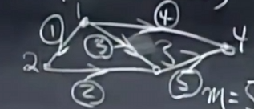

## 11. Matrix Spaces
$M$ = all 3 by 3 matrices,**dimension** = 9
subspace of $M$:
1. symmetric matrices 3 by 3,dimension = 6
2. upper triangular matrices 3 by 3, dimension = 6

**Basis** for $M$ = all 3 by 3 matrices 
$$
\begin{bmatrix}
1 & 0 & 0 \\
0 & 0 & 0 \\
0 & 0 & 0
\end{bmatrix}
$$
$$
\begin{bmatrix}
0 & 1 & 0 \\
0 & 0 & 0 \\
0 & 0 & 0
\end{bmatrix},
\begin{bmatrix}
0 & 0 & 1 \\
0 & 0 & 0 \\
0 & 0 & 0
\end{bmatrix}....
\begin{bmatrix}
0 & 0 & 0 \\
0 & 0 & 0 \\
0 & 0 & 1
\end{bmatrix}
$$
 
- $S\cup U $ = symmetric matrices + upper triangular = diagonal matrices 3 by 3, dimension{$S \cup U $} = 3
- $S \cap U $ is not a subspace of $M$
- $S + U $ = any elements of $S$ + any elements of $U$ ,it is a vector space = **all** 3 by 3 matrices,
dim($S + U$) = 9 = dim($M$)
- dim($S$) + dim($U$) = 6+6= 12 = dim($S$ + $U$) + dim($S$ $\cup$ $U$)= 9+3=12

#### differential equations:
$$
\frac{d^2y}{dx^2} +y = 0,
$$
$$
y = cosx, sinx, e^{ix}
$$ 
The complete solution is a **vector space** : 
$$
y = c_1cosx + c_2sinx 
$$
one of the basis of the vector space is $cosx, sinx$,dim(solution space) = 2,but $e^{ix}$ and $e^{-ix}$ are also solutions.
> the future of differential equations

$$
\begin{bmatrix}
1 & 4 & 5 \\
2 & 8 & 10 \\
\end{bmatrix}
$$
dimC(A) = 1 = dimC($A^T$) = 1
rank(A) = 1
$$
A = 
\begin{bmatrix}
1  \\
2  \\
\end{bmatrix}
\begin{bmatrix}
1 & 4 & 5 \\
\end{bmatrix}
$$
$$
A = U V^T
$$
- every matrix can be written as a product of some rank(1)matrix

**example**:a 5 by 17 rank(4) matrix can be written as a product of 4 rank(1) matrix

$M$ is all 5 by 17 matrix

subset of a rank 1 matrix is not a subspace 

In $R^4$,
$$
v =
\begin{bmatrix}
v_1 \\
v_2 \\
v_3 \\
v_4 \\
\end{bmatrix} 
$$
S = all vectors in $R^4$ with $v_1 + v_2 + v_3 + v_4 = 0$, 
rank = 1 ,dim = 3  
S = nullspace of A,$Av=0$,A =
$$
\begin{bmatrix}
1 & 1 & 1 & 1 \\
\end{bmatrix}
$$
n = 4, rank(A) = 1,dim(A) = 3
Basis for S =
$$
\begin{bmatrix}
-1 \\
1 \\
0 \\
0 \\
\end{bmatrix},
\begin{bmatrix}
-1 \\
0 \\
1 \\
0 \\
\end{bmatrix},
\begin{bmatrix}
-1 \\
0 \\
0 \\
1 \\
\end{bmatrix}
$$

- column space for A :
  - r = 1, C(A) = $R^1$ 
  - 3+1=4 = n
  - 1+0=1 = m
  - N($A^T$)={0}

#### small world graphs
- Graph = {nodes,edges} 

## 12. Graphs and Networks ,Incidence Matrices,Lirchhoff's Law

- nodes = n = 4
- edges = m = 5

NODE 1 2 3 4 
EDGE 
1
 2
  3
   4
    5

$$
A =
\begin{bmatrix}
-1 & 1 & 0 & 0  \\
0 & -1 & 1 & 0  \\
-1 & 0 & 1 & 0  \\
-1 & 0 & 0 & 1  \\
0 & 0 & -1 & 1  \\
\end{bmatrix}
$$
描述了问题的拓扑结构，rank(A) = 3
- N(A) = {0}
Ax = 0:
$$
Ax=
\begin{bmatrix}
x_2 - x_1 \\
x_3 - x_2 \\
x_3 - x_1 \\
x_4 - x_1 \\
x_4 - x_3 \\
\end{bmatrix}
=
\begin{bmatrix}
0 \\
0 \\
0 \\
0 \\
0 \\
\end{bmatrix}
$$
it shows the pontential of the nodes
$$
x = c
\begin{bmatrix}
1 \\
1 \\
1 \\
1 \\
1 \\
\end{bmatrix}
$$
potential of the nodes is caused by one of the nodes,if one node is c volt,the other nodes are c volt.

$$
A^T y = 0,dimN(A^T)?
$$
$$
A^Ty = 
\begin{bmatrix}
-1 & 0 & -1 & -1 & 0 \\
1 & -1 & 0 & 0 & 0 \\
0 & 1 & 1 & 0 & -1 \\
0 & 0 & 0 & 1 & 1 \\
\end{bmatrix}
\begin{bmatrix}
y_1 \\
y_2 \\
y_3 \\
y_4 \\
y_5 \\
\end{bmatrix}=
\begin{bmatrix}
0 \\
0 \\
0 \\
0 \\
\end{bmatrix}
$$
y is the current in the edges,$A^Ty = 0$ is **KCL**
first row: $-y_1 - y_3 - y_4 = 0$ means **in equals out**

Basis for N($A^T$) ：
$$
\begin{bmatrix}
1 \\
1 \\
-1 \\
0 \\
0 \\
\end{bmatrix},
\begin{bmatrix}
0 \\
0 \\
1 \\
-1 \\
1 \\
\end{bmatrix}
$$
- indepedent equals loops
$$
dimN(A^T) = m-r
loops = edges - (nodes - 1)
\Longrightarrow
$$
#### Eular's formula:
$$
nodes + loops - edges = 1
$$
 
 ----------------
core points:
$$
e=Ax,y=Ce,A^Ty=f
$$
most important equation:
$$
A^TCAx = f
$$

## 13. Review
1. 
$$
B  = 
\begin{bmatrix}
U \\
2U \\
\end{bmatrix}
$$
Echelon form?
$$
\begin{bmatrix}
U \\
0 \\
\end{bmatrix}
$$
2. 
$$
C =
\begin{bmatrix}
U & U \\
U & 0 \\
\end{bmatrix}
$$
Echelon form?
$$
\begin{bmatrix}
U & 0 \\
0 & U \\
\end{bmatrix}
$$
3.
3.1. 
$$
Ax = 
\begin{bmatrix}
2 \\
4 \\
2 \\
\end{bmatrix},
x= 
\begin{bmatrix}
2 \\
0 \\
0 \\
\end{bmatrix}+ c 
\begin{bmatrix}
1 \\
1 \\
0 \\
\end{bmatrix}+ d
\begin{bmatrix}
0 \\
0 \\
1 \\
\end{bmatrix}
$$
A?
answer:
dim N(A) = 2
$$
A =
\begin{bmatrix}
1 & -1 & 0 \\
2 & -2 & 0 \\
1 & -1 & 0 \\
\end{bmatrix}
$$

3.2.  Ax=b can be solve if?
answer : b is in the column space of A
b has the form of 
$$
c
\begin{bmatrix}
1 \\
2 \\
1 \\
\end{bmatrix}
$$
.....

## 14. Orthogonal Vectors and Subspaces
- $X^Ty=0$ equals to X and y are **orthogonal**
- orthogonal subspace: 
  1. row space of A is orthogonal to the nullspace of A

Q: Ax=b,what is the solution, when there is **no** solution?
$$
A^TA\hat{x} = A^Tb
$$
$N(A^TA)$= N(A),rank of A = rank of $A^TA$
$A^TA$ is invertible, only if A is full rank
