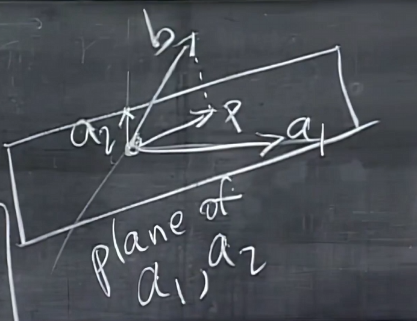

# MIT Linear Algebra Course Notes

## 11. Matrix Spaces

### 11.1 Basic Matrix Spaces
- $M$ = all 3 by 3 matrices, **dimension** = 9
- Subspaces of $M$:
  1. Symmetric matrices 3×3, dimension = 6
  2. Upper triangular matrices 3×3, dimension = 6

### 11.2 Basis for Matrix Space
A basis for $M$ (all 3×3 matrices) consists of matrices with a single 1 and zeros elsewhere:

$$
\begin{bmatrix}
1 & 0 & 0 \\
0 & 0 & 0 \\
0 & 0 & 0
\end{bmatrix},
\begin{bmatrix}
0 & 1 & 0 \\
0 & 0 & 0 \\
0 & 0 & 0
\end{bmatrix},
\begin{bmatrix}
0 & 0 & 1 \\
0 & 0 & 0 \\
0 & 0 & 0
\end{bmatrix}, \ldots,
\begin{bmatrix}
0 & 0 & 0 \\
0 & 0 & 0 \\
0 & 0 & 1
\end{bmatrix}
$$

### 11.3 Subspace Operations
- $S \cap U$ = intersection of symmetric matrices and upper triangular matrices = diagonal matrices 3×3, dimension = 3
- $S + U$ = any element of $S$ plus any element of $U$ = **all** 3×3 matrices, dim($S + U$) = 9 = dim($M$)
- Dimension formula: dim($S$) + dim($U$) = 6+6 = 12 = dim($S + U$) + dim($S \cap U$) = 9+3 = 12

### 11.4 Differential Equations as Vector Spaces
$$\frac{d^2y}{dx^2} + y = 0$$

Solutions include:
$$y = \cos x, \sin x, e^{ix}$$

The complete solution forms a **vector space**:
$$y = c_1\cos x + c_2\sin x$$

- One basis is $\{\cos x, \sin x\}$, dim(solution space) = 2
- $e^{ix}$ and $e^{-ix}$ are also solutions
> *The future of differential equations*

### 11.5 Rank-One Matrices and Matrix Factorization

Example:
$$
\begin{bmatrix}
1 & 4 & 5 \\
2 & 8 & 10 \\
\end{bmatrix}
$$

- dim C(A) = 1 = dim C($A^T$) = 1
- rank(A) = 1
- Matrix factorization:
$$
A = 
\begin{bmatrix}
1  \\
2  \\
\end{bmatrix}
\begin{bmatrix}
1 & 4 & 5 \\
\end{bmatrix} = U V^T
$$

**Key insight**: Every matrix can be written as a sum of rank-1 matrices.

**Example**: A 5×17 matrix with rank 4 can be written as a sum of 4 rank-1 matrices.

> Note: The subset of all rank-1 matrices is not a subspace.

### 11.6 Nullspace Example in $\mathbb{R}^4$

In $\mathbb{R}^4$, consider vectors:
$$
v =
\begin{bmatrix}
v_1 \\
v_2 \\
v_3 \\
v_4 \\
\end{bmatrix} 
$$

Let S = all vectors in $\mathbb{R}^4$ with $v_1 + v_2 + v_3 + v_4 = 0$
- S is the nullspace of matrix A where $Av=0$
- A = $\begin{bmatrix} 1 & 1 & 1 & 1 \\ \end{bmatrix}$
- n = 4, rank(A) = 1, dim(S) = 3

Basis for S:
$$
\begin{bmatrix}
-1 \\
1 \\
0 \\
0 \\
\end{bmatrix},
\begin{bmatrix}
-1 \\
0 \\
1 \\
0 \\
\end{bmatrix},
\begin{bmatrix}
-1 \\
0 \\
0 \\
1 \\
\end{bmatrix}
$$

Column space properties:
- r = 1, C(A) = $\mathbb{R}^1$ 
- 3+1 = 4 = n
- 1+0 = 1 = m
- N($A^T$) = {0}

### 11.7 Small World Graphs
- Graph = {nodes, edges}

## 12. Graphs and Networks, Incidence Matrices, Kirchhoff's Law

- nodes = n = 4
- edges = m = 5

### 12.1 Incidence Matrix

$$
A =
\begin{bmatrix}
-1 & 1 & 0 & 0  \\
0 & -1 & 1 & 0  \\
-1 & 0 & 1 & 0  \\
-1 & 0 & 0 & 1  \\
0 & 0 & -1 & 1  \\
\end{bmatrix}
$$

- Describes the topological structure of the problem
- rank(A) = 3
- N(A) = {0}

### 12.2 Node Potentials

Ax = 0:
$$
Ax=
\begin{bmatrix}
x_2 - x_1 \\
x_3 - x_2 \\
x_3 - x_1 \\
x_4 - x_1 \\
x_4 - x_3 \\
\end{bmatrix}
=
\begin{bmatrix}
0 \\
0 \\
0 \\
0 \\
0 \\
\end{bmatrix}
$$

- Represents node potentials
- Solution: $x = c \begin{bmatrix} 1 \\ 1 \\ 1 \\ 1 \\ \end{bmatrix}$
- Interpretation: If one node has potential c volts, all other nodes must also be at c volts

### 12.3 Kirchhoff's Current Law (KCL)

$$A^T y = 0$$

$$
A^Ty = 
\begin{bmatrix}
-1 & 0 & -1 & -1 & 0 \\
1 & -1 & 0 & 0 & 0 \\
0 & 1 & 1 & 0 & -1 \\
0 & 0 & 0 & 1 & 1 \\
\end{bmatrix}
\begin{bmatrix}
y_1 \\
y_2 \\
y_3 \\
y_4 \\
y_5 \\
\end{bmatrix}=
\begin{bmatrix}
0 \\
0 \\
0 \\
0 \\
\end{bmatrix}
$$

- $y$ represents currents in the edges
- $A^Ty = 0$ is **Kirchhoff's Current Law (KCL)**
- First row: $-y_1 - y_3 - y_4 = 0$ means **current in equals current out**

Basis for N($A^T$):
$$
\begin{bmatrix}
1 \\
1 \\
-1 \\
0 \\
0 \\
\end{bmatrix},
\begin{bmatrix}
0 \\
0 \\
1 \\
-1 \\
1 \\
\end{bmatrix}
$$

- Independent loops = dim N($A^T$) = m - r
- Loops = edges - (nodes - 1)

### 12.4 Euler's Formula
$$\text{nodes} + \text{loops} - \text{edges} = 1$$

### 12.5 Core Network Equations
$$e = Ax, y = Ce, A^Ty = f$$

Most important equation:
$$A^TCAx = f$$

## 13. Review

### 13.1 Echelon Forms

Example 1:
$$
B = 
\begin{bmatrix}
U \\
2U \\
\end{bmatrix}
$$

Echelon form:
$$
\begin{bmatrix}
U \\
0 \\
\end{bmatrix}
$$

Example 2:
$$
C =
\begin{bmatrix}
U & U \\
U & 0 \\
\end{bmatrix}
$$

Echelon form:
$$
\begin{bmatrix}
U & 0 \\
0 & U \\
\end{bmatrix}
$$

### 13.2 Matrix Problems

Problem 1:
$$
Ax = 
\begin{bmatrix}
2 \\
4 \\
2 \\
\end{bmatrix},
x = 
\begin{bmatrix}
2 \\
0 \\
0 \\
\end{bmatrix} + c 
\begin{bmatrix}
1 \\
1 \\
0 \\
\end{bmatrix} + d
\begin{bmatrix}
0 \\
0 \\
1 \\
\end{bmatrix}
$$

Find A?

Answer:
- dim N(A) = 2
$$
A =
\begin{bmatrix}
1 & -1 & 0 \\
2 & -2 & 0 \\
1 & -1 & 0 \\
\end{bmatrix}
$$

Problem 2:  
When can Ax = b be solved?

Answer: When b is in the column space of A.
b must have the form: $c \begin{bmatrix} 1 \\ 2 \\ 1 \\ \end{bmatrix}$

## 14. Orthogonal Vectors and Subspaces

- $X^Ty = 0$ means X and y are **orthogonal**
- Orthogonal subspace properties:
  - Row space of A is orthogonal to the nullspace of A

### 14.1 No Solution Case
When Ax = b has no solution, find the best approximation:
$$A^TA\hat{x} = A^Tb$$

- N($A^TA$) = N(A)
- rank of A = rank of $A^TA$
- $A^TA$ is invertible only if A has full column rank

## 15. Projections

### 15.1 Projection onto a Line
- $a^T(b-xa) = 0$ (perpendicularity condition)
- $x = \frac{a^Tb}{a^Ta}$ (scalar projection)
- $P = a\frac{a^Tb}{a^Ta}$ (vector projection)

**Projection Matrix**: 
$$P = a\frac{a^T}{a^Ta}$$

Properties of projection matrix:
- Column space is a line through $a$
- rank = 1
- $P$ is symmetric: $P^T = P$  
- $P$ is idempotent: $P^2 = P$

### 15.2 Why Project?

Because Ax = b may have no solution, we solve for the **closest** solution.
- Ax is always in the column space of A, but b may not be
- We solve Ax = p, where p is the projection of b onto the column space of A
- Best possible solution is $\hat{x}$

### 15.3 Projection onto a Plane

1. **What is the plane?**  
   $a_1, a_2$ are basis vectors of the plane (not necessarily orthogonal, but independent)

2. **How to project b onto the plane?**  
   Projection: $P = \hat{x}_1 a_1 + \hat{x}_2 a_2 = A\hat{x}$

3. **Key insight**: $e = b - A\hat{x}$ must be orthogonal to the plane, so:
   $$a_1^Te = 0, a_2^Te = 0$$
   $$\begin{bmatrix} a_1^T \\ a_2^T \end{bmatrix}(b-A\hat{x}) = \begin{bmatrix} 0 \\ 0 \end{bmatrix}$$
   $$A^T(b-A\hat{x}) = 0$$

   Thus, $e \in$ N($A^T$), which means $e \perp$ C(A)

**Resulting formulas**:
1. $\hat{x} = (A^TA)^{-1}A^Tb$
2. $P = A\hat{x} = A(A^TA)^{-1}A^Tb$
3. Projection matrix: $P = A(A^TA)^{-1}A^T$

Verification: $P^2 = P$
$$P^2 = A(A^TA)^{-1}A^TA(A^TA)^{-1}A^T = A(A^TA)^{-1}A^T = P$$

### 15.4 Application Example

Example problem:

Fit some points to a line:
- C+D=1
- C+2D=2
- C+3D=2

Matrix form: Ax = b
$$
A =
\begin{bmatrix}
1 & 1 \\
1 & 2 \\
1 & 3 \\
\end{bmatrix}, x =
\begin{bmatrix}
C \\
D \\
\end{bmatrix}, b =
\begin{bmatrix}
1 \\
2 \\
2 \\
\end{bmatrix}
$$

## 16. Projections and Least Squares

$$P = A(A^TA)^{-1}A^T$$

Properties:
- If b is in the column space of A, then $Pb = b$
- If b is $\perp$ to the column space of A, then $Pb = 0$

[Link to example](#my-anchor)

### 16.1 Least Squares Method

Goal: Minimize $||b-A\hat{x}||^2 = ||e||^2 = e_1^2 + e_2^2 + e_3^2$

Error vector: $e = b-A\hat{x} = b-Pb = (I-P)b$

Steps to solve:
1. Find $\hat{x} = \begin{bmatrix} \hat{C} \\ \hat{D} \end{bmatrix}$

2. Setup normal equations:
   $$A^TA\hat{x} = A^Tb$$

3. Calculate 
$A^TA$:
$$
A^TA =
\begin{bmatrix}
1 & 1 & 1 \\
1 & 2 & 3 \\
\end{bmatrix}
\begin{bmatrix}
1 & 1 \\
1 & 2 \\
1 & 3 \\
\end{bmatrix}
= 
\begin{bmatrix}
3 & 6 \\
6 & 14 \\
\end{bmatrix}
$$

4. Solve the normal equations:
   $$
   3C + 6D = 5 \\
   6C + 14D = 11
   $$

5. Solution: $D = \frac{1}{2}, C = \frac{2}{3}$

6. Fitted line: $y = \frac{2}{3} + \frac{1}{2}t$

7. Error vector: $e_1 = -\frac{1}{6}, e_2 = \frac{2}{6}, e_3 = -\frac{1}{6}$

### 16.2 Important Theorem
If A has independent columns, then $A^TA$ is invertible.

Proof:
1. A matrix is invertible if and only if its nullspace is {0}
2. Consider $A^TAx = 0$
3. This means $x^TA^TAx = 0$, which implies $(Ax)^T(Ax) = 0$
4. This means $Ax = 0$
5. Since A has independent columns, $x = 0$
6. Therefore, N($A^TA$) = {0} and $A^TA$ is invertible

## 17. Orthogonal Bases and Matrices, Gram-Schmidt

### 17.1 Orthogonal Basis
A set of vectors $q_1, q_2, q_3, ..., q_n$ is orthogonal if: 
$$
q_i^Tq_j = \begin{cases}
1 & \text{if } i=j \\
0 & \text{if } i \neq j \\
\end{cases}
$$

### 17.2 Orthogonal Matrix
For a matrix Q with orthonormal columns:
$$
Q = 
\begin{bmatrix}
q_1 & q_2 & q_3 &...& q_n\\
\end{bmatrix}
$$

$$
Q^TQ = 
\begin{bmatrix}
q_1^T \\
q_2^T \\
q_3^T \\
\vdots \\
q_n^T \\
\end{bmatrix}
\begin{bmatrix}
q_1 & q_2 & q_3 &...& q_n\\
\end{bmatrix}
= I
$$

- Q is called an **orthogonal matrix**
- If Q is square, then $Q^TQ = I$ implies $Q^T = Q^{-1}$

### 17.3 Examples of Orthogonal Matrices

Example 1: Permutation matrix
$$
Q = 
\begin{bmatrix}
0&0&1 \\
1&0&0 \\
0&1&0 \\
\end{bmatrix},
Q^T = 
\begin{bmatrix}
0&1&0 \\
0&0&1 \\
1&0&0 \\
\end{bmatrix}
$$
$$Q^TQ = I$$

Example 2:
$$
Q =\frac{1}{2}
\begin{bmatrix}
1&1&1&1 \\
1&-1&1&-1 \\
1&1&-1&-1 \\
1&-1&-1&1 \\
\end{bmatrix}
$$

### 17.4 Advantages of Orthogonal Matrices

1. **Simplified projection**: If Q has orthogonal columns, projection onto its column space is
   $P = Q(Q^TQ)^{-1}Q^T = QQ^T = I$ (if Q is square)

2. **Idempotent property**: $(QQ^T)(QQ^T) = QQ^T$

3. **Simplified least squares**: 
   - Normal equations: $Q^TQ\hat{x} = Q^Tb$ reduce to $\hat{x} = Q^Tb$
   - Component formula: $\hat{x}_i = q_i^Tb$

### 17.5 Gram-Schmidt Orthogonalization

Converting independent vectors to orthogonal vectors:

**Two vectors**:
1. Choose A = a
2. $B = b - \frac{A^Tb}{A^TA}A$ (remove the projection of b onto A)
3. $q_1 = \frac{A}{||A||}, q_2 = \frac{B}{||B||}$ (normalize)

**Three vectors**:
1. As with a, b, find $q_1, q_2$
2. $C = c - \frac{A^Tc}{A^TA}A - \frac{B^Tc}{B^TB}B$ (remove projections onto A and B)
3. $q_3 = \frac{C}{||C||}$

QR Factorization: $A = QR$

## 18. Determinants

- det(A) is defined for square matrices only
- det(A) = 0 means A is singular (not invertible)

### 18.1 Properties of Determinants

1. det(I) = 1
2. When rows are exchanged, det changes sign:
   - $\begin{vmatrix} 0&1 \\ 1&0 \end{vmatrix} = -1$
   - For 2×2 matrix: $\begin{vmatrix} a&b \\ c&d \end{vmatrix} = ad-bc$
3. Determinant is linear in each row:
   - $\begin{vmatrix} ta&tb \\ c&d \end{vmatrix} = t \begin{vmatrix}a&b \\ c&d \end{vmatrix}$
   - $\begin{vmatrix} a+a'&b+b' \\ c&d \end{vmatrix} = \begin{vmatrix}a&b \\ c&d \end{vmatrix} + \begin{vmatrix}a'&b' \\ c&d \end{vmatrix}$
4. If two rows are equal, det = 0
5. Subtracting a multiple of one row from another **does not** change the determinant
6. A row of zeros produces det = 0
7. For a triangular matrix, det = product of diagonal elements = product of pivots:
   $\begin{vmatrix} d_1&*&* \\ 0&d_2&* \\ 0&0&d_3 \end{vmatrix} = d_1d_2d_3$
8. det(A) = 0 if and only if A is singular
9. det(AB) = det(A)·det(B)
10. det($A^{-1}$) = $\frac{1}{det(A)}$
11. det(A) = det($A^T$)

## 19. Formula for the Determinant

### 19.1 Computing Determinants

2×2 determinant:
$$\begin{vmatrix} a&b \\ c&d \end{vmatrix} = ad-bc$$

Breaking down how this works:
$$
\begin{vmatrix} a&b \\ c&d \end{vmatrix} = 
\begin{vmatrix} a&0 \\ c&d \end{vmatrix} +
\begin{vmatrix} 0&b \\ c&d \end{vmatrix} =
\begin{vmatrix} a&0 \\ c&0 \end{vmatrix} +
\begin{vmatrix} a&0 \\ 0&d \end{vmatrix} +
\begin{vmatrix} 0&b \\ c&0 \end{vmatrix} +   
\begin{vmatrix} 0&b \\ 0&d \end{vmatrix} = ad-bc
$$

3×3 determinant:
$$
\begin{vmatrix} 
a_{11}&a_{12}&a_{13} \\
a_{21}&a_{22}&a_{23} \\
a_{31}&a_{32}&a_{33}
\end{vmatrix} =
\begin{vmatrix}
a_{11}&0&0 \\
0&a_{22}&0 \\
0&0&a_{33}
\end{vmatrix} +
\begin{vmatrix}
a_{11}&0&0 \\
0&0&a_{23} \\
0&a_{32}&0
\end{vmatrix} +
\begin{vmatrix}
0&a_{12}&0 \\
a_{21}&0&0 \\
0&0&a_{33}
\end{vmatrix} + \ldots
$$

This equals $a_{11}a_{22}a_{33} - a_{11}a_{23}a_{32} - a_{12}a_{21}a_{33} + \ldots$

### 19.2 General Formula

For an n×n matrix:
$$\det A = \sum_{n!\text{ terms}} \pm a_{1\alpha}a_{2\beta}a_{3\gamma}\ldots a_{n\omega}$$

where $(\alpha, \beta, \gamma, \ldots, \omega)$ is a permutation of $(1, 2, 3, \ldots, n)$.

**Example**:
$$
\begin{vmatrix}
0 & 0 & 1 & 1 \\ 
0 & 1 & 1 & 0 \\
1 & 1 & 0 & 0 \\
1 & 0 & 0 & 1
\end{vmatrix}
$$

Permutations like $(4,3,2,1) \rightarrow +1$ and $(3,2,1,4) \rightarrow -1$ appear in the calculation.
The determinant equals zero, indicating this matrix is singular.

### 19.3 Cofactor Expansion

Another approach is to use cofactors:
$$\det = a_{11}C_{11} + a_{12}C_{12} + a_{13}C_{13} + \ldots$$

where $C_{ij}$ is the cofactor of $a_{ij}$:
$$C_{ij} = (-1)^{i+j}M_{ij}$$

$M_{ij}$ is the minor of $a_{ij}$ - the determinant of the matrix obtained by deleting the $i$-th row and $j$-th column of A.

## 20. Applications of Determinants

### 20.1 Matrix Inverse Formula

For a 2×2 matrix:
$$
\begin{bmatrix}
a & b \\
c & d
\end{bmatrix}^{-1} = 
\frac{1}{ad-bc}
\begin{bmatrix}
d & -b \\
-c & a
\end{bmatrix}
$$

Notice that d is the cofactor of a, -b is the cofactor of b, etc.

Generally:
$$A^{-1} = \frac{1}{\det A}C^T$$

where C is the matrix of cofactors.

Proof: $AC^T = (\det A)I$

$$
\begin{bmatrix}
a_{11} & \cdots & a_{1n} \\
\vdots & \ddots & \vdots \\
a_{n1} & \cdots & a_{nn}
\end{bmatrix}
\begin{bmatrix}
c_{11} & \cdots & c_{n1} \\
\vdots & \ddots & \vdots \\
c_{1n} & \cdots & c_{nn}
\end{bmatrix} = 
\begin{bmatrix}
\det A & 0 & 0 \\
0 & \det A & 0 \\
0 & 0 & \det A
\end{bmatrix}
$$

### 20.2 Cramer's Rule

For solving Ax = b:
$$x_j = \frac{\det B_j}{\det A}$$

where $B_j$ is matrix A with its $j$-th column replaced by b.

For example, 
$$
B_1 = \begin{bmatrix}
b & \text{(n-1 columns of A)}
\end{bmatrix}
$$

Expanding the determinant along the first column:
$$\det B_1 = b_1C_{11} + b_2C_{21} + \ldots + b_nC_{n1}$$

### 20.3 Geometric Interpretation

- det(A) = volume of a box with sides given by the column vectors of A
- For a 2×2 matrix, det(A) = area of the parallelogram formed by the column vectors
- If A = I, the volume is 1
- If A = Q (orthogonal matrix), the volume equals the product of the lengths of the column vectors

## 21. Eigenvalues and Eigenvectors

### 21.1 Definition and Basic Properties

An eigenvector x of matrix A satisfies:
$$Ax = \lambda x$$

where λ is the corresponding eigenvalue.

- If A is singular, then λ = 0 is an eigenvalue
- For a projection matrix P:
  - If x is in the column space: Px = x, λ = 1
  - If x is orthogonal to column space: Px = 0, λ = 0

**Example 1**:
$$
A=
\begin{bmatrix}
0 & 1 \\
1 & 0
\end{bmatrix}
$$

Eigenvectors and eigenvalues:
1. $x = \begin{bmatrix} 1 \\ 1 \end{bmatrix}$, λ = 1
2. $x = \begin{bmatrix} 1 \\ -1 \end{bmatrix}$, λ = -1

**Key relations**:
- Sum of eigenvalues = trace of A
- Product of eigenvalues = det(A)

### 21.2 Finding Eigenvalues and Eigenvectors

To find eigenvalues:
1. Set up $(A-\lambda I)x = 0$
2. For non-trivial solutions, det$(A-\lambda I) = 0$
3. Solve this characteristic equation for λ

**Example 2**:
$$
A=
\begin{bmatrix}
3 & 1 \\
1 & 3
\end{bmatrix}
$$

Characteristic equation:
$$
\det(A-\lambda I) =
\begin{vmatrix}
3-\lambda & 1 \\
1 & 3-\lambda
\end{vmatrix} = (3-\lambda)^2-1 = 0
$$

Solutions: $\lambda_1 = 2, \lambda_2 = 4$

Corresponding eigenvectors:
$$
x_1 = 
\begin{bmatrix}
1 \\
1
\end{bmatrix},
x_2 =
\begin{bmatrix}
1 \\
-1
\end{bmatrix}
$$

### 21.3 Complex Eigenvalues

**Example 3**: 90° rotation matrix
$$
Q =
\begin{bmatrix}
0 & -1 \\
1 & 0
\end{bmatrix}
$$

- trace = 0, det = 1
- Characteristic equation: $\lambda^2 + 1 = 0$
- Eigenvalues: $\lambda_1 = i, \lambda_2 = -i$
- Complex eigenvalues occur in conjugate pairs

### 21.4 Repeated Eigenvalues

**Example 4**:
$$
A =
\begin{bmatrix}
3 & 1 \\
0 & 3
\end{bmatrix}
$$

- Characteristic equation: $(3-\lambda)^2 = 0$
- Eigenvalue: $\lambda = 3$ (repeated)
- There is only one linearly independent eigenvector: $\begin{bmatrix} 1 \\ 0 \end{bmatrix}$
- This matrix is not diagonalizable

## 22. Diagonalization of Matrices

### 22.1 The Diagonalization Process

If A has n linearly independent eigenvectors, then:
$$S^{-1}AS = \Lambda$$

where:
- S = matrix with eigenvectors as columns
- Λ = diagonal matrix with eigenvalues on diagonal

Proof:
$$
AS = A 
\begin{bmatrix}
x_1 & x_2 & \cdots & x_n
\end{bmatrix} =
\begin{bmatrix}
\lambda_1 x_1 & \lambda_2 x_2 & \cdots & \lambda_n x_n
\end{bmatrix}
$$

$$ = 
\begin{bmatrix}
x_1 & x_2 & \cdots & x_n
\end{bmatrix}
\begin{bmatrix}
\lambda_1 & 0 & \cdots & 0 \\
0 & \lambda_2 & \cdots & 0 \\
\vdots & \vdots & \ddots & \vdots \\
0 & 0 & \cdots & \lambda_n
\end{bmatrix} = S\Lambda
$$

Therefore:
$$\Lambda = S^{-1}AS$$

A matrix is diagonalizable if and only if it has n linearly independent eigenvectors.

### 22.2 Powers of a Matrix

When A is diagonalizable:
$$A^k = S\Lambda^k S^{-1}$$

This simplifies finding powers of A since:
$$
\Lambda^k = 
\begin{bmatrix}
\lambda_1^k & 0 & \cdots & 0 \\
0 & \lambda_2^k & \cdots & 0 \\
\vdots & \vdots & \ddots & \vdots \\
0 & 0 & \cdots & \lambda_n^k
\end{bmatrix}
$$

**Theorem**: $A^k \rightarrow 0$ as $k \rightarrow \infty$ if all $|\lambda_i| < 1$

### 22.3 Fibonacci Numbers Example

Consider the Fibonacci sequence:
$$0, 1, 1, 2, 3, 5, 8, 13, 21, \ldots$$

We can represent this as a recurrence relation:
$$F_{k+2} = F_{k+1} + F_k$$

Define state vector:
$$
u_k =
\begin{bmatrix}
F_{k+1} \\
F_k
\end{bmatrix}
$$

The transition matrix:
$$
A =
\begin{bmatrix}
1 & 1 \\
1 & 0
\end{bmatrix}
$$

such that $u_{k+1} = Au_k$

Characteristic equation:
$$\lambda^2 - \lambda - 1 = 0$$

Eigenvalues:
$$\lambda_1 = \frac{1+\sqrt{5}}{2}, \lambda_2 = \frac{1-\sqrt{5}}{2}$$

For large k:
$$F_k \approx c_1\lambda_1^k = c_1\left(\frac{1+\sqrt{5}}{2}\right)^k$$

The eigenvalues control the growth of the sequence.

## 23. Matrix Exponential $e^{At}$

### 23.1 Differential Equations as Matrix Systems

Consider the system:
$$
\frac{du_1}{dt} = -u_1 + 2u_2 \\
\frac{du_2}{dt} = u_1 - 2u_2
$$

This can be written as:
$$\frac{du}{dt} = Au$$

where:
$$
A = 
\begin{bmatrix}
-1 & 2 \\
1 & -2
\end{bmatrix}
$$

Eigenvalues: λ = 0, -3

### 23.2 Solution Using Eigendecomposition

When A is diagonalizable:
$$u(t) = c_1e^{\lambda_1t}x_1 + c_2e^{\lambda_2t}x_2 + \ldots + c_ne^{\lambda_nt}x_n$$

where $x_i$ are eigenvectors and $c_i$ are constants determined by initial conditions.

For the above example:
$$
x_1 = 
\begin{bmatrix}
2 \\
1
\end{bmatrix}, 
x_2 = 
\begin{bmatrix}
1 \\
-1
\end{bmatrix}
$$

With initial condition $u(0) = \begin{bmatrix} 1 \\ 0 \end{bmatrix}$:
$$
c_1 
\begin{bmatrix}
2 \\
1
\end{bmatrix} + 
c_2
\begin{bmatrix}
1 \\
-1
\end{bmatrix} =
\begin{bmatrix}
1 \\
0
\end{bmatrix}
$$

Solving: $c_1 = \frac{1}{3}, c_2 = \frac{1}{3}$

The steady state is:
$$
u_{\infty} = \frac{1}{3}
\begin{bmatrix}
2 \\
1
\end{bmatrix}
$$

### 23.3 Stability Criteria

1. **Stability**: $u(t) \rightarrow u_{\infty}$ as $t \rightarrow \infty$ requires all λ ≤ 0 with λ = 0 having a complete set of eigenvectors
2. **Steady state**: λ₁ = 0 (with complete eigenvector set) and all other λ < 0
3. **Blow up**: any λ > 0 means unbounded growth

For a 2×2 matrix:
$$
A =
\begin{bmatrix}
a & b \\
c & d
\end{bmatrix}
$$

Stability requires:
- trace(A) = a+d = λ₁+λ₂ < 0
- det(A) = ad-bc = λ₁λ₂ > 0

### 23.4 Matrix Exponential Definition

$$e^{At} = I + At + \frac{A^2t^2}{2!} + \frac{A^3t^3}{3!} + \ldots$$

When A is diagonalizable:
$$e^{At} = Se^{\Lambda t}S^{-1}$$

where:
$$
e^{\Lambda t} =
\begin{bmatrix}
e^{\lambda_1t} & 0 & \cdots & 0 \\
0 & e^{\lambda_2t} & \cdots & 0 \\
\vdots & \vdots & \ddots & \vdots \\
0 & 0 & \cdots & e^{\lambda_nt}
\end{bmatrix}
$$

### 23.5 Second-Order Equations

A second-order equation:
$$y'' + by' + ky = 0$$

can be transformed to a first-order system by defining:
$$
u = 
\begin{bmatrix}
y' \\
y
\end{bmatrix}
$$

resulting in:
$$
u' =
\begin{bmatrix}
y'' \\
y'
\end{bmatrix}=
\begin{bmatrix}
-b & -k \\
1 & 0
\end{bmatrix}
\begin{bmatrix}
y' \\
y
\end{bmatrix} = Au
$$
