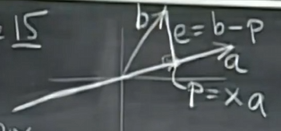
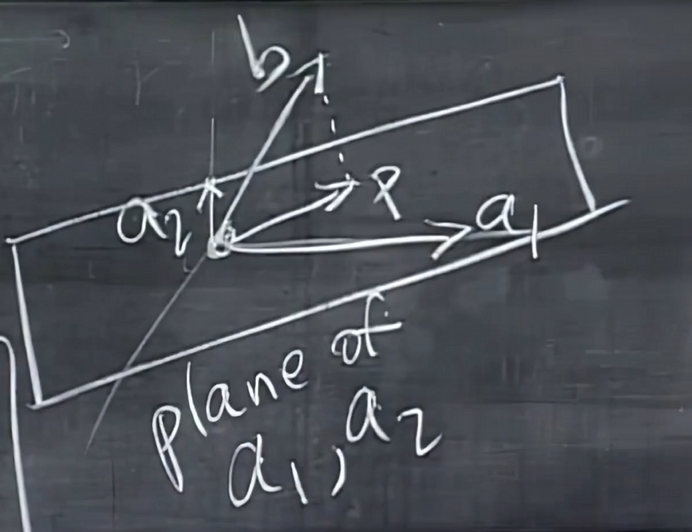
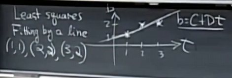
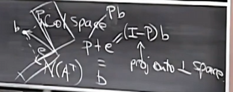

## 11. Matrix Spaces
$M$ = all 3 by 3 matrices,**dimension** = 9
subspace of $M$:
1. symmetric matrices 3 by 3,dimension = 6
2. upper triangular matrices 3 by 3, dimension = 6

**Basis** for $M$ = all 3 by 3 matrices 
$$
\begin{bmatrix}
1 & 0 & 0 \\
0 & 0 & 0 \\
0 & 0 & 0
\end{bmatrix}
$$
$$
\begin{bmatrix}
0 & 1 & 0 \\
0 & 0 & 0 \\
0 & 0 & 0
\end{bmatrix},
\begin{bmatrix}
0 & 0 & 1 \\
0 & 0 & 0 \\
0 & 0 & 0
\end{bmatrix}....
\begin{bmatrix}
0 & 0 & 0 \\
0 & 0 & 0 \\
0 & 0 & 1
\end{bmatrix}
$$
 
- $S\cup U $ = symmetric matrices + upper triangular = diagonal matrices 3 by 3, dimension{$S \cup U $} = 3
- $S \cap U $ is not a subspace of $M$
- $S + U $ = any elements of $S$ + any elements of $U$ ,it is a vector space = **all** 3 by 3 matrices,
dim($S + U$) = 9 = dim($M$)
- dim($S$) + dim($U$) = 6+6= 12 = dim($S$ + $U$) + dim($S$ $\cup$ $U$)= 9+3=12

#### differential equations:
$$
\frac{d^2y}{dx^2} +y = 0,
$$
$$
y = cosx, sinx, e^{ix}
$$ 
The complete solution is a **vector space** : 
$$
y = c_1cosx + c_2sinx 
$$
one of the basis of the vector space is $cosx, sinx$,dim(solution space) = 2,but $e^{ix}$ and $e^{-ix}$ are also solutions.
> the future of differential equations

$$
\begin{bmatrix}
1 & 4 & 5 \\
2 & 8 & 10 \\
\end{bmatrix}
$$
dimC(A) = 1 = dimC($A^T$) = 1
rank(A) = 1
$$
A = 
\begin{bmatrix}
1  \\
2  \\
\end{bmatrix}
\begin{bmatrix}
1 & 4 & 5 \\
\end{bmatrix}
$$
$$
A = U V^T
$$
- every matrix can be written as a product of some rank(1)matrix

**example**:a 5 by 17 rank(4) matrix can be written as a product of 4 rank(1) matrix

$M$ is all 5 by 17 matrix

subset of a rank 1 matrix is not a subspace 

In $R^4$,
$$
v =
\begin{bmatrix}
v_1 \\
v_2 \\
v_3 \\
v_4 \\
\end{bmatrix} 
$$
S = all vectors in $R^4$ with $v_1 + v_2 + v_3 + v_4 = 0$, 
rank = 1 ,dim = 3  
S = nullspace of A,$Av=0$,A =
$$
\begin{bmatrix}
1 & 1 & 1 & 1 \\
\end{bmatrix}
$$
n = 4, rank(A) = 1,dim(A) = 3
Basis for S =
$$
\begin{bmatrix}
-1 \\
1 \\
0 \\
0 \\
\end{bmatrix},
\begin{bmatrix}
-1 \\
0 \\
1 \\
0 \\
\end{bmatrix},
\begin{bmatrix}
-1 \\
0 \\
0 \\
1 \\
\end{bmatrix}
$$

- column space for A :
  - r = 1, C(A) = $R^1$ 
  - 3+1=4 = n
  - 1+0=1 = m
  - N($A^T$)={0}

#### small world graphs
- Graph = {nodes,edges} 

## 12. Graphs and Networks ,Incidence Matrices,Lirchhoff's Law

- nodes = n = 4
- edges = m = 5

NODE 1 2 3 4 
EDGE 
1
 2
  3
   4
    5

$$
A =
\begin{bmatrix}
-1 & 1 & 0 & 0  \\
0 & -1 & 1 & 0  \\
-1 & 0 & 1 & 0  \\
-1 & 0 & 0 & 1  \\
0 & 0 & -1 & 1  \\
\end{bmatrix}
$$
描述了问题的拓扑结构，rank(A) = 3
- N(A) = {0}
Ax = 0:
$$
Ax=
\begin{bmatrix}
x_2 - x_1 \\
x_3 - x_2 \\
x_3 - x_1 \\
x_4 - x_1 \\
x_4 - x_3 \\
\end{bmatrix}
=
\begin{bmatrix}
0 \\
0 \\
0 \\
0 \\
0 \\
\end{bmatrix}
$$
it shows the pontential of the nodes
$$
x = c
\begin{bmatrix}
1 \\
1 \\
1 \\
1 \\
1 \\
\end{bmatrix}
$$
potential of the nodes is caused by one of the nodes,if one node is c volt,the other nodes are c volt.

$$
A^T y = 0,dimN(A^T)?
$$
$$
A^Ty = 
\begin{bmatrix}
-1 & 0 & -1 & -1 & 0 \\
1 & -1 & 0 & 0 & 0 \\
0 & 1 & 1 & 0 & -1 \\
0 & 0 & 0 & 1 & 1 \\
\end{bmatrix}
\begin{bmatrix}
y_1 \\
y_2 \\
y_3 \\
y_4 \\
y_5 \\
\end{bmatrix}=
\begin{bmatrix}
0 \\
0 \\
0 \\
0 \\
\end{bmatrix}
$$
y is the current in the edges,$A^Ty = 0$ is **KCL**
first row: $-y_1 - y_3 - y_4 = 0$ means **in equals out**

Basis for N($A^T$) ：
$$
\begin{bmatrix}
1 \\
1 \\
-1 \\
0 \\
0 \\
\end{bmatrix},
\begin{bmatrix}
0 \\
0 \\
1 \\
-1 \\
1 \\
\end{bmatrix}
$$
- indepedent equals loops
$$
dimN(A^T) = m-r
loops = edges - (nodes - 1)
\Longrightarrow
$$
#### Eular's formula:
$$
nodes + loops - edges = 1
$$
 
 ----------------
core points:
$$
e=Ax,y=Ce,A^Ty=f
$$
most important equation:
$$
A^TCAx = f
$$

## 13. Review
1. 
$$
B  = 
\begin{bmatrix}
U \\
2U \\
\end{bmatrix}
$$
Echelon form?
$$
\begin{bmatrix}
U \\
0 \\
\end{bmatrix}
$$
2. 
$$
C =
\begin{bmatrix}
U & U \\
U & 0 \\
\end{bmatrix}
$$
Echelon form?
$$
\begin{bmatrix}
U & 0 \\
0 & U \\
\end{bmatrix}
$$
3.
3.1. 
$$
Ax = 
\begin{bmatrix}
2 \\
4 \\
2 \\
\end{bmatrix},
x= 
\begin{bmatrix}
2 \\
0 \\
0 \\
\end{bmatrix}+ c 
\begin{bmatrix}
1 \\
1 \\
0 \\
\end{bmatrix}+ d
\begin{bmatrix}
0 \\
0 \\
1 \\
\end{bmatrix}
$$
A?
answer:
dim N(A) = 2
$$
A =
\begin{bmatrix}
1 & -1 & 0 \\
2 & -2 & 0 \\
1 & -1 & 0 \\
\end{bmatrix}
$$

3.2.  Ax=b can be solve if?
answer : b is in the column space of A
b has the form of 
$$
c
\begin{bmatrix}
1 \\
2 \\
1 \\
\end{bmatrix}
$$
.....

## 14. Orthogonal Vectors and Subspaces
- $X^Ty=0$ equals to X and y are **orthogonal**
- orthogonal subspace: 
  1. row space of A is orthogonal to the nullspace of A

Q: Ax=b,what is the solution, when there is **no** solution?
$$
A^TA\hat{x} = A^Tb
$$
$N(A^TA)$= N(A),rank of A = rank of $A^TA$
$A^TA$ is invertible, only if A is full rank

## 15. Projections

- $a^T(b-xa)=0$
$$
 x =\frac{a^Tb}{a^Ta}$$
$$
 P = a\frac{a^Tb}{a^Ta}
$$
- P is a projection matrix， n by n
$$
 Projection Matrix = a\frac{a^T}{a^Ta}
$$
- the column space of P is a line through a,rank = 1
    - P is symmetric, $P^T = P$  
    - $P^2 = P$
### Q:Why project?
Because Ax=b may have not solution , so solve the **closest** solution.
Ax always in the column space of A, but b may not .
So solve Ax = P, P is the projection of b in the column space of A
best possible solution of Ax=b is $\hat{x}$

1. WHAT IS THE PLANE?
$a_1 ,a_2$ are the basis of the plane，they are not to be orthogonal,but independent
2. How to project b to the plane?How to find the projection matrix?
It must be 
$$
\begin{bmatrix}
a_1 & a_2 \\
\end{bmatrix}
$$
so 
$$
P = \hat{x_1}a_1 + \hat{x_2}a_2 = A\hat{x}
$$
Key: $e = b-A\hat{x}$ is orthogonal to the plane
so 
$$
a_1^Te = 0,a_2^Te = 0
$$
$$
\begin{bmatrix}
a_1^T \\
a_2^T \\
\end{bmatrix}(b-A\hat{x}) =
\begin{bmatrix}
0 \\
0 \\
\end{bmatrix},
A^T(b-A\hat{x}) = 0
$$
so e in N($A^T$),so e $\perp$ C(A)

SO:
1. $\hat{x} = (A^TA)^{-1}A^Tb$
2. $P = A\hat{x}   =  A(A^TA)^{-1}A^Tb$
3. matrix $P = A(A^TA)^{-1}A^T$
> Check: $P^2 = P$
> $P^2 = A(A^TA)^{-1}A^TA(A^TA)^{-1}A^T = A(A^TA)^{-1}A^T = P$

### 15.2 Application:
习题

FIT some points to a line
- C+D=1
C+2D=2
C+3D=2
matrix : Ax=b
$$
A =
\begin{bmatrix}
1 & 1 \\
1 & 2 \\
1 & 3 \\
\end{bmatrix},x=
\begin{bmatrix}
C \\
D \\
\end{bmatrix},b=
\begin{bmatrix}
1 \\
2 \\
2 \\
\end{bmatrix}
$$

## 16. Projections, Least Squares
$$
P = A(A^TA)^{-1}A^T
$$
IF b is in the column space of A, then $Pb=b$
IF b is $\perp$ the column space of A,$ Pb = 0$

[tap here](#my-anchor)
goal: minimize $||b-A\hat{x}||^2= ||e||^2
= e_1^2 + e_2^2 + e_3^2$

$$
e = b-A\hat{x} = b-Pb = (I-P)b
$$
1. find 
$$
\hat{x} = 
\begin{bmatrix}
\hat{C} \\
\hat{D} \\
\end{bmatrix},P
$$
$$
A^TA\hat{x}= A^Tb
$$
$$
A^TA =
\begin{bmatrix}
1 & 1 & 1 \\
1 & 2 & 3 \\
\end{bmatrix}
\begin{bmatrix}
1 & 1 \\
1 & 2 \\
1 & 3 \\
\end{bmatrix}
= 
\begin{bmatrix}
3 & 6 \\
6 & 14 \\
\end{bmatrix}
$$
$$
3C + 6D = 5,
6C + 14D = 11
$$
get the **nomal equation**
$$
D= \frac{1}{2},C = \frac{2}{3}
$$
the line:
$$
y = \frac{2}{3} + \frac{1}{2}t
$$
so 
$$
e_1 = -\frac{1}{6},e_2 = \frac{2}{6},e_3 = -\frac{1}{6}
$$
final answer:
$$
A^TA\hat{x} = A^Tb,
P = A\hat{x}
$$

### pROVE: 
If a has indepedent calumns, then $A^TA$ is invertible
1. a matrix is invertible if and only if 
its nullspace is {0}
so :
$$
A^TAx = 0
$$
IDEA: $A^TAx = 0$ means $x^TA^TAx = 0$,means
$$
(Ax)^T(Ax) = 0 \Longrightarrow Ax = 0
$$
and A has independent columns ,so x = 0
    - Proved

## 17. Orthogonal basis and matrix, Gram-Schmidt
- basis: $q_1,q_2,q_3$ are orthogonal
so : 
$$
q_i^Tq_j = \begin{cases}
1 & i=j \\
0 & i \neq j \\
\end{cases}
$$
$$
Q = 
\begin{bmatrix}
q_1 & q_2 & q_3 &...& q_n\\
\end{bmatrix}
$$
$$
Q^TQ = 
\begin{bmatrix}
q_1^T \\
q_2^T \\
q_3^T \\
... \\
q_n^T \\
\end{bmatrix}
\begin{bmatrix}
q_1 & q_2 & q_3 &...& q_n\\
\end{bmatrix}
= I
$$
Q is **orthogonal matrix**
If Q is square, then $Q^TQ$ = I, tells us $Q^T = Q^{-1}$

EXAMPLE:
1. 
$$
perms Q = 
\begin{bmatrix}
0&0&1 \\
1&0&0 \\
0&1&0 \\
\end{bmatrix},
Q^T = 
\begin{bmatrix}
0&1&0 \\
0&0&1 \\
1&0&0 \\
\end{bmatrix}
$$
$$
Q^TQ = I
$$
2.
$$
Q =\frac{1}{2}
\begin{bmatrix}
1&1&1&1 \\
1&-1&1&-1 \\
1&1&-1&-1 \\
1&-1&-1&1 \\
\end{bmatrix}
$$

Advantage of orthogonal matrix:
1. if Q has orthogonal columns, projects onto its columns space 
$P = 
P = Q(Q^TQ)^{-1}Q^T = QQ^T=I$if Q is square
2. $(QQ^T)(QQ^T) = QQ^T$
3. $A^TA\hat{x} = A^Tb$,now A is Q
  so $Q^TQ\hat{x} = Q^Tb$
  so $\hat{x} = Q^Tb$
  so $\hat{x_i}= $
  $$
  q_i^Tb
  $$
### Gram-Schmidt
- independent vectors a,b;$\rightarrow$ orthogonal vectors A,B;then $\rightarrow$ orthogonal basis
1. choose A = a
2. $$
B =b- \frac{A^Tb}{A^TA}A
$$
3. $q_1 = \frac{A}{||A||},q_2 = \frac{B}{||B||}$

- a,b,c are independent vectors
1. as a,b find $q_1,q_2$
2. $$
C = c - \frac{A^Tc}{A^TA}A - \frac{B^Tc}{B^TB}B
$$
3. $q_3$ = $\frac{C}{||C||}$
  
$$
A = QR
$$
> 这鸟人在说什么

## 2.18 determinants
- det(A)  is for square matrices
- det(A) = 0 means A is singular, i.e. not invertible

1. det(I) = 1
2. exchange matrix,det= 1 or -1,depends on number of exchanges
   1. $$\begin{bmatrix} 0&1 \\ 1&0 \end{bmatrix}=-1$$
   2. $$\begin{bmatrix} 0&1 \\ 1&1 \end{bmatrix}=1$$ 
   3. $$\begin{bmatrix} a&b \\ c&d \end{bmatrix}=ad-bc$$
3.  
    1. $$\begin{bmatrix} ta&tb \\ c&d \end{bmatrix}=t \begin{bmatrix}a&b \\ c&d \end{bmatrix}   $$
    2. $$\begin{bmatrix} a+a'&b+b' \\ c&d \end{bmatrix}=\begin{bmatrix}a&b \\ c&d \end{bmatrix}+ \begin{bmatrix}a'&b' \\ c&d \end{bmatrix}$$
4. if two rows are equal, det=0
5. Subtracting a multiple of one row from another **does not** change the determinant
6. row of zeros, det=0
7. triangular matrix, det=product of diagonal elements,product of pivots
$$
\begin{bmatrix} d_1&*&* \\ 0&d_2&* \\0&0&d_3 \end{bmatrix}=d_1d_2d_3
$$ 

8. det A = 0 when A is singular,det A not zero when A is invertible

9. det AB = det A det B,det $A^{-1}$ = $\frac{1}{detA}$, if $AA^{-1}=I$,$detA det A^{-1}=1$
10. $det A = det A^T$
   PROVE:  

## 2.19 Formula for the determinant
1. det I = 1
2. $$\begin{bmatrix} 0&1 \\ 1&0 \end{bmatrix}=-1$$
SO:
$$
\begin{bmatrix} a&b \\ c&d \end{bmatrix}= 
\begin{bmatrix} a&0 \\ c&d \end{bmatrix}+
\begin{bmatrix} 0&b \\ c&d \end{bmatrix}=
$$
$$
\begin{bmatrix} a&0 \\ c&0 \end{bmatrix}+
\begin{bmatrix} a&0 \\ 0&d \end{bmatrix}+
\begin{bmatrix} 0&b \\ c&0 \end{bmatrix}+   
\begin{bmatrix} 0&b \\ 0&d \end{bmatrix}= ad-bc
$$
FOr 3x3 matrix:
$$
\begin{vmatrix} 
a_{11}&a_{12}&a_{13} \\
a_{21}&a_{22}&a_{23} \\
a_{31}&a_{32}&a_{33}
\end{vmatrix}=
$$
$$
\begin{vmatrix}
a_{11}&0&0 \\
0&a_{22}&0 \\
0&0&a_{33}
\end{vmatrix}+
\begin{vmatrix}
a_{11}&0&0 \\
0& 0& a_{23} \\
0&a_{32}&0
\end{vmatrix} +
\begin{vmatrix}
0&a_{12}&0 \\
a_{21}&0&0 \\
0&0&a_{33}
\end{vmatrix}+...
$$

$=a_{11}a_{22}a_{33}-a_{12}a_{23}a_{32}$
(minus means exchange)
$- a_{12}a_{21}a_{33}$.....

SO:
$$
detA = \sum_{n!terms}\pm a_{1\alpha}a_{2\beta}a_{3\gamma}...a_{n\omega}
$$
$
(\alpha ,\beta,\gamma,...,\omega)$ = perm of (1,2,3,...,n)

EXAMPLE:
$$
\begin{vmatrix}
0 & 0 & 1 & 1 \\ 
0 & 1 & 1 & 0 \\
1 & 1 & 0 & 0 \\
1 & 0 & 0 & 1
\end{vmatrix}=
$$
$$
(4,3,2,1)\rightarrow +1,(3,2,1,4)\rightarrow -1
$$
so det = 0,the matrix is singular

### Cofactor expansion(代数余子式展开)
$$
det = a_{11}(a_{22}a_{33}+ a_{23}+a_{32})+a_{12}(...) + a_{13}(...) +...
$$
$$
\begin{vmatrix}
a_{11}&O&O \\
O&a_{22}&a_{23} \\
O&a_{32}&a_{33}
\end{vmatrix}+ 
\begin{vmatrix}
O&a_{12}&O \\
a_{21}&O&a_{23} \\
a_{31}&O&a_{33}
\end{vmatrix}+
\begin{vmatrix}
O&O&a_{13} \\
a_{21}&a_{22}&O \\
a_{31}&a_{32}&O
\end{vmatrix}
$$
Cofactor of $a_{ij}$ is $C_{ij}$ = $(-1)^{i+j}M_{ij}$

$M_{ij}$ is the minor of $a_{ij}$,which is the determinant of the matrix obtained by deleting the i-th row and j-th column of A

## 2.20 Applications of determinants
$$
\begin{bmatrix}
a & b \\
c & d
\end{bmatrix}^{-1}= 
\frac{1}{ad-bc}
\begin{bmatrix}
d & -b \\
-c & a
\end{bmatrix}
$$
d is the Cofactor of a , -b is the Cofactor of B,

SO:
$$
A^{-1} = \frac{1}{detA}C^T
$$
> C: Cofactor matrix

Prove: 
$$
AC^T = (detA)  I
$$
$$
\begin{bmatrix}
a_{11} & ... & a_{1n} \\
... & ... & ... \\
a_{n1} & ... & a_{nn}
\end{bmatrix}
\begin{bmatrix}
c_{11} & ... & c_{n1} \\
... & ... & ... \\
c_{1n} & ... & c_{nn}
\end{bmatrix}= 
\begin{bmatrix}
detA & 0 & 0 \\
0 & detA & 0 \\
0 & 0 & detA
\end{bmatrix}
$$
Qustion: Why is the Cofactor from row two plus row one equal to zero?
- 
$$
Ax=b
$$
$$
x = A^{-1}b = \frac{1}{detA}C^Tb
$$
### Cramer's rule
$$
x_1 = \frac{detB_1}{detA},
x_j = \frac{detB_j}{detA}
$$
$$
B_1 = \begin{bmatrix}
b & (\text{n-1 columns of A})
\end{bmatrix}
$$
expand the determinant along the first column
$$
det B_1 = b_{11}C_{11}+ b_{21}C_{21}+...+b_{n1}C_{n1}
$$
$B_j$ = A with the j-th column replaced by b

EXAMPLE:

det A = volumn of a box
build a 3 by 3 box with sides $a_1,a_2,a_3$
- if A is I , the box is a cube with volume 1,det A = 1
- if A is Q ,a (orthogomal )orthogonal matrix, the box is a cube with volumn $|a_1||a_2||a_3|$,det A = $|a_1||a_2||a_3|$,$Q^TQ=I$
- and other futures of det could be found in this way
- and for 2 by 2 matrix, det is the area of the parallelogram

## 2.21 Eigenvalues and eigenvectors
$$ 
Ax = \lambda x
$$
- if A is singular , $\lambda = 0$

What are x's and $\lambda$'s for projection matrix?
- any x in plane : $Px = x$, $\lambda = 1$
- any x perpendicular to plane: $Px = 0$, $\lambda = 0$

EXAMPLE: 
$$
A=
\begin{bmatrix}
0 & 1 \\
1 & 0
\end{bmatrix}
$$
1. 
$$
x = 
\begin{bmatrix}
1 \\
1
\end{bmatrix},Ax = 
\begin{bmatrix}
1 \\
1
\end{bmatrix},
\lambda = 1$$
2.
$$
x =
\begin{bmatrix}
1 \\
-1
\end{bmatrix},
Ax =
\begin{bmatrix}
-1 \\
1
\end{bmatrix},
\lambda = -1
$$
Fact : sum of eigenvalues = trace of A, product of eigenvalues = det A

How to solve $Ax = \lambda x$?
$$
(A-\lambda I)x = 0
$$
means A - $\lambda I$ is **singular**, and det(A - $\lambda I$) = 0,find $\lambda$ first

EXAMPLE:
$$
A=
\begin{bmatrix}
3 & 1 \\
1 & 3
\end{bmatrix}
$$
$$
det(A-\lambda I) =
\begin{vmatrix}
3-\lambda & 1 \\
1 & 3-\lambda
\end{vmatrix} = (3-\lambda)^2-1 = 0
$$
$$
\lambda_1 = 2, \lambda_2 = 4
$$
$$
x_1 = 
\begin{bmatrix}
1 \\
1
\end{bmatrix},
x_2 =
\begin{bmatrix}
1 \\
-1
\end{bmatrix}
$$

EXAMPLE: Q = 90 degree rotation
$$
Q =
\begin{bmatrix}
0 & -1 \\
1 & 0
\end{bmatrix}
$$
- trace = 0, det = 1 = $\lambda_1\lambda_2$
$$
det(Q-\lambda I) = \lambda^2 + 1 = 0
\lambda_1 =  i, \lambda_2 = -i
$$
- no real eigenvalues, but complex eigenvalues
- conjugate pairs of eigenvalues means the matrix is reversible
> conjugate ， 共轭的

EXAMPLE: A = 2 by 2 matrix
$$
A =
\begin{bmatrix}
3 & 1 \\
0 & 3
\end{bmatrix},det (A-\lambda I) = 
\begin{vmatrix}
3-\lambda & 1 \\
0 & 3-\lambda
\end{vmatrix} = (3-\lambda)^2 = 0
$$
$$
\lambda_1 = 3, \lambda_2 = 3
$$
find eigenvectors:
$$
(A-3I)x = 
\begin{bmatrix}
0 & 1 \\
0 & 0
\end{bmatrix}
\begin{bmatrix}
x \\ 
\end{bmatrix} = [0]
$$
$$
x_1 = 
\begin{bmatrix}
1 \\
0
\end{bmatrix}, x_2 =
\begin{bmatrix}
\textrm{degenerate}
\end{bmatrix}
$$
- degenerate means there is only one eigenvector,a shortedge of basis

## 2.22 Diagonalization of matrices
$$
A x = \lambda x
$$
$$
\star \star \star     S^{-1}AS = \Lambda
$$
1. suppose A has n independent eigenvectors
2. put them in columns of S
$$
AS = A 
\begin{bmatrix}
x_1 & x_2 & ... & x_n
\end{bmatrix} =
\begin{bmatrix}
\lambda_1 x_1 & \lambda_2 x_2 & ... & \lambda_n x_n
\end{bmatrix} 
$$
$$
= 
\begin{bmatrix}
x_1 & x_2 & ... & x_n
\end{bmatrix}
\begin{bmatrix}
\lambda_1 & 0 & ... & 0 \\
0 & \lambda_2 & ... & 0 \\
... & ... & ... & ... \\
0 & 0 & ... & \lambda_n
\end{bmatrix}
$$
$$
= S \Lambda
$$
we need to find the reverse of  $\Lambda$
$$
\Lambda = S^{-1}AS
$$
$$
A = S \Lambda S^{-1}
$$
- a matrix left multiply by S and right multiply by S inverse is a diagonal matrix
- what is the eigenvalue of A ?

if 
$$
A x = \lambda x
$$
$$
A^2 x = A(Ax) = A(\lambda x) = \lambda(Ax) = \lambda^2 x
$$
so the eigenvalue of $A^2$ is $\lambda^2$
and the eigenvalue of $A^k$ is $\lambda^k$
$$
A^2 = S \Lambda S^{-1} S \Lambda S^{-1} = S \Lambda^2 S^{-1}
$$
So 
$$
A^k = S \Lambda^k S^{-1}
$$
(only possible if S^-1 exists)

THROREM:
$$
A^k \rightarrow 0 \textrm{ as } k \rightarrow \infty \textrm{ if all } |\lambda_i| < 1
$$

A is sure to have n independent evectors (and be diagonaligable)
if all the $\lambda$'s are different(no repeated eigenvalues)

EXAMPLE:
$$
A =
\begin{bmatrix}
2 & 1 \\
0 & 2
\end{bmatrix}
$$
$$
A - 2I =
\begin{bmatrix}
0 & 1 \\
0 & 0
\end{bmatrix}
$$
$$
det (A-2I) = 0, \lambda_1 = 2, \lambda_2 = 2
$$
so A is not diagonalizable,don't have two independent eigenvectors

Equaton: $u_{k+1} = Au_k$ 
1. given the vector $u_0$
$$
u_1 = Au_0, u_2 = Au_1 = A^2u_0,...,u_k = A^ku_0
$$

To really solve : 
$$
u_0 = c_1 x_1 + c_2 x_2...+c_n x_n
$$
$$
Au_0 = c_1 \lambda_1 x_1 + c_2 \lambda_2 x_2 + ... + c_n \lambda_n x_n
$$
$$
A^ku_0 = c_1 \lambda_1^k x_1 + c_2 \lambda_2^k x_2 + ... + c_n \lambda_n^k x_n
= \Lambda^k S c
$$

Fibonacci example: 
$$
0,1,1,2,3,5,8,13,21,...
$$
$$
F_{100}=?
$$
Fibonacci rule:
$$
F_{k+2} = F_{k+1} + F_k,
F_k = F_k
$$

how to indicate $u_k$?
$$
u_k =
\begin{bmatrix}
F_{k+1} \\
F_k
\end{bmatrix},
u_{k+1} =
\begin{bmatrix}
\\
\end{bmatrix}u_k?
$$

$$
u_{k+1} =
\begin{bmatrix}
1&1 \\
1&0
\end{bmatrix}
\begin{bmatrix}
F_{k+1} \\
F_k
\end{bmatrix}= 
\begin{bmatrix}
F_{k+1}+F_k \\
F_{k+1}
\end{bmatrix}
$$
SO:

$$
A =
\begin{bmatrix}
1&1 \\
1&0
\end{bmatrix}
$$
$$
|A-\lambda I| =
\begin{bmatrix}
1-\lambda & 1 \\
1 & -\lambda
\end{bmatrix}= \lambda^2 - \lambda - 1 = 0
$$
solve it:
$$
\lambda_1 = \frac{1+\sqrt{5}}{2}, \lambda_2 = \frac{1-\sqrt{5}}{2}
$$
> what it means?

> eigenvalues rules the growth of the Fibonacci sequence

$$
F_{100} \approx \lambda_1^{100} = c_1 \frac{1+\sqrt{5}}{2}^{100}
$$
$$
(A-\lambda I )x=
\begin{bmatrix}
1-\lambda & 1 \\
1 & -\lambda
\end{bmatrix}
\begin{bmatrix}
\lambda \\
1
\end{bmatrix} = 0
$$

## 2.23 exponential $e^{At}$ of a matrix
EXAMPLE:
$$
\frac{du_1}{dt} = -u_1 + 2u_2
\frac{du_2}{dt} = u_1 - 2u_2
$$
$$
\rightarrow
A = 
\begin{bmatrix}
-1 & 2 \\
1 & -2
\end{bmatrix}
$$
1. find eigenvalues and eigenvector
 
observe,and find it is singular
$$
A - \lambda I =
\begin{bmatrix}
-1-\lambda & 2 \\
1 & -2-\lambda
\end{bmatrix}
$$

$\lambda$ = 0,-3,so one part of the solution is $e^{0t}$,the other part is $e^{-3t}$
$$
A + 3I =
\begin{bmatrix}
2 & 2 \\
1 & 1
\end{bmatrix}
$$
it is singular,so we need to find the eigenvector
$$
x_2 = 
\begin{bmatrix}
1 \\
-1
\end{bmatrix},Ax_2 = -3x_2
$$

SO:
solution is two pure exponentials
$$
u(t) = c_1 e^{\lambda_1t}x_1 + c_2 e^{\lambda_2t}x_2
\approx c_1 \lambda^{k}x_1 + c_2 \lambda^{k}x_2
$$
find c1 and c2 by initial conditions:
$$
u(0) =
\begin{bmatrix}
1 \\
0
\end{bmatrix}
$$

at t = 0:
$$
c_1 
\begin{bmatrix}
2 \\
1
\end{bmatrix}+ 
c_2
\begin{bmatrix}
1 \\
-1
\end{bmatrix} =
\begin{bmatrix}
1 \\
0
\end{bmatrix}
$$

$$
\begin{bmatrix}
  2&1 \\
   1&-1 
\end{bmatrix}
$$
is the **eigenvector matrix**, every column is an eigenvector
so actually is 
$$
Sc=u(0)
$$
so c1 = 1/3, c2 = 1/3

so the steady state is
$$
u_{\infty} = \frac{1}{3}
\begin{bmatrix}
2 \\
1
\end{bmatrix}
$$
1. Stability: $u(t) \rightarrow u_{\infty}$ as t $\rightarrow \infty$
, we need $e^{\lambda t} \rightarrow 0$ as t $\rightarrow \infty$,means $\lambda < 0$
2. steady state: $\lambda_1 = 0$ means steady state and other $\lambda<0 $ 
3. blow up: any $\lambda > 0$ means blow up

example: 2 by 2 matrix
$$
A =
\begin{bmatrix}
a & b \\
c & d
\end{bmatrix}
$$
trace = a+d = $\lambda_1 + \lambda_2$<0
> but it could not be sure that the matrix is stable, as an example:,it could have one stable part and another blows up

det > 0($\lambda_1 \lambda_2$)

$$
\frac{du}{dt} = Au
$$
goal : uncouple the equations,means diagonalize A
$$
 \frac{dv}{dt} = S^{-1} A S v = \Lambda v
$$
GOAL: find $e^{At}$
$$
v(t) = e^{\Lambda t}v(0)
$$
$$
u(t) = S e^{\Lambda t}S^{-1}u(0) = e^{At}u(0)
$$
> A is a matrix~

#### Matrix exponential:
- identity : expand it 
$$
e^{At} = S e^{\Lambda t} S^{-1}
$$
it means 
$$
e^{At} =
I + At + \frac{A^2t^2}{2!} + \frac{A^3t^3}{3!} + ...
$$
> talyor series

for matrix:
$$
(I-At)^{-1} = I + At + A^2t^2 + A^3t^3 + ...
$$
> if t is small, we could use the first two terms to approximate the result

Prove:
$$
u(t) = S e^{\Lambda t}S^{-1}u(0) = e^{At}u(0)
$$
> hope to compute $e^{At}$ from S and $\Lambda$

SO
$$
e^{At} = I + At + \frac{A^2t^2}{2!} + \frac{A^3t^3}{3!} + ...
= I + S \Lambda S^{-1}t + \frac{S \Lambda^2 S^{-1}t^2}{2!} + \frac{S \Lambda^3 S^{-1}t^3}{3!} + ...
$$

$$
= S (e^{\Lambda t}) S^{-1}
$$
> assumption: A could be diagonalized

$$
e^{\Lambda t} = =
\begin{bmatrix}
e^{\lambda_1 t} & 0 & ... & 0 \\
0 & e^{\lambda_2 t} & ... & 0 \\
... & ... & ... & ... \\
0 & 0 & ... & e^{\lambda_n t}
\end{bmatrix}
$$
if it is steady state, means $\lambda$ is real and **negative**

#### EXAMPLE:

$$
y'' +by' + ky = 0
$$
how to turn it into a 2 by 2 first order system?
$$
u = 
\begin{bmatrix}
y' \\
y
\end{bmatrix}
$$

$$
u' =
\begin{bmatrix}
y'' \\
y'
\end{bmatrix}=
\begin{bmatrix}
-b & -k \\
1 & 0
\end{bmatrix}
\begin{bmatrix}
y' \\
y
\end{bmatrix}
$$

## 2.24 Markov matrices
- What is a Markov matrix?
   1.  all entries are non-negative
   2.  each column adds up to 1
$$
A = 
\begin{bmatrix}
0.1 & 0.01 & 0.3 \\
0.2 & 0.99 & 0.3 \\
0.7 & 0.0 & 0.4
\end{bmatrix}
$$
- What is the meaning of a Markov matrix?
   1. $\lambda = 1 $is an eigenvalue 
   2.  All other eigenvalues are less than 1, $ |\lambda_i |$
   $$
   u_k = A^k u_0= c_1 \lambda_1^k x_1 + c_2 \lambda_2^k x_2(\text{goes to zero}) + ... + c_n \lambda_n^k x_n(\text{goes to zero})
   $$
   so $x_1$ part is the steady state
Prove:
$$
A - 1I =
\begin{bmatrix}
-0.9 & 0.01 & 0.3 \\
0.2 & -0.01 & 0.3 \\
0.7 & 0.0 & -0.6
\end{bmatrix}
$$
it needs to be singular, so we can calculate the det, another way is to add up the rows, it should be **zero**
prove the second part:
because $(1,1,1)$ is in the n(A^T)  

