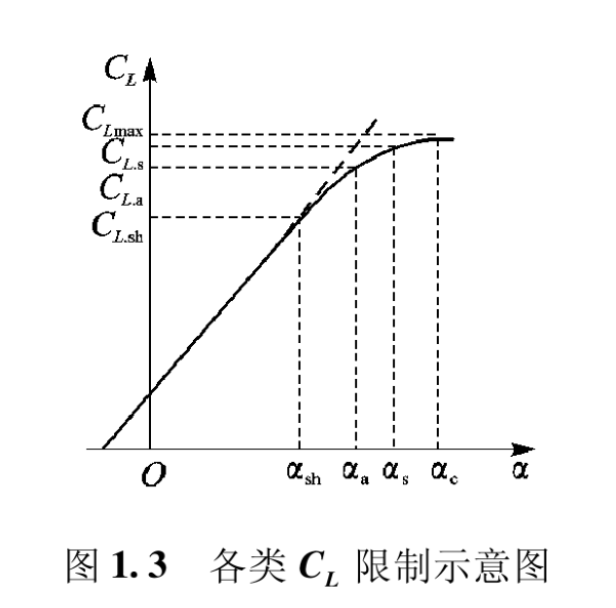
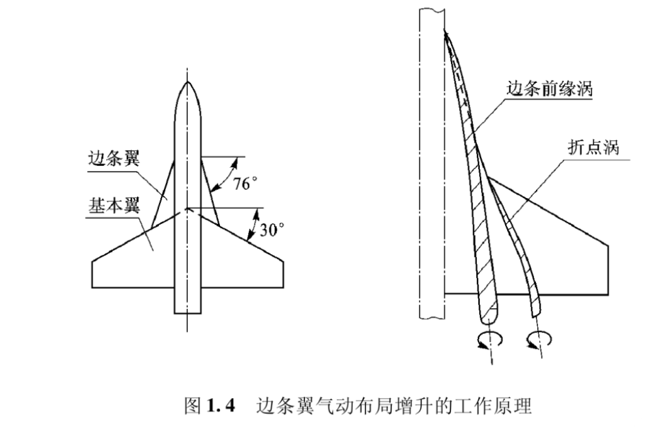
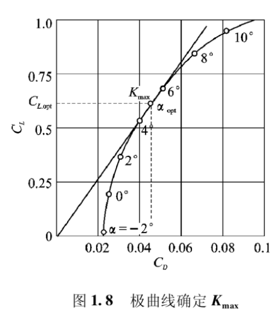
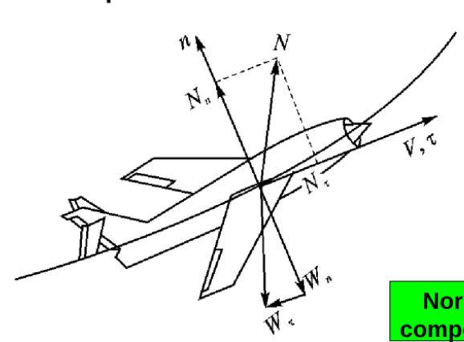
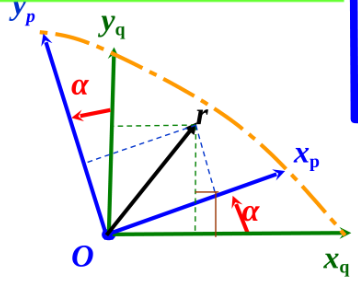
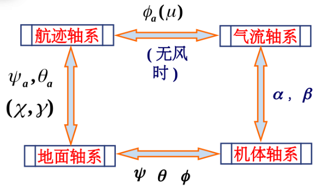

# 1. 飞行器质心运动方程
- 绪论
    - 外力：
         - 重力W
         - 空气动力 升力 L 阻力 D 侧力Cs
         - 推力 T

## 1.1 作用在飞行器上的外力
### 1.1.1 气动力
- 气动力一般公式
$$
\begin{array}{l}
L &= \frac{1}{2} \rho V^2 S C_L \\
D &= \frac{1}{2} \rho V^2 S C_D \\
C &= \frac{1}{2} \rho V^2 S C_C
\end{array}
$$
- 给定飞行状态
  $$ C_L = C_{L.wb}+ C_{L.ht}+ C_{L.\delta}$$
- 便于分析 
  $$ C_L =C_{L\alpha} (\alpha - \alpha_0)$$
> 升力线斜率仅在失速迎角前适用

### 1.1.1.2 阻力特性
- 阻力特性:分为零升阻力和升致阻力
  $$ C_D =C_{D0} + C_{Di} =C_{D0} + A C_L^2$$
### 1.1.1.3 升阻比
- $ K =\frac{C_L}{C_D}$
- 重要参数： $K_{max}$ ,$ \alpha_{opt}$, $C_{L.opt}$
 
- $ C_{L.opt} 为最大升力系数, C_{L.opt}= \sqrt{\frac{C_{D0}}{A}}$
  - $ K_{max} = \frac{2}{\sqrt{C_{D0}A}}$
  - 当$ C_{D0}$ 增加10%时，$K_{max}$降低5%，$ C_{L.opt}$ 增大5%
  - 一般希望$K_{max}$越大越好
### 1.1.2 发动机的推力
- 发动机分类。。。
- 推力表达式
  - 喷气式发动机：$$ T = m'(V_j-V_i)$$
  - 功率式发动机：$$ P_c = P + TV/ \eta$$
     - $\eta$ 为螺旋桨效率,近似取0.8 
## 1.2 飞行器的操纵
### 1.2.1 常规飞机

$$
\begin{array}{l}
\\ N_n = A_n + T_n \quad 
\\ A_n = L + C
\\ N_\tau = A_\tau + T_\tau = D + T_\tau
\end{array}
$$
- 轨迹的改变需要通过姿态的改变间接完成
- 大迎角时气动舵面效能明显不足
### 1.2.2 现代飞机
- 发动机矢量
### 1.2.3 导弹
- 不作滚转
## 1.3 常用坐标系及其转换
### 1.3.1 常用的坐标轴系
#### 1.3.1.1 地面坐标系
$$ o_gx_gy_gz_g$$
- $o_g$ 地面选择的某一固定点
- $o_gx_g$ 指向任意选定方向
- $o_gz_g$ 铅直向下
   > 常用NED
- $o_gy_g$ 由右手定则确定，与$o_gx_gz_g$平面垂直
特点：忽略地球自转和质心的运动曲线可看做惯性坐标系
与地面坐标系对应，还存在“牵连地面坐标系”
#### 1.3.1.2 机体坐标系
$$ ox_by_bz_b$$
- $o$ 为飞行器质心
- $ox_b$ 在飞机对称平面内，指向机头，一般与翼弦或机身轴线平行
- $oz_b$ 指向机头下方，与机翼平面垂直
- $oy_b$ 垂直飞机对称面，指向右翼为正

特点：与地面坐标系的角位置确定了飞机空中姿态
> 一般用来研究旋转
#### 1.3.1.3 半机体坐标系
$$ ox_iy_iz_i$$
> 介于机体坐标系和气流坐标系
- $o$ 为飞行器质心
- $ox_i$ 沿空速在飞机对称面上的投影方向
- $oz_i$ 位于飞机对称面，垂直于$ox_i$，向下为正
- $oy_i$ 垂直飞机对称面，指向右翼为正
#### 1.3.1.4 稳定坐标系
$$ ox_sy_sz_s$$
- $o$ 为飞行器质心
- $ox_s$ 沿**基准**空速在飞机投影面上的投影方向
- $oz_s$ 位于飞机投影面，垂直于$ox_s$，向下为正
- $oy_s$ 垂直飞机投影面，指向右翼为正
> 风洞实验用
#### 1.3.1.5 气流坐标系
$$ ox_ay_az_a$$
- $o$ 为飞行器质心
- $ox_a$ 始终指向空速方向
- $oz_a$ 位于飞机对称面，垂直于$ox_a$，向下为正
- $oy_a$ 右手定则确定
#### 1.3.1.6 航迹坐标系
$$ ox_ky_kz_k$$
- $o$ 为飞行器质心
- $ox_k$ 始终指向飞机地速方向
- $oz_k$ 位于包含$O_{Xk}$轴的铅垂面，垂直于$ox_k$，向下为正
- $oy_k$ 垂直$ox_k$，指向右翼为正
> 质心动力学方程在该坐标系下书写
> 飞行器状态始终为
$$
\begin{bmatrix}
v \\
0 \\
0
\end{bmatrix}
$$

### 1.3.2 坐标转换矩阵
#### 1.3.2.1 两个矢量坐标系间的转换

####  1.3.2.2. 平面坐标系各轴间的转换

$$
\begin{cases}
x_q = x_p \cos(\alpha) - y_p \sin(\alpha) \\
y_q = x_p \sin(\alpha) + y_p \cos(\alpha)
\end{cases}
$$

- 假设有一矢量 $r$，在两个原点重合的坐标系中的分量分别为 $(x_p, y_p)$，$(x_q, y_q)$。
则有：
$$
\begin{bmatrix}
x_q \\
y_q
\end{bmatrix}
=
\begin{bmatrix}
\cos(\alpha) & -\sin(\alpha) \\
\sin(\alpha) & \cos(\alpha)
\end{bmatrix}
\begin{bmatrix}
x_p \\
y_p
\end{bmatrix}
$$
$$
\begin{bmatrix}
x_q \\
y_q
\end{bmatrix}
=
\begin{bmatrix}
\cos(x_q, x_p) & \cos(x_q, y_p) \\
\cos(y_q, x_p) & \cos(y_q, y_p)
\end{bmatrix}
\begin{bmatrix}
x_p \\
y_p
\end{bmatrix}
$$
$$
\begin{bmatrix}
x_p \\
y_p
\end{bmatrix}
=
\begin{bmatrix}
\cos(\alpha) & \sin(\alpha) \\
-\sin(\alpha) & \cos(\alpha)
\end{bmatrix}
\begin{bmatrix}
x_q \\
y_q
\end{bmatrix}
$$
$$
\begin{bmatrix}
x_p \\
y_p
\end{bmatrix}
=
\begin{bmatrix}
\cos(x_p, x_q) & \cos(x_p, y_q) \\
\cos(y_p, x_q) & \cos(y_p, y_q)
\end{bmatrix}
\begin{bmatrix}
x_q \\
y_q
\end{bmatrix}
$$
由
$$
\begin{bmatrix}
x_q \\
y_q
\end{bmatrix}
=
\begin{bmatrix}
\cos(\alpha) & -\sin(\alpha) \\
\sin(\alpha) & \cos(\alpha)
\end{bmatrix}
\begin{bmatrix}
x_p \\
y_p
\end{bmatrix}
$$
令
$$
L_{qp} =
\begin{bmatrix}
\cos\alpha & -\sin\alpha \\
\sin\alpha & \cos\alpha
\end{bmatrix}
$$
则
$$
r_q = L_{qp} r_p
$$
$L_{qp}$ 为从坐标系 $p$ 到坐标系 $q$ 的坐标转换矩阵，即是这两个坐标系之间的方向余弦矩阵。
#### 1.3.2.3 三维坐标系间的转换
- 基元变换矩阵：
#### 1.3.3 常用坐标系关系

# 沟槽的南航 超星课程不全，就到这了