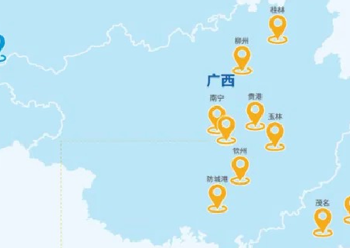
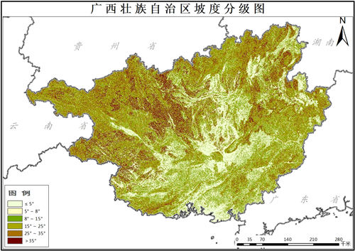
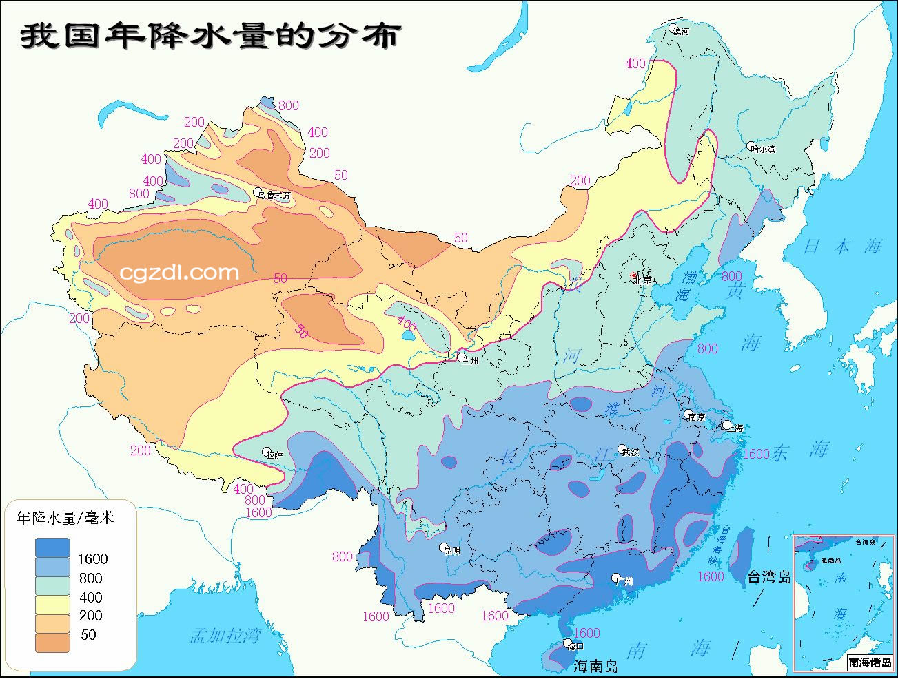
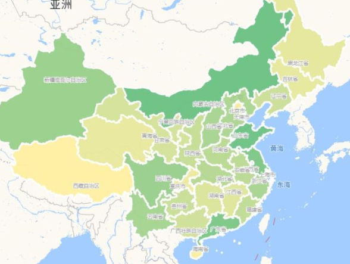
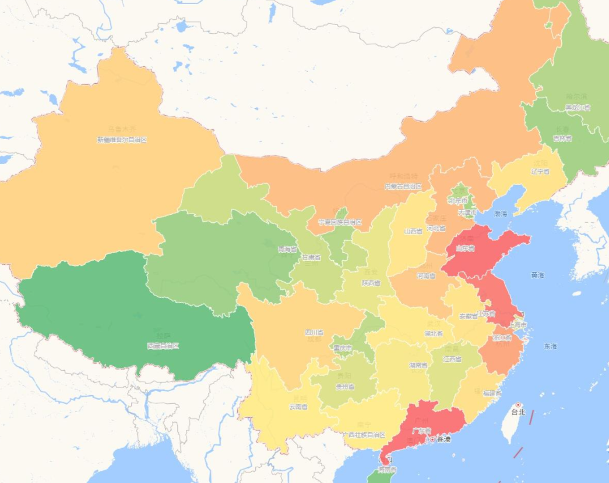

### Exploring Energy Storage

#### Abstract

Energy storage technologies are becoming crucial for balancing renewable energy supply and demand. This paper focuses on two widely used methods: electrochemical energy storage (like batteries) and pumped storage. While batteries are efficient and compact, pumped storage is more reliable for large-scale applications. This paper explores their advantages, challenges, and potential uses.

#### Introduction

Energy storage is key to ensuring a stable power supply as renewable energy sources, like wind and solar, grow. Two popular storage options are batteries (electrochemical storage) and pumped storage, which uses water reservoirs to store energy. This paper introduces these technologies, their features, and their practical applications.

1. **Electrochemical Storage**: Compact and responsive but expensive and environmentally demanding.
2. **Pumped Storage**: Reliable for large-scale needs but requires specific terrain and has high initial costs.
3. **Comparison**: A detailed look at their roles and challenges in energy storage.

#### Discussion

##### Electrochemical Energy Storage

Batteries, like lithium-ion, are everywhere—from phones to large energy grids. They work by storing energy chemically and releasing it as needed.

###### Advantages

1. **Compact and High Energy Density**: Batteries can store a lot of energy in a small space.
2. **Quick Response**: They quickly adapt to changes in energy demand.
3. **Flexible Use**: Batteries work well in various locations, including cities.
4. **Scalable**: Easily adjusted to fit small or large projects.

###### Disadvantages

1. **High Cost**: Batteries are expensive to produce and maintain.
2. **Environmental Impact**: Mining materials like lithium harms the environment.
3. **Safety Risks**: Overheating can cause fires or explosions.
4. **Limited Lifespan**: Batteries degrade over time, reducing efficiency.

##### Pumped Storage

Pumped storage is a simple concept: use electricity to pump water to a higher reservoir, then release it to generate power when needed. It’s been used for decades for large-scale energy storage.

###### Advantages

1. **Highly Efficient**: Converts up to 85% of stored energy back into electricity.
2. **Long Lifespan**: Facilities often last 40-60 years.
3. **Handles Large Energy Needs**: Perfect for stabilizing national grids.
4. **Proven Technology**: Decades of successful use worldwide.

###### Disadvantages

1. **Location Limits**: Needs specific geography—two reservoirs at different heights.
2. **High Upfront Costs**: Building dams and reservoirs is expensive.
3. **Environmental Impact**: Can disrupt ecosystems and communities.
4. **Slower Response**: Takes longer to adjust compared to batteries.

##### Comparison and Discussioncreate 


```markdown
### Fig.1 Proportion of Global Rated Power of Energy Storage Technologies

| Energy Storage Technology | Proportion (%) |
|---------------------------|----------------|
| Pumped Storage            | 95             |
| Electrochemical Storage   | 2.16           |
| Compressed Air Storage    | 0.79           |
| Flywheel Storage          | 0.51           |
| Liquid Air Storage        | 0.003          |
| Hydrogen Storage          | 0.011          |
| Thermal Storage           | 1.71           |
| Other                     | 5              |
```
It can be seen that pumped storage is the dominant energy storage method in China.

#### Key Metrics:&#x20;

Performance and Costs

| Storage Technology | Rated Power (MW) | Discharge Duration | Daily Self-Discharge Rate | Suitable Storage Period | Lifespan (Years) |
| ------------------ | ---------------- | ------------------ | ------------------------- | ----------------------- | ---------------- |
| Pumped Storage     | 100-5000         | Hours              | Very Low                  | Hours to Months         | 40-60            |
| Compressed Air     | 5-300            | Hours              | Low                       | Hours to Months         | 20-40            |
| Liquid Air         | 0.1-300          | Hours              | 0.5%-1%                   | Hours to Days           | 20-40            |
| High-Temp Thermal  | 0-60             | Hours              | 0.05%-1%                  | Minutes to Hours        | 5-15             |
| Lead-Acid Battery  | 0.05-8           | Seconds to Hours   | 0%-20%                    | Seconds to Hours        | 10-15            |

The table provides a comprehensive comparison of energy storage technologies, emphasizing the distinct advantages of pumped storage for large-scale, long-duration energy needs. Pumped storage systems can handle significant power capacities ranging from 100 MW to 5000 MW and have a long operational lifespan of 40-60 years. This makes them well-suited for stabilizing national grids and managing substantial energy demands over periods extending from hours to months. Additionally, their daily self-discharge rate is negligible, ensuring energy retention over extended durations.

In contrast, electrochemical storage systems like lead-acid batteries excel in situations requiring short-term energy solutions. With rated power capacities of 0.05 MW to 8 MW and discharge durations spanning seconds to hours, these systems are highly adaptable to urban and small-scale applications. However, their shorter lifespan of 10-15 years and higher self-discharge rates (up to 20%) limit their effectiveness for prolonged or large-scale use. Batteries are ideal for rapid deployment and flexibility but are less viable for addressing the energy storage challenges associated with large-scale renewable integration.

This contrast highlights the importance of tailoring energy storage solutions to specific needs, whether it is the long-term reliability offered by pumped storage or the rapid adaptability of electrochemical systems. Geographic constraints, cost considerations, and the intended application must guide the selection of the appropriate technology.

###### Land Use and Challenges


*Figure 1: Distribution of pumped storage in southern China.*



*Figure 2: Slope analysis of Guangxi, showing suitable terrains.*

Pumped storage systems depend on specific geographical conditions, particularly slopes in mountainous regions, to function efficiently. These slopes must strike a balance—being neither too steep nor too flat—to ensure feasibility. However, such suitable terrains are often categorized as habitable or arable land, and many of these areas have already been developed for residential or agricultural use. As a result, finding locations for new pumped storage facilities has become increasingly challenging, posing significant obstacles to expanding this technology. Additionally, the selection of suitable sites for pumped storage facilities often competes directly with locations identified for hydropower stations. Both require similar topographical conditions, such as access to significant elevation differences and reliable water sources. This overlap intensifies the challenge, as many of the optimal sites are already occupied by existing hydropower projects, further restricting opportunities for new pumped storage developments.

*Figure 3: Precipitation distribution across China, highlighting regions with significant rainfall.*

*Figure 4: Regional distribution of power generation in China, showing areas with high production capacity.*

*Figure 5: Regional distribution of power consumption across China, indicating areas with high electricity demand.*

China’s electricity-exporting provinces are primarily located in the northwest, a region characterized by low precipitation levels. This lack of consistent water sources creates significant challenges for establishing large-scale pumped storage facilities, which rely heavily on the availability of adequate water supplies. The northwest’s arid climate exacerbates this issue, as reservoirs in such regions often face high evaporation rates and insufficient replenishment from rainfall. Furthermore, competing demands for limited water resources—including agricultural irrigation and urban consumption—place additional strain on the feasibility of pumped storage projects. These factors collectively restrict the potential for implementing such systems, despite the region’s critical role in electricity production and exportation.

###### Environmental Impact

China is currently the world's largest producer and consumer of electric vehicles, as well as the leading producer and consumer of power batteries. According to recent data, China added approximately 387.7 GWh of new battery capacity in 2023, reflecting a 31.6% year-on-year increase (Wu et al., 2021). As the adoption of electric vehicles continues to grow, it is anticipated that the lifecycle of power batteries, typically spanning 5 to 8 yea, will lead to a significant wave of battery retirements in the coming years. Projections suggest that by 2025, China could face over 104 million tons of retired batteries, and this figure may increase to 350 million tons by 2030 (Chen et al., 2009).


These retired batteries, though no longer suitable for automotive applications, still retain sufficient capacity for reuse in energy storage systems. By repurposing them for electrochemical energy storage, these batteries can serve as a cost-effective resource for stabilizing the electrical grid while simultaneously mitigating the environmental impact of battery disposal. This approach not only offers a sustainable solution to address rising energy demands but also contributes to reducing the ecological footprint of battery waste.

While pumped storage may alter ecosystems, battery production involves extensive mining and waste, posing significant environmental risks. For large projects, pumped storage is usually less harmful overall.


#### Conclusion

Although pumped storage currently dominates large-scale energy storage due to its reliability and long lifespan, its costs are expected to continue rising due to limited suitable sites and increasing competition for land use. Conversely, the cost of electrochemical storage is projected to decline, driven by advancements in technology and the repurposing of retired batteries from the electric vehicle industry. With its flexibility and scalability, electrochemical storage has immense potential to address future energy demands. It is imperative to adopt a holistic approach when selecting energy storage solutions, carefully weighing factors such as cost, location, environmental impact, and the specific energy needs of the application.

#### References

1. Wu, D., Wang, J., Wei, Y., Yang, H., Zhang, L., & Huang, Z. (2021). Development Status and Application Prospects of Energy Storage Technology. *Tsinghua University, Institute of Power and Energy Engineering*.
2. Dunn, B., Kamath, H., & Tarascon, J.-M. (2011). Electrical Energy Storage for the Grid: A Battery of Choices. *Science, 334*(6058), 928-935.
3. BYD. (2021). BYD 2021 Annual Report. *BYD Company Limited*.
4. China Southern Power Grid. (2021). China Southern Power Grid 2021 Annual Report. *China Southern Power Grid Co., Ltd.*

