#  1. 绪论
>
> 1. 热工过程基本术语： 变量，内扰，外扰，设备单元 
> 2. 按信号馈送方式的系统分类有哪些， 结构形式， 方框图，原理
> 3. 开环控制 闭环控制 过渡形式 的四种基本形式
---
## 1.1 热工过程基本术语
### 1.1.1 常用术语：

1. 被控对象： 被控制的生产过程称为被控对象
2. 被调量（被控参数）： 表征生产过程是否符合**规定情况的物理量**称为被调量或者被控参数
3. 给定值： 希望被调量维持的数值称为给定值
> 在很多情况下，给定值是不变的， 但有些情况下给定值是按一定要求变化的
4. 扰动： 引起被调量变化的各种原因都称为扰动
5. 控制量（或调节量）：由控制（调节） 作用改变去**控制被调量变化**的物理量称为控制量（调节量）
6. 控制机构（调节机关）： 接受控制（调节）作用去改变控制量（调节量）的设备称为控制（调节）机构

### 1.1.2 设备单元
1. 测量单元：用来测定被调量，并把被调量转换为与之成比例（或其它函数关系）的某种便于传输和综合的信号
2. 给定单元：用来设定被调量的给定值，发出与测量信号同一类型的给定值信号
3. 调节单元：接受被调量信号和给定制信号比较后的偏差信号，发出一定规律的调节指令给执行器
4. 执行器：根据调节单元送来的调节指令去推动调节机构，改变调节量

## 1.2 按信号馈送方式的系统分类有哪些， 结构形式， 方框图，原理
### 1.2.1 分类 
#### 反馈控制系统
   * 被控量对控制系统有影响
   * **闭环控制** 信息传输构成了一个闭合回路
   * 优点： 稳定性好，精度高，抗扰动能力强
   * 缺点： 控制不即时
  
#### 前馈控制（开环控制）系统 

* 直接根据扰动决定控制效果，信息传输没有构成闭合回路
* **开环控制** 信息传输是单向的，被控量对控制没有影响的系统，信息传输没有构成闭合回路
* 优点： 构造简单，容易维护，成本低，无稳定性问题
* 缺点： 
  1.  稳定性差，抗扰动能力差
  2.  未知扰动出现时，便不能完成既定任务
   

  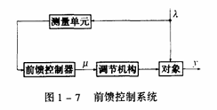

#### 前馈-反馈控制系统
* 由前馈控制和反馈控制两部分组成
 

  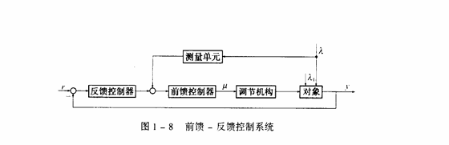

### 1.2.2 控制系统的方框图
1. 相加点符号： 
   两个信号的代数相加，且有相同量纲
2. 分支点符号：
   一个信号分成两个信号，送到两个地方

### 1.2.3 过渡过程基本形式
过渡过程： 当有扰动作用于控制系统时，控制系统的被调量发生变化，通过系统工作达到了新的平衡状态的过程
 **扰动**使用单位阶跃函数
1. 衰减震荡过程
   * 一段时间震荡后能收敛
2. 非周期过程
   * 没有震荡，一段时间后收敛
3. 等幅振荡
   * 此过程称为临界过程
4. 扩大震荡过程
   * 不能达到稳定，变化幅度越来越大
  

    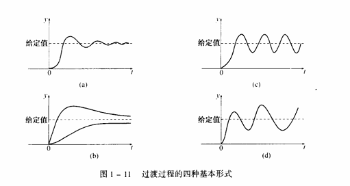

# 2， 线性自动控制系统的数学描述
> 1. 动态模型的三种描述形式 以**电路和水箱系统**为例 
> 2. laplace变换 以及某些规则（线性，实平移，微分，积分，初值终值定理
> 3. 传递函数的定义，性质，以及如何求解，利用反变换求阶跃输入下的输出响应 **P45 1-6行**
> 4. 求阶跃响应稳态值（条件 极点位于左半平面）
> 5. 一阶惯性环节 一阶实际微分环节，微分方程传递函数， 电路例子 **2-25，2-28**
> 6. 框图变换或梅森公式求传递函数 **讲例2-10 作业2-4 2-5（1） 2-6**

---

 ## 2.1 模型的描述形式
### 2.1.1. 系统的输出-输入描述
* 不考虑系统内部的状态x， 只建立输入u和输出y之间的关系
* 只涉及系统的端部特性，不涉及系统的内部特性
### 2.1.2 系统的输入-状态-输出描述
* 即为**状态空间描述**
* 考虑系统的状态x， 系统的输入u， 系统的输出y之间的关系
* 不但涉及系统的端部特性，还涉及系统的内部特性，是系统特性的完整表达
## 2.2 laplace变换

    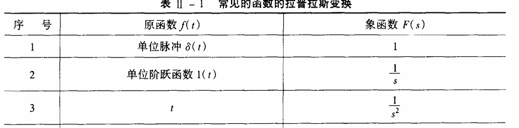
    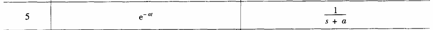
    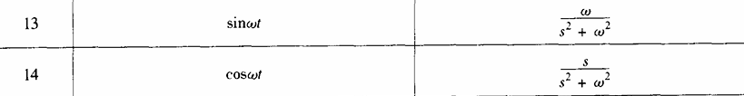

$\mathcal
{L}\{f(t)\}$
表示函数f(t)的laplace变换
#### 2.2.1 定义
$\mathcal{L}\{f(t)\} = F(s) = \int_0^\infty e^{-st}f(t)dt$
#### 2.2.2 运算规则
1. 线性性质： $\mathcal{L}\{af(t)+bg(t)\} = a\mathcal{L}\{f(t)\} + b\mathcal{L}\{g(t)\}$
2. 实平移性质： $\mathcal{L}\{f(t-t_0)\} = e^{-st_0}\mathcal{L}\{f(t)\}$
3. 复平移性质： $\mathcal{L}\{e^{at}f(t)\} = F(s-a)$
4. 微分性质： $\mathcal{L}\{f'(t)\} = sF(s) - f(0)$
5. 积分准则（零初始条件）： $\mathcal{L}\{\int_0^t f(\tau)d\tau\} = \frac{1}{s}F(s)$
   $\mathcal{L}\{\int_0^t \int_0^t f(\tau)d\tau\} = \frac{1}{s^2}F(s)$
6. 初值定理： $\lim_{t\to 0} f(t) = \lim_{s\to \infty} sF(s)$
7. 终值定理： $\lim_{t\to \infty} f(t) = \lim_{s\to 0} sF(s)$
> 终值定理表示了$\mathcal f(\tau) $的稳态值和$\mathcal sF(s)$在零点附近状态值之间的关系，仅当$\mathcal lim_{t\to \infty} sF(s)$存在时，终值定理才成立

> 初值和终值定理使用注意
> * 如果$\mathcal sF(s)$的所有极点位于左半s平面， 则$\mathcal \lim_{t\to \infty} f(t)$ 存在
> * 如果$\mathcal sF(s)$有极点位于虚轴上， 则$\mathcal \lim_{t\to \infty} f(t)$ 不存在， $\mathcal f(t)$ 包含震荡的或按指数规律增长的时间函数   、
> 如果$\mathcal f(t)$ 是正弦函数 $\mathcal \sin(\omega t)$, 将有位于虚轴上的极点，极限不存在

## 2.3 传递函数
### 2.3.1 定义
* **在零值初始条件下**，系统的输出响应与输入信号的laplace变换之比
$\mathcal  G(s) = \frac{Y(s)}{U(s)}$ = $\frac{\mathcal L\{y(t)\}}{\mathcal L\{u(t)\}}$
### 2.3.2 性质
1. 线性定常系统；
2. 复频域下的数学模型，表征系统动态特性
3. 系统本身属性，与输入信号无关
4. SISO系统，表达输入输出两个变量之间的联系。但不提供任何有关物理结构的信息、
5. 特征方程，零点，极点

### 2.3.3 零点和极点
* 传递函数的分母为关于s的n次多项式：$\mathcal G(s) = \frac{b_ms^m + b_{m-1}s^{m-1} + \cdots + b_1s + b_0}{a_ns^n + a_{n-1}s^{n-1} + \cdots + a_1s + a_0}$
* **特征多项式**：$\mathcal \Phi(s)  = a_ns^n + a_{n-1}s^{n-1} + \cdots + a_1s + a_0 $， 特征多项式的根称为**传递函数**的极点
* **传递函数的零点**： 使得传递函数的分子$ b_ms^m + b_{m-1}s^{m-1} + \cdots + b_1s + b_0 $为0的s值，称为传递函数的零点
* 分子的阶次不高于分母的阶次的传递函数称为 **正则传递函数**

### 2.3.4 求解传递函数
#### 解析法
1. 写出系统的微分方程
2. 假设初始条件为0， 对微分方程进行laplace变换
3. 求输出量$Y(s)$和输入量$U(s)$的关系

### 2.3.5 阶跃输入下的输出响应
* 阶跃输入：$1(t) = 1$
* 
单位阶跃函数的laplace变换为$\mathcal L\{1(t)\} = \frac{1}{s}$
所以输出响应为$\mathcal y(t) = \mathcal{L^{-1}} [{\frac{1}{s} \mathcal G(s)}] = h(t) $
### 2.3.6 阶跃响应的稳态值 
 稳态值： $\lim_{t\to \infty} y(t) = \lim_{s\to 0} s\mathcal G(s)$

## 2.4 基本环节和环节的连接方式
### 2.4.1 基本环节
1. 比例环节
传递函数为 $\mathcal G(s) = k = \frac{Y(s) }{U(s)} $
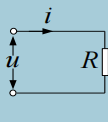

2. 积分环节
传递函数为 $\mathcal G(s) = \frac{1}{T_a s}$
$ T_a $ 为积分环节的积分时间
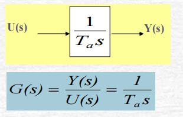
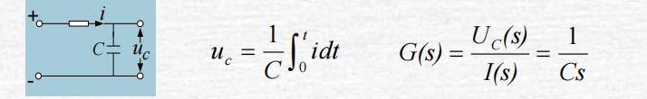
3. 微分环节
传递函数为 $\mathcal G(s) = T_ds$
$ T_d $ 为微分环节的微分时间
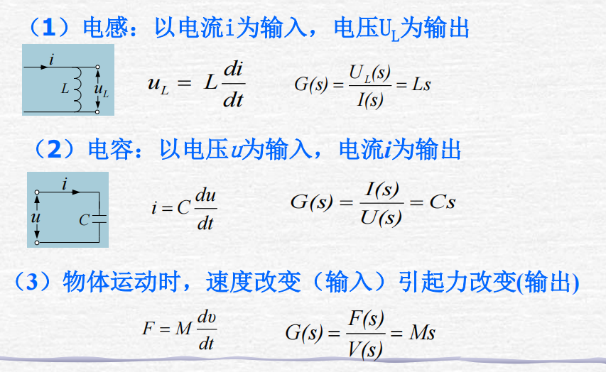
### 2.4.2 环节的连接方式
1. 串联连接
总的传递函数等于各个环节传递函数的乘积
$\mathcal G(s) = \mathcal G_1(s) \mathcal G_2(s) \cdots \mathcal G_n(s)$
2. 并联连接
总的传递函数等于各个环节传递函数的代数和
$\mathcal G(s) = \mathcal G_1(s) + \mathcal G_2(s) + \cdots + \mathcal G_n(s)$
3. 反馈连接
   1. 负反馈： 当输入信号$u$与反馈信号$u_f$相减时称为负反馈
   此时传递函数为$\mathcal G(s) = \frac{\mathcal G_1(s)}{1 + \mathcal G_1(s) \mathcal G_2(s)}$
   2. 正反馈： 当输入信号$u$与反馈信号$u_f$相加时称为正反馈
    此时传递函数为$\mathcal G(s) = \frac{\mathcal G_1(s)}{1 - \mathcal G_1(s) \mathcal G_2(s)}$
### 2.4.3 常见环节
#### 2.4.3.1. **一阶惯性环节**
传递函数为$\mathcal G(s) = \frac{k}{T_Cs + 1}$
阶跃响应函数为$\mathcal y(t) = k u_0(1 - e^{-\frac{t}{T_C}})$
$k$:惯性环节的传递系数或称稳态放大系数，即当系统从一个稳态变换到另一个稳态时，输出量的变化量与输入量的变化量之比

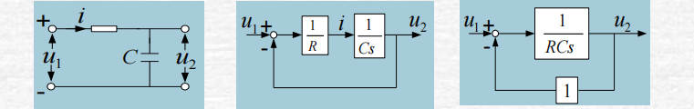
此时的$\mathcal G(s) = \frac{1}{RC_s + 1}$
#### 2.4.3.2 **一阶实际微分环节**
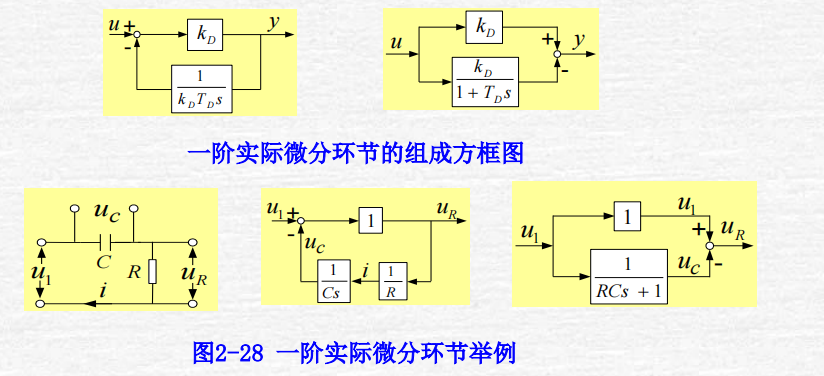

## 2.5 框图变换与简单物理系统传递函数推导
### 2.5.1 框图变换关系
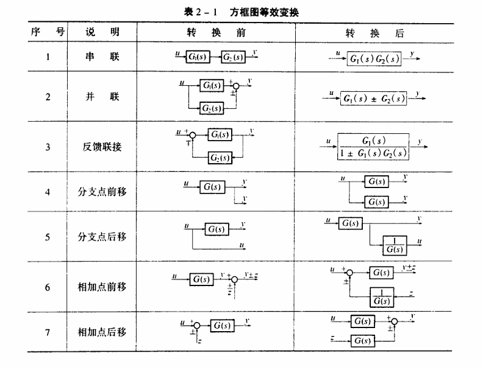
### 2.5.2 梅森公式
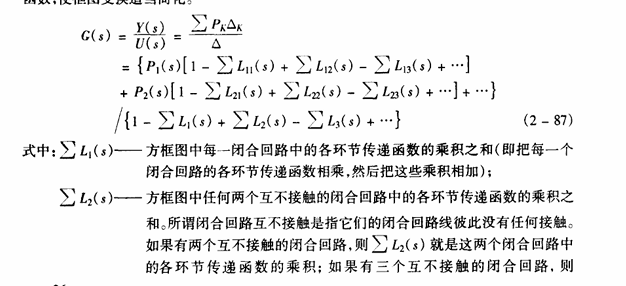
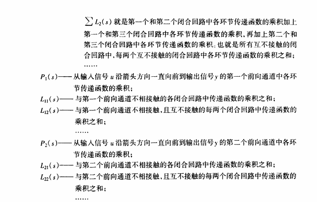
# 3. 热工对象和自动调节器的动态特性
> 1.内部扰动，外部扰动
> 2. 热工对象的动态特性和特点：有，无自平衡能力的对象的传递函数，图像。参数 $n ,T_0,T_a $的含义
> 3. 比例 积分 微分 三种基本作用
> 4. 两种PID表达形式，**3-69，3-70**，标准式和工程整定式
## 3.1 内部扰动，外部扰动

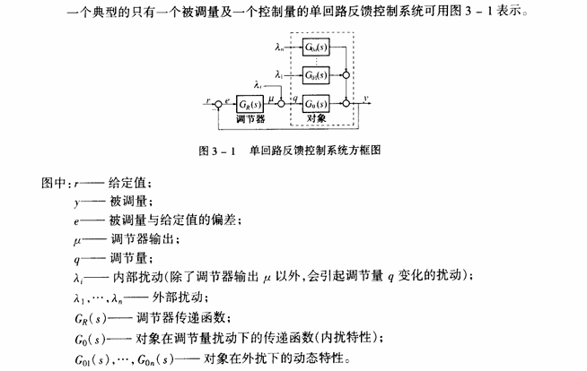 
## 3.2 有自平衡能力的热工对象
### 3.2.1 自平衡系数

#### TEMP
   
1. 3.2.1
2. 3.2.2 
   $ \mathcal G(s) = \frac{1}{T_as + 1}$
   $ \lambda $