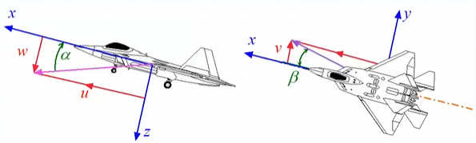
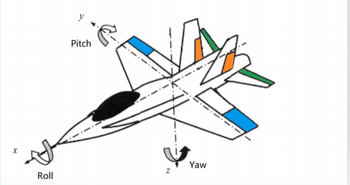
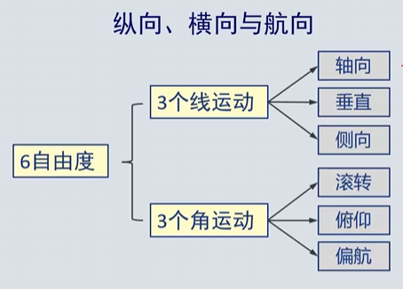
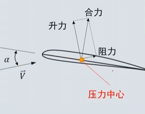
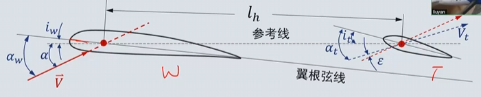
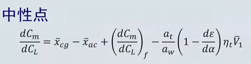
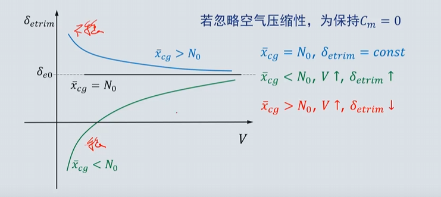

# 4 纵向静稳定性

## 4.1 变量表示
### 4.1.1 气流角

- 迎角：$\alpha$
- 气流角：$\beta$
### 4.1.2 操纵面偏角

> 升降舵：elevator $\delta e$
> 副翼：ailerons $\delta a$
> 方向舵：rudder  $\delta r$

### 4.1.3 系统的符号
$$
\text{力系数：}
C_X = \frac{X}{qS} \quad C_L = \frac{L}{qS} \quad C_Y = \frac{Y}{qS} \quad C_D = \frac{D}{qS} \quad C_Z = \frac{Z}{qS}
$$
$$
\text{力矩系数：}
C_L = \frac{L}{qSb} \quad C_M = \frac{M}{qSc} \quad C_N = \frac{N}{qSb}
$$
>$ \bar{c}: \text{平均气动弦长} \quad \text{mean aerodynamic chord} 
  ，b: 翼展 $
下标大写：力
下标小写：力矩

### 4.1.4 d导数
$$
A_B
$$
- 是 A关于B的导数

## 4.1.5 飞机运动方向

- $轴向：u 垂直：w 侧向：v$
- $滚转：p, L$
- $俯仰：q, M$
- $偏航：r, N$
> u,w可确定侧滑角

纵向静稳定性： $$\alpha = \tan^{-1}(\frac{w}{u})，M  $$
航向静稳定性： $$\beta = \tan^{-1}(\frac{v}{V})，N  $$
横向静稳定性： $$\phi \rightarrow\beta,L  $$

## 4.2 纵向静稳定性
- 定义： 如果飞机受到迎角扰动时，能使飞机产生使飞机回到初始状态的俯仰力矩，则飞机纵向静稳定
$$
+\triangle \alpha \rightarrow -\triangle M
$$
- 纵向静稳定性准则
$$
\frac{dM}{d\alpha}  < 0 \iff \frac{dCm}{d\alpha} < 0  \iff \frac{d C_m}{d C_L} < 0
$$
> $$ \quad C_M = \frac{M}{qSc} ,
$$

> $$ \frac{dC_m}{dC_L} =\frac{d C_m}{d \alpha} \frac{d \alpha}{d C_L}$$
$$
\frac{d \alpha}{d C_L} = \frac{1}{\alpha}， \alpha 为升力线斜率
$$

### 4.2.1 静稳定性分析-假设条件
- 飞机具有垂直对称面：几何和质量分布对称
- 纵横分离：纵向操纵面不产生侧力，滚转及偏航力矩，横向操纵面不产生俯仰力矩或升力
- 气动力与力矩随气动变量，操纵变量线性变化
- 作用在全机的气动力和力矩等于作用在各部位的气动力和力矩之和
### 4.2.2 纵向受力

> wing tail fuselage
> $X_a: 机翼升力中心到飞机重心的距离$
> $L_t: 水平尾翼升力中心到飞机重心的距禋$
#### 4.2.2.1 机身贡献

经验公式：
$$
\left( \frac{\partial C_m}{\partial \alpha} \right)_f = \frac{\pi}{2Sc} \int_0^{l_f} b_f^2 \left( 1 + \frac{\partial \epsilon_u}{\partial \alpha} \right) dx
$$
一般大于0，故机身体现不稳定特性
#### 4.2.2.2 机翼贡献

- 压力中心：气动合力方向与弦线的交点
若力矩参考点位于压心则0，然而压心为一不固定点
$$
C_m = C_{m0} + \xi C_l
$$
- $C_{m0}$：无升力时的力矩系数
- $\xi$：取决于力矩参考点的参数
  - 参考点位于前缘：升力$\uparrow$，俯仰力矩$\downarrow$，$\xi<0$
  - 参考点位于后缘：升力$\uparrow$，俯仰力矩$\uparrow$，$\xi>0$
  - $\xi=0$de点即为气动中心（aerodynamic center）,在该点$C_{m，ac}= C_{m0}$无关
  - 焦点一般定义在四分之一弦长处

- 假设：
  - 焦点是固定的
  - 焦点是合力作用点（在合理迎角范围内）

- 机翼上的俯仰力矩：
$$
M_W=L_Wx_a + M_{ac,w}
$$
> $M_{ac,w}$取决于弯度，对称弯度时为0，上弯为正，下弯为负
> $x_a$取决于机翼焦点与重心相对距离,焦点前为正，焦点后为负

关于$\alpha$求导
$$
\frac{dM_W}{d\alpha} = \frac{dL_W}{d\alpha}x_a 
$$
故机翼贡献取决于$x_a$，即机翼焦点与重心相对距离
- 焦点位于中心之前$\frac{d M_w}{d \alpha} $为正数，降低稳定性
- 焦点位于中心之后$\frac{d M_w}{d \alpha} $为负数，提高稳定性
#### 4.2.2.3 水平尾翼贡献——上洗与下洗
- 所有升力面都对其前后面的气流产生影响
   - 向上转折-上洗(upwash),向下转折-下洗(downwash)
- 平尾处局部迎角受机翼下洗影响

$
\text{机翼迎角：} \, a_w = \alpha + i_w
$
$
\text{平尾迎角：} \, a_t = \alpha + i_t + \epsilon \quad \text{平尾焦点处的下洗角}
$
$
\Rightarrow \quad \frac{d \alpha_t}{d a_w} = \frac{d \alpha_t}{d \alpha} \frac{d \alpha}{d a_w} = 1 - \frac{d \epsilon}{d \alpha}
$
> 下洗取决于机翼平面、展弦比、机翼与平尾间距离$$
 \frac{d \epsilon}{d \alpha} \approx 0.3 \sim 0.35
$
$\epsilon$ 平尾焦点处的下洗角
$i_w $机翼和平尾的安装角

- 平尾升力

$$ L_t = q_t S_t C_{L_t} $$
> $q_t$: 平尾上的动压,小于q

 - 假设：
      - $C_L= a_w \alpha_w$
      - 平尾升力系数远小于机翼升力系数
- 平尾俯仰力矩
$$ 
M_t = - L_t l_t + M_{ac,t} \iff M_t = -L_t l_t 
$$
> 平尾使用对称翼型，故$M_{ac,t} = 0$

无量纲化后
$$
C_{m_t} = -C_{L.t}\frac{q_t}{q} \frac{S_t l_t}{S \bar{c}}
$$
> $\frac{S_t l_t}{S \bar{c}}$ 尾**容**比,意为平尾升力产生的力矩相对于机翼产生的力矩的比值，一般是0.3-0.5 
### 4.2.3 全机纵向静稳定性和中性点

- 重心前移，$\bar{x_{cg}} \downarrow , \frac{d C_m}{d C_L} \downarrow $，稳定度提高
- 重心后移，$\bar{x_{cg}} \uparrow , \frac{d C_m}{d C_L} \uparrow $，稳定度降低
- 中性点：$\frac{d C_m}{d C_L} = 0$
- 尾翼可将中性点后移，稳定度提高
- 相当于全机的焦点
**焦点在重心之后稳定，在重心之前不稳定**

- 可用静稳定裕度描述飞机的纵向握杆静稳定度
$$
\text{静稳定裕度} = N_0 - \bar{x_{cg}} - (\frac{d C_m}{d C_L})_fix
$$
裕度为正稳定
## 4.3 纵向操纵面
- 飞机应具有在其气动限制范围内任何迎角飞行的能力，
- 平衡状态下的升力系数
$$
C_{L_{\delta e}} = \frac{- C{mac,w} - C_{mf} +C_{Lt}\bar{V_1} \eta_t }{ \bar{x_{cg}}-\bar{x_{ac}} }
$$
  1. 改变弯度 $C_{mac,w} $ 机翼弯度可变（襟翼）
  2. 改变重心位置  $x_{cg}$
  3. 改变平尾升力,局部升力   $C_{Lt}$
  4. $C_{mf}$ 机身升力
  5. $x_ac$ 中性点位置，不可变
### 4.3.1 改变机翼弯度
- $C_{mac_w}$ 是机翼弯度的函数，可通过偏转前后缘襟翼改变
- 通常用于无尾和鸭式布局飞机，不适用于有尾飞机

### 4.3.2 改变重心位置
- 改变$ \bar{x_{cg}} $
- 不常用

### 4.3.3 平尾/升降舵/鸭翼
#### 4.3.3.1 升降舵
- 位于平尾后缘的襟翼，可绕铰链轴偏转
$$
C_{m,t} = -C_{L,t} \bar{V}_1 \eta_t
$$
> $\eta_t=\frac{q_t}{q}$,$\bar{v_1}=   \bar{\frac{S_tl_t}{S\bar{c}}}$

$$
C_{L,t} = a_t \alpha_t = a_t (\alpha_w - i_w + i_t - \varepsilon + \tau \delta_e)
$$
> $\tau$：升降舵效率因子。单位升降舵偏角相当于的平尾迎角改变量

$$
\frac{dC_{m,t}}{dC_L} = \frac{dC_{m,t}}{dC_{L_t}} \frac{dC_{L_t}}{dC_L} = -\frac{a_t}{a_w} \left(1 - \frac{d\varepsilon}{d\alpha} \right) \bar{V}_1 \eta_t
$$
- 纵向配平(trim)
$$
\begin{cases}
C_m = （C_{L,w} \bar{x}_a + C_{mac,w}）机翼 + （C_{mf}）机身
\ - （C_{L,t} \eta_t \bar{V}_1）平尾  = 0\\
C_L = \frac{W}{qS}
\end{cases}
$$

$$
C_{L,t} = \frac{C_{L,w} \bar{x}_a + C_{mac,w} + C_{mf}}{\bar{V}_1 \eta_t}
$$

其中：
- $C_{L,w}  > 0$
- $C_{mf} > 0$
- $C_{L,t}$ 取决于 $x_{cg}$

> 静不稳定飞机机翼升力小于自重

- 配平升降舵偏角
平尾升力系数：
$$
C_{L,t} = a_t (\alpha_w - i_w + i_t - \varepsilon + \tau_1 \delta_e)
$$
纵向配平所需升降舵偏角：
$$
\delta_e = \frac{C_{L,w} \bar{x}_a + C_{mac,w} + C_{mf} - a_t (\alpha_w - i_w + i_t - \varepsilon) \bar{V}_1 \eta_t}{a_t \bar{V}_1 \eta_t \tau_1}
$$
> $C_{m\delta_e} = a_t \bar{V}_1 \eta_t \tau_1$**升降舵操纵效率**

**关于 \( C_L \) 求导**：

$$
\frac{d\delta_e}{dC_L} =
\frac{\bar{x}_a + \left( \frac{dC_m}{dC_L} \right)_f - \frac{a_t}{a_w} \left( 1 - \frac{\partial \varepsilon}{\partial \alpha} \right) \bar{V}_1 \eta_t}
{-C_{m\delta_e}}
$$
> 越小越好

- 配平升降舵偏角随$C_L$的变化梯度 
$$
\frac{d\delta_e}{dC_L} = - \frac{\left( \frac{dC_m}{dC_L} \right)_{fix}}{C_{m\delta_e}} = - \frac{\bar{x}_{cg} - N_0}{C_{m\delta_e}}
$$
> $\bar{x}_{cg}$ 即为重心和中性点的距离，距离越大操纵性越差
- 配平升降舵偏角与$C_L$的关系
$$
\delta_e = \delta_{e,0} + \frac{d\delta_e}{dC_L} C_L
$$
> $\delta_{e,0}$即为零机翼升力的_ \( \delta_{e,trim} \)

$$
\delta_e = \frac{C_{L,w} \bar{x}_a + C_{mac,w} + C_{mf} - a_t (\alpha_w - i_w + i_t - \varepsilon) \bar{V}_1 \eta_t}
{a_t \bar{V}_1 \eta_t \tau_1}
$$

对于给定升力系数，配平升降舵直接取决于飞机的静稳定度
$$
\frac{d\delta_e}{dC_L} = - \frac{\left( \frac{dC_m}{dC_L} \right)_{fix}}{C_{m\delta_e}} = - \frac{\bar{x}_{cg} - N_0}{C_{m\delta_e}}
$$

- 重心前限
$$
\delta_{e,0} = \frac{C_{mac,w} + C_{mf,0} - a_t (\alpha_{w,0L} - i_w + i_t) \bar{V}_1 \eta_t}{-C_{m\delta}}
$$
- 配平曲线
$$
\delta_{e trim} = \delta_{e,0} - \frac{\bar{x}_{cg} - N_0}{C_{m\delta}} C_L 
= \delta_{e,0} - \frac{\bar{x}_{cg} - N_0}{C_{m\delta}} \frac{2W/S}{\rho V^2}
$$

- 空气压缩性影响
  不记了
- 地面效应
  在起飞着陆阶段，地面存在相当于给下洗气流增加了边界，显著改变流线

    - 下洗减小的影响：
        - 平尾下洗角减小
        - 平尾升力线斜率$a_t$增加
        - 翼身组合体的升力线斜率增加
    - 结果：
        - 平尾效率增加
        - 机翼升力增加

## 4.4 操纵力   
- 拉杆：$\delta_e$>0，产生抬头力矩
- 推杆：$\delta_e$<0，产生低头力矩
### 4.4.1 铰链力矩
- 如果升降舵安装在一个无摩擦的铰链上，则可在气流的干涉下自由浮动，由作用在升降舵上的气动力造成的关于铰链轴上的力称为铰链力矩
- 升降舵可在气动力作用下自由偏转直到铰链力矩为0，此时升降舵偏角被称为**浮动角**，取决于：
  - 升降舵的气动力
  - 铰链轴与升降舵压心之间的距离
### 4.4.2 气动补偿
- 铰链力矩的值
  - 太大：高度敏感
  - 太小：过于迟钝
### 4.4.3 松杆中性点
- 松浮角： 对于机械操纵飞机，松杆= 升降舵可在气动力作用下偏转直到铰链力矩为0
$$
C_h = C_{h0} + C_{h\alpha} \alpha + C_{h\delta_e} \delta_e = 0
$$
- 松杆中性点：

## 4.5 机动飞行中的稳定性
- 机动飞行中的稳定性：法向过载超过1的飞行轨迹
    - 铅垂面的拉升机动
    - 水平面内的协调转弯

- 确定n过载的升降舵偏角和杆力：
$$
飞机收法向力:L-W = (n-1)W
$$
$$
力平衡：
\begin{cases}
m\frac{V^2}{R}= (n-1)mg \\
V = \Omega R
\end{cases}
$$
$$
\rightarrow \Omega = \frac{(n-1)g}{V}
$$
  - 假设：
  - 前向速度变化很小，可忽略
  - 飞机仅受迎角及过载扰动，扰动很小
  - 在给定速度和高度下，配平升降舵偏角与配平杆力分别为$\delta_{e}$ ,$F_{s}$
  - 同样速度与高度下的拉升运动，升降舵偏角和杆力则为$\delta_{e} +\triangle \delta_e$, $F_{s}+ \triangle F_s$
### 4.5.1. 单位过载升降舵偏角
- 假设平飞与机动飞行间的差别量均为小量，则
$$
\Delta C_L = C_{L\alpha} \Delta\alpha + C_{Lq} \bar{q} + C_{L\delta_e} \Delta\delta_e
$$

$$
\Delta C_m = C_{m\alpha} \Delta\alpha + C_{mq} \bar{q} + C_{m\delta_e} \Delta\delta_e
$$

$$
无量纲角速度： \bar{q}= \frac{q\bar{c}}{2V} 
C_{mq} = \frac{\partial C_m}{\partial \bar{q}}, \quad C_{Lq} = \frac{\partial C_L}{\partial \bar{q}}
$$

$$
\triangle \alpha_l = \frac{ql_l}{V} 局部迎角改变量
$$
重心之后的部分迎角增大，重心之前的部分迎角减小，可得+q正的无量纲角速度对应-M低头力矩
$$
C_{mq} < 0 ，称为俯仰阻尼力矩
$$
$\triangle L_{aft} > \triangle L_{fore}（重心前机翼面积小于重心后机翼面积）  $,+q产生-M和+L
平尾力臂长，对俯仰阻尼的贡献约占全机的90%
$$
\Delta L_t = a_t \Delta \alpha_t \cdot q_{ct} S_t = a_t \frac{q l_t}{V} \cdot q_{ct} S_t
$$
$$
\dot{\Delta M_t} = -\Delta L_t l_t = -a_t \Delta \alpha_t \cdot q_{ct} S_t l_t = -a_t \frac{q l_t}{V} \cdot q_{ct} S_t l_t
$$
$$
先无量纲化：C_{mqt} = -2 a_t \eta_t \bar{V}_1 \frac{l_t}{\bar{c}}
$$

$$
在对\bar{q}求导C_{Lqt} = 2 a_t \eta_t \bar{V}_1
$$
- 定常拉升机动中：角加速度为0，C_m=0,则：
$$
\begin{cases}
\Delta C_L = C_{L\alpha} \Delta\alpha + C_{Lq} \bar{q} + C_{L\delta_e} \Delta\delta_e \\
0 = C_{m\alpha} \Delta\alpha + C_{mq} \bar{q} + C_{m\delta_e} \Delta\delta_e
\end{cases}
$$

$$
C_W = \frac{W}{qS}
$$

$$
\mu = \frac{2m}{\rho S \bar{c}}
$$

$$
\begin{cases}
(n-1) C_W = C_{L\alpha} \Delta\alpha + C_{Lq} (n-1) \frac{C_W}{2\mu} + C_{L\delta_e} \Delta\delta_e \\
0 = C_{m\alpha} \Delta\alpha + C_{mq} (n-1) \frac{C_W}{2\mu} + C_{m\delta_e} \Delta\delta_e
\end{cases}
$$

$$
\frac{\Delta\delta_e}{n-1} = - \frac{C_W \left[ C_{m\alpha} - \frac{1}{2\mu} (C_{Lq} C_{m\alpha} - C_{L\alpha} C_{mq}) \right]}{C_{L\alpha} C_{m\delta_e} - C_{L\delta_e} C_{m\alpha}}
$$
引入概念：**机动点** : $M_0$
...一堆推导
$$
M_0>N_0
$$

- 最后结论：
**放宽静稳定性可提高机动性**