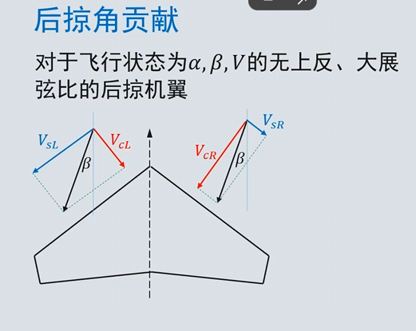
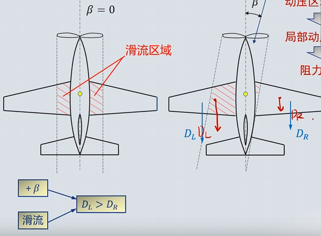

# 5. 航向静稳定性
- 飞机受到侧滑扰动后，如果能产生使**机头指向来流**方向的力矩，抵消侧滑，则飞机航向静稳定
- 
## 5.1 航向静稳定性的组成
- 与纵向静稳定性一样，飞机的航向静稳定性等于各独立部件的贡献之和

- 机翼：主要关注上反角和后掠角
### 5.1.1 上反角贡献
- 飞行状态$\alpha, \beta, V$的无后略，大展弦比，上反角机翼角度$\Gamma$
- 将来流分解为平行机翼和垂直机翼两个方向 
- 
左边迎角增大，升力系数增大，阻力系数增大，右边迎角减小，升力系数减小，阻力系数减小————改变局部迎角
- 垂直于机翼平面的速度分量
**垂直于机翼平面的速度分量**：

$$
V_N = V_0 (\sin\alpha \pm \beta \sin\Gamma),\alpha， \Gamma， \beta 为极小值
$$

$$
V_N = V_0 (\alpha \pm \beta\Gamma)
$$

**弦向速度（影响动压）**：

$$
V_C = V_0 \cos\alpha \approx V_0
$$

**局部迎角**：
$$
\alpha_l = \frac{V_N}{V_C} = \alpha \pm \beta\Gamma
$$
**局部动压**：
$$
q_l = \frac{1}{2} \rho (V_N^2 + V_C^2) \approx \frac{1}{2} \rho V_0^2
$$

小幅降低航向静稳定性
### 5.2.2 后掠角贡献

**机翼展向、弦向及垂直方向的速度分量**：
$$
\begin{cases}
V_S = V_0 (\sin\Lambda \cos\alpha \pm \beta \cos\Lambda) \\
V_C = V_0 (\cos\Lambda \cos\alpha \pm \beta \sin\Lambda) \\
V_N = V_0 \sin\alpha
\end{cases}
$$
与上反角不同，后掠角$ \Lambda $不是极小角
$$
\begin{cases}
V_S = V_0 \cos\Lambda (\tan\Lambda \pm \beta) \\
V_C = V_0 \cos\Lambda (1 \pm \beta \tan\Lambda) \\
V_N = V_0 \alpha
\end{cases}
$$
**局部迎角**：
$$
\alpha_l = \frac{V_N}{V_C} = \alpha \sec\Lambda (1 \mp \beta \tan\Lambda)
$$
$$
\alpha_R < \alpha_L
$$
**局部动压**：
$$
q_l = \frac{1}{2} \rho V_0^2 \cos^2\Lambda (1 \pm \beta \tan\Lambda)^2
$$
$$
q_R > q_L
$$

小幅增加了航向静稳定性

### 5.2.3 机身贡献
- 与纵向类似，降低航向静稳定性
- 又臭又长的经验公式：
$$
(C_{n\beta})_{B(W)} = - K_N K_{RI} \left( \frac{S_{B,S}}{S} \right) \cdot \left( \frac{l_f}{b} \right)
$$

### 5.2.4 尾翼贡献
1. 平尾：原理同机翼，可忽略
2. 垂尾：唯一最大来源
   - 贡献取决于$l_v，S_v,AR,\Lambda_v $，后机身几何形状，侧洗角$\sigma $
   - 类比迎角
   - 侧力计算 ：
$$
Y_V = - k \eta_v q a_v (\beta + \sigma) S_v
$$
>$\frac{k}{\eta_v}, \quad \text{经验因子}，\eta_v = \frac{q_v}{q}, \quad \text{动压比}$

$$
(N_V)_{\text{fix}} = -Y_V l_v = k q \eta_v a_v (\beta + \sigma) S_v l_v
$$

$$
(C_{n,V})_{\text{fix}} = k a_v (\beta + \sigma) \eta_v \bar{V}_2 \frac{S_v l_v}{S b}
$$

$$
(C_{n\beta,V})_{\text{fix}} = k a_v \left( 1 + \frac{\partial \sigma}{\partial \beta} \right) \eta_v \bar{V}_2
$$

### 5.2.5 动力系统贡献
- 螺旋桨：直接贡献
  - 拉力系统： 降低稳定性
  - 推力系统： 增加稳定性
- 间接影响：由滑流导致

右侧滑流区域变小，左侧滑流区域变大，产生侧向力矩，降低航向静稳定性

### 5.2.6 垂尾与隐身
- 垂尾是侧向RCS的最大来源
- 飞翼式布局一般航向不稳定或者中立稳定，一般用V尾作折中

## 5.2 航向操纵
- 方向舵是航向主要操纵面
- 非常规航向操纵面：
  - 开裂式阻力方向舵（通常用于大展弦比机翼）
  - 差动偏转同侧升降副翼
### 5.2.1 正方向舵偏角产生的偏航力矩
$$
N = -k q \eta_v S_v a_v (\tau_2 \delta_r + \sigma) l_v
$$
**产生或平衡侧滑角 \( \beta \) 所需的方向舵偏角**：

$$
C_{n\beta} \beta + C_{n\delta_r} \delta_r = 0
$$

$$
\delta_r = - \frac{C_{n\beta} \beta}{C_{n\delta_r}}
$$

飞机的航向静稳定度越高，产生给定侧滑所需的方向舵偏角越大。

**\( C_{n\beta} \) 的上限取决于航向的临界操纵要求。**

### 5.2.2 航向操纵面临界条件
- 应满足需求：
  - 不利偏航
  - 侧风起飞/着陆
  - 不对称推力
  - 尾旋改出
- 侧风起飞：起飞着陆阶段，由于前向速度小，侧风造成的侧滑角较大，因此也是一个临界情况
$$
\beta = \sin^{-1} \frac{V_c}{V}
$$
此时方向舵应能抵消侧风带来的偏转力矩
- 不对称推力：

# 6.横向静稳定性
- 主要问题：滚转角扰动$\rightarrow $滚转$\rightarrow $展向重力分量$\rightarrow $侧滑$\rightarrow $恢复滚转力矩
- 
## 6.1 横向静稳定性的组成
- 机翼 机身 尾翼
### 6.1.1 机翼贡献（主要）
- 上反角$\Gamma $
对于无后掠角，大展弦比，矩形机翼，飞行状态为$\alpha, \beta, V$，机翼上反角$\Gamma $

上反角：右侧滑产生左滚力矩，增加稳定性
下反角：右侧滑产生右滚力矩，降低稳定性
- 后掠角$\Lambda $
- 安装位置：下单翼，上单翼
### 6.1.2 机身贡献
- 直接影响：忽略
- 间接影响：翼身干扰
### 6.1.3 尾翼贡献
- 平尾
- 垂尾