# 1. 基本概念
## 1.1 稳定性
飞机在平衡状态受到扰动（静止或匀速运动）
- 静稳定性 ：有回到初始状态的趋势
- 动稳定性： 时间响应收敛并最终回到初始状态

受力与运动学方程

- $ \gamma $ ：爬升角
- $ \alpha $ ：迎角
- $ \theta $ ：俯仰角
- $ \phi_T $ ：发动机安装角
## 1.2 计算所需数据
1. $m$：飞机质量，计算中取常数
2. 大气数据：$ \rho, a, \mu $
3. 速度
- TAS：真空速，飞机和空气的相对速度，又称 **真速**
- IAS：指示空速，飞机的速度表指示的速度
 > 空速表为一动压表，只有在标准海平面ISA下才等于真空速TAS
 > $\rho_0$ $V_{IAS}^2 = \rho_H V_{TAS}^2$
 不同高度下，平飞和过载飞行需要的TAS不同，但IAS相同
 - CAS：校正空速，IAS校正后的值
 - EAS：矫正空速，当量等效空速，标准大气下的空速
 - GS：地速，飞机相对地面的速度
$\vec{GS} = \vec{TAS} + \vec{V_W}$
## 1.3 推进系统
- 分类：...
### 1.3.1 推力特性的假设：
- **给定高度下，由螺旋桨式发动机产生的功率和推进效率为常数**
  - 可用功率和飞行速度无关
  - 可用功率随高度变化
- **给定高度下，由喷气式发动机产生的推力为常数**

## 1.4 空气动力
- 动压：$q = \frac{1}{2} \rho V^2$
- S: 参考面积,通常取机翼面积
- 升力: $L =  C_LqS $
- 阻力: $D = C_DqS $
- 推力: $T = C_CqS$
### 1.4.1 升力与升力系数
- $C_L = C_L\frac{1}{2} \rho V^2 S$
- $C_L = C_{L0}+ a*\alpha$
> a: 升力线斜率

重要性能参数：法向过载系数 n=$\frac{L}{W}$
### 1.4.2 阻力
#### 1.4.2.1 阻力类型
- 零升阻力：
\[
\left\{
\begin{array}{l}
\text{表面摩擦阻力} \\
\text{压差阻力：气流分离导致的前后压力差减小} \\
\text{波阻：由激波产生} \\
\end{array}
\right.
\]
- 诱导阻力$D_i$由升力产生：又称升致阻力，由翼尖涡产生
#### 1.4.2.2 阻力系数
- $D = D_0+ D_i= C_D \frac{1}{2} \rho V^2 S$
- $C_D =C_{D0} + C_{Di} = C_{D0} + k C_L^2$
> $C_{D0}$: 零升阻力系数
> $C_{Di}$: 升致阻力系数
> $k$: 诱导阻力因子 $k = \frac{1}{\pi e A}$
> >e为奥斯瓦尔德修正因子，椭圆为1

 
 #### 1.4.2.3 升阻比和升阻极曲线
- 升阻比：$\frac{L}{D} = \frac{C_L}{C_D}$
- 升阻极曲线：
  $(\frac{C_D}{C_L})_{min}= 2\sqrt{(kC_{D0})} $
  最大升阻比：
  $\frac{L}{D} = \frac{1}{2\sqrt{kC_{D0}}}$
#### 1.4.2.4 阻力计算

- 低速诱导阻力为主，高速零升为主

**平飞参考速度$V_R$**
- 平飞阻力最小对应的速度
## 1.5 重要的无量纲参数
* 升阻比：$E=\frac{L}{D} = \frac{C_L}{C_D}$
* 过载系数：$n = \frac{L}{W}$
* 无因次速度：$u = \frac{V}{V_R}$
* 无因次推力：$z = \frac{TE_m}{W}$

# 2. 飞行性能指标
* 按加速度分：
  1. 静性能（零加速度）
  2. 动态性能（有限加速度）
## 2.1 滑翔（静性能）
损失高度的无动力下滑飞行
### 2.1.1 滑翔时的受力与方程

- $\gamma$ 航迹角
- $\alpha$ 迎角
- $\theta$ 俯仰角
$$
\left\{
\begin{array}{l}
\text{升力}：L = W \cos \gamma \\
\text{阻力}：D + W \sin \gamma=0 \\
\end{array}
\right.
$$
$$
\Rightarrow 
\text{滑翔时航迹角较小}
\left\{
\begin{array}{l}
\text{升力}：L = W \\
\text{阻力}：D = W \gamma \\
\end{array}
\right.
\Rightarrow
$$
$$ \gamma = \frac{D}{W} = -\frac{1}{\frac{L}{D}} = \frac{C_D}{C_L}$$
- 滑翔角与升阻比相关， $E_m$对应最平缓滑翔，滑翔角最小，巡航距离最远

#### 航程：
$R = $
$$
-\int_{h_i}^{h_f} E \, dh
$$
$E_m$对应最平缓滑翔，滑翔角最小，航程最大
$$
R_{max}=E_m \triangle h = \frac{\triangle h}{2\sqrt{kC_{D0}}} 
$$ 
滑翔比：在静止空气中，滑翔比等于升阻比
#### 下降率:
$$
\left\{
\begin{array}{l}
\dot h = \frac{dh}{dt}=V\sin \gamma\approx V\gamma \\
D+W\gamma =0 \\
\end{array}
\right.
$$
#### 续航时间：
$$
\dot h = \frac{dh}{dt} = V\gamma = -\sqrt{\frac{2W}{\rho S}} (\frac{C_D}{C_L^{3/2}})
$$
$$
\Downarrow
\text{不考虑大气密度的变化}
$$
$$
t=\sqrt{\frac{\rho S}{2W}}(\frac{C_L^{3/2}}{C_D})(h_i-h_f)
$$
#### 滑翔性能总结
- 最大航程：
  $R_max =E_m \triangle h= \frac{\triangle h}{2\sqrt{kC_{D0}}}$
- 最大航时
  $t_{max} = \sqrt{\frac{\rho S}{2}}\sqrt[4]{\frac{C_L}{C_D}}\frac{(h_i-h_f)}{4}$
  > 航程和载荷无关，航时与载荷有关
  > 减小k和$C_{D0}$对航程航时都有利
## 2.2 最大最小速度
- 喷气式飞机，用推力计算
- 螺旋桨式飞机，用功率计算
- 对比$V_{min}和V_{stall}$确定最小速度
## 2.3 爬升性能
- 爬升率：$V_z = \frac{dh}{dt}$
- 最快爬升：最大爬升率
- 最陡爬升：最大爬升角
  
# 3.机动性
- 铅垂面内的机动
- 水平面内的机动
- 空间机动
## 3.1 铅垂面内的机动

## 3.2 盘旋
- 定常盘旋
- 一般盘旋

> 偏航角$\psi$：机头与正北方向的夹角
> 航向角$\psi_s$：速度矢量与正北的夹角
### 3.2.1 盘旋受力分析

$$
\text{动力学方程}
  \left\{
  \begin{array}{l}
  L\cos \phi = W \cos \gamma \\
  T \cos \phi -D -\omega \sin r= 0 \\
  T \sin \beta +L \sin \phi - \frac{W}{g}\frac{V^2\cos^2 r}{R} = 0 \\
  \end{array}
  \right.
$$
对于水平定常盘旋，$\gamma = 0$
### 3.2.2 侧滑影响
- 侧滑对推力分量的影响

- 沿速度矢量方向：
\[ T\cos\beta - D - W\sin\gamma = 0 \]
平衡阻力的推力分量减少
- 垂直于速度矢量方向：
 \[T\sin\beta + L\sin\phi - \left( \frac{WV^2\cos^2\gamma}{gR} \right) = 0 \]
推力分量也提供了向心力

- 协调盘旋，侧滑角为0

$ n = \frac{L}{W} = \frac{1}{\cos\phi} \Rightarrow \cos\phi = \frac{1}{n} \Rightarrow \tan\phi = \sqrt{n^2 - 1} $

$ R = \frac{V^2}{g\tan\phi} = \frac{V^2}{g\sqrt{n^2 - 1}} $

$ \omega = \frac{V}{R} = \frac{g\tan\phi}{V} = \frac{g\sqrt{n^2 - 1}}{V} $

$ t_{2\pi} = \frac{2\pi}{\omega} = \frac{2\pi V}{g\sqrt{n^2 - 1}} $

给定速度下，过载越大：
- 盘旋半径越小
- 盘旋角速度越大
- 盘旋一周时间越短
  
为提高机动性，应增大$C_L$
> 脱体涡可提高升力，延后失速角度

# 4 纵向静稳定性

## 4.1 变量表示
### 4.1.1 气流角
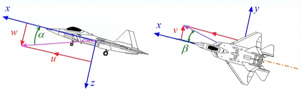
- 迎角：$\alpha$
- 气流角：$\beta$
### 4.1.2 操纵面偏角
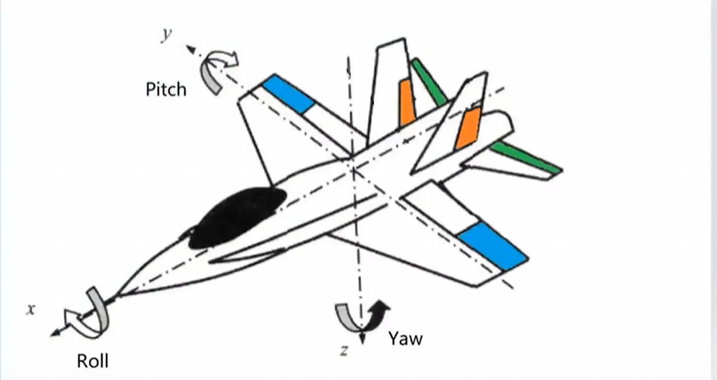
> 升降舵：elevator $\delta e$
> 副翼：ailerons $\delta a$
> 方向舵：rudder  $\delta r$

### 4.1.3 系统的符号
$$
\text{力系数：}
C_X = \frac{X}{qS} \quad C_L = \frac{L}{qS} \quad C_Y = \frac{Y}{qS} \quad C_D = \frac{D}{qS} \quad C_Z = \frac{Z}{qS}
$$
$$
\text{力矩系数：}
C_L = \frac{L}{qSb} \quad C_M = \frac{M}{qSc} \quad C_N = \frac{N}{qSb}
$$
>$ \bar{c}: \text{平均气动弦长} \quad \text{mean aerodynamic chord} 
  ，b: 翼展 $
下标大写：力
下标小写：力矩

### 4.1.4 d导数
$$
A_B
$$
- 是 A关于B的导数

## 4.1.5 飞机运动方向
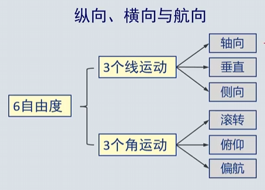
- $轴向：u 垂直：w 侧向：v$
- $滚转：p, L$
- $俯仰：q, M$
- $偏航：r, N$
> u,w可确定侧滑角

纵向静稳定性： $$\alpha = \tan^{-1}(\frac{w}{u})，M  $$
航向静稳定性： $$\beta = \tan^{-1}(\frac{v}{V})，N  $$
横向静稳定性： $$\phi \rightarrow\beta,L  $$

## 4.2 纵向静稳定性
- 定义： 如果飞机受到迎角扰动时，能使飞机产生使飞机回到初始状态的俯仰力矩，则飞机纵向静稳定
$$
+\triangle \alpha \rightarrow -\triangle M
$$
- 纵向静稳定性准则
$$
\frac{dM}{d\alpha}  < 0 \iff \frac{dCm}{d\alpha} < 0  \iff \frac{d C_m}{d C_L} < 0
$$
> $$ \quad C_M = \frac{M}{qSc} ,
$$

> $$ \frac{dC_m}{dC_L} =\frac{d C_m}{d \alpha} \frac{d \alpha}{d C_L}$$
$$
\frac{d \alpha}{d C_L} = \frac{1}{\alpha}， \alpha 为升力线斜率
$$

### 4.2.1 静稳定性分析-假设条件
- 飞机具有垂直对称面：几何和质量分布对称
- 纵横分离：纵向操纵面不产生侧力，滚转及偏航力矩，横向操纵面不产生俯仰力矩或升力
- 气动力与力矩随气动变量，操纵变量线性变化
- 作用在全机的气动力和力矩等于作用在各部位的气动力和力矩之和
### 4.2.2 纵向受力
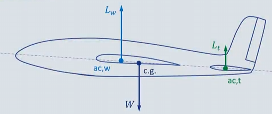
> wing tail fuselage
> $X_a: 机翼升力中心到飞机重心的距离$
> $L_t: 水平尾翼升力中心到飞机重心的距禋$
#### 4.2.2.1 机身贡献
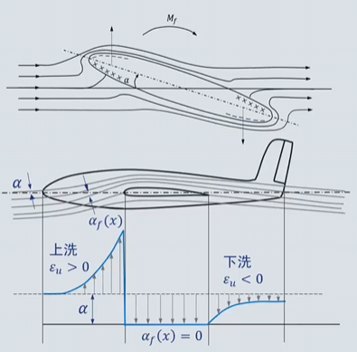
经验公式：
$$
\left( \frac{\partial C_m}{\partial \alpha} \right)_f = \frac{\pi}{2Sc} \int_0^{l_f} b_f^2 \left( 1 + \frac{\partial \epsilon_u}{\partial \alpha} \right) dx
$$
一般大于0，故机身体现不稳定特性
#### 4.2.2.2 机翼贡献
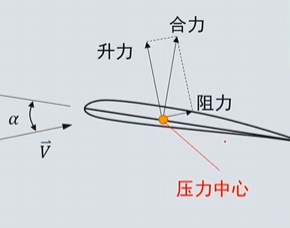
- 压力中心：气动合力方向与弦线的交点
若力矩参考点位于压心则0，然而压心为一不固定点
$$
C_m = C_{m0} + \xi C_l
$$
- $C_{m0}$：无升力时的力矩系数
- $\xi$：取决于力矩参考点的参数
  - 参考点位于前缘：升力$\uparrow$，俯仰力矩$\downarrow$，$\xi<0$
  - 参考点位于后缘：升力$\uparrow$，俯仰力矩$\uparrow$，$\xi>0$
  - $\xi=0$de点即为气动中心（aerodynamic center）,在该点$C_{m，ac}= C_{m0}$无关
  - 焦点一般定义在四分之一弦长处
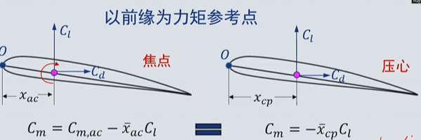
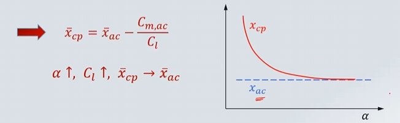
- 假设：
  - 焦点是固定的
  - 焦点是合力作用点（在合理迎角范围内）

- 机翼上的俯仰力矩：
$$
M_W=L_Wx_a + M_{ac,w}
$$
> $M_{ac,w}$取决于弯度，对称弯度时为0，上弯为正，下弯为负
> $x_a$取决于机翼焦点与重心相对距离,焦点前为正，焦点后为负

关于$\alpha$求导
$$
\frac{dM_W}{d\alpha} = \frac{dL_W}{d\alpha}x_a 
$$
故机翼贡献取决于$x_a$，即机翼焦点与重心相对距离
- 焦点位于中心之前$\frac{d M_w}{d \alpha} $为正数，降低稳定性
- 焦点位于中心之后$\frac{d M_w}{d \alpha} $为负数，提高稳定性
#### 4.2.2.3 水平尾翼贡献——上洗与下洗
- 所有升力面都对其前后面的气流产生影响
   - 向上转折-上洗(upwash),向下转折-下洗(downwash)
- 平尾处局部迎角受机翼下洗影响
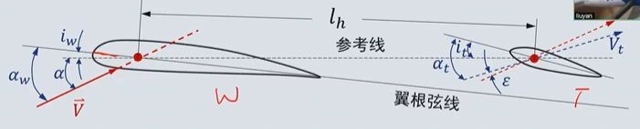

$
\text{机翼迎角：} \, a_w = \alpha + i_w
$
$
\text{平尾迎角：} \, a_t = \alpha + i_t + \epsilon \quad \text{平尾焦点处的下洗角}
$
$
\Rightarrow \quad \frac{d \alpha_t}{d a_w} = \frac{d \alpha_t}{d \alpha} \frac{d \alpha}{d a_w} = 1 - \frac{d \epsilon}{d \alpha}
$
> 下洗取决于机翼平面、展弦比、机翼与平尾间距离$$
 \frac{d \epsilon}{d \alpha} \approx 0.3 \sim 0.35
$
$\epsilon$ 平尾焦点处的下洗角
$i_w $机翼和平尾的安装角

- 平尾升力

$$ L_t = q_t S_t C_{L_t} $$
> $q_t$: 平尾上的动压,小于q

 - 假设：
      - $C_L= a_w \alpha_w$
      - 平尾升力系数远小于机翼升力系数
- 平尾俯仰力矩
$$ 
M_t = - L_t l_t + M_{ac,t} \iff M_t = -L_t l_t 
$$
> 平尾使用对称翼型，故$M_{ac,t} = 0$

无量纲化后
$$
C_{m_t} = -C_{L.t}\frac{q_t}{q} \frac{S_t l_t}{S \bar{c}}
$$
> $\frac{S_t l_t}{S \bar{c}}$ 尾**容**比,意为平尾升力产生的力矩相对于机翼产生的力矩的比值，一般是0.3-0.5 
### 4.2.3 全机纵向静稳定性和中性点
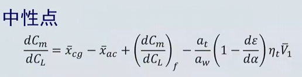
- 重心前移，$\bar{x_{cg}} \downarrow , \frac{d C_m}{d C_L} \downarrow $，稳定度提高
- 重心后移，$\bar{x_{cg}} \uparrow , \frac{d C_m}{d C_L} \uparrow $，稳定度降低
- 中性点：$\frac{d C_m}{d C_L} = 0$
- 尾翼可将中性点后移，稳定度提高
- 相当于全机的焦点
**焦点在重心之后稳定，在重心之前不稳定**

- 可用静稳定裕度描述飞机的纵向握杆静稳定度
$$
\text{静稳定裕度} = N_0 - \bar{x_{cg}} - (\frac{d C_m}{d C_L})_fix
$$
裕度为正稳定
## 4.3 纵向操纵面
- 飞机应具有在其气动限制范围内任何迎角飞行的能力，
- 平衡状态下的升力系数
$$
C_{L_{\delta e}} = \frac{- C{mac,w} - C_{mf} +C_{Lt}\bar{V_1} \eta_t }{ \bar{x_{cg}}-\bar{x_{ac}} }
$$
  1. 改变弯度 $C_{mac,w} $ 机翼弯度可变（襟翼）
  2. 改变重心位置  $x_{cg}$
  3. 改变平尾升力,局部升力   $C_{Lt}$
  4. $C_{mf}$ 机身升力
  5. $x_ac$ 中性点位置，不可变
### 4.3.1 改变机翼弯度
- $C_{mac_w}$ 是机翼弯度的函数，可通过偏转前后缘襟翼改变
- 通常用于无尾和鸭式布局飞机，不适用于有尾飞机

### 4.3.2 改变重心位置
- 改变$ \bar{x_{cg}} $
- 不常用

### 4.3.3 平尾/升降舵/鸭翼
#### 4.3.3.1 升降舵
- 位于平尾后缘的襟翼，可绕铰链轴偏转
$$
C_{m,t} = -C_{L,t} \bar{V}_1 \eta_t
$$
> $\eta_t=\frac{q_t}{q}$,$\bar{v_1}=   \bar{\frac{S_tl_t}{S\bar{c}}}$

$$
C_{L,t} = a_t \alpha_t = a_t (\alpha_w - i_w + i_t - \varepsilon + \tau \delta_e)
$$
> $\tau$：升降舵效率因子。单位升降舵偏角相当于的平尾迎角改变量

$$
\frac{dC_{m,t}}{dC_L} = \frac{dC_{m,t}}{dC_{L_t}} \frac{dC_{L_t}}{dC_L} = -\frac{a_t}{a_w} \left(1 - \frac{d\varepsilon}{d\alpha} \right) \bar{V}_1 \eta_t
$$
- 纵向配平(trim)
$$
\begin{cases}
C_m = （C_{L,w} \bar{x}_a + C_{mac,w}）机翼 + （C_{mf}）机身
\ - （C_{L,t} \eta_t \bar{V}_1）平尾  = 0\\
C_L = \frac{W}{qS}
\end{cases}
$$

$$
C_{L,t} = \frac{C_{L,w} \bar{x}_a + C_{mac,w} + C_{mf}}{\bar{V}_1 \eta_t}
$$

其中：
- $C_{L,w}  > 0$
- $C_{mf} > 0$
- $C_{L,t}$ 取决于 $x_{cg}$
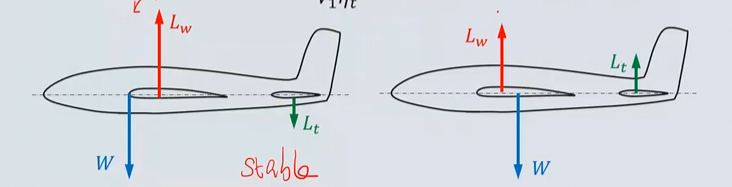
> 静不稳定飞机机翼升力小于自重

- 配平升降舵偏角
平尾升力系数：
$$
C_{L,t} = a_t (\alpha_w - i_w + i_t - \varepsilon + \tau_1 \delta_e)
$$
纵向配平所需升降舵偏角：
$$
\delta_e = \frac{C_{L,w} \bar{x}_a + C_{mac,w} + C_{mf} - a_t (\alpha_w - i_w + i_t - \varepsilon) \bar{V}_1 \eta_t}{a_t \bar{V}_1 \eta_t \tau_1}
$$
> $C_{m\delta_e} = a_t \bar{V}_1 \eta_t \tau_1$**升降舵操纵效率**

**关于 \( C_L \) 求导**：

$$
\frac{d\delta_e}{dC_L} =
\frac{\bar{x}_a + \left( \frac{dC_m}{dC_L} \right)_f - \frac{a_t}{a_w} \left( 1 - \frac{\partial \varepsilon}{\partial \alpha} \right) \bar{V}_1 \eta_t}
{-C_{m\delta_e}}
$$
> 越小越好

- 配平升降舵偏角随$C_L$的变化梯度 
$$
\frac{d\delta_e}{dC_L} = - \frac{\left( \frac{dC_m}{dC_L} \right)_{fix}}{C_{m\delta_e}} = - \frac{\bar{x}_{cg} - N_0}{C_{m\delta_e}}
$$
> $\bar{x}_{cg}$ 即为重心和中性点的距离，距离越大操纵性越差
- 配平升降舵偏角与$C_L$的关系
$$
\delta_e = \delta_{e,0} + \frac{d\delta_e}{dC_L} C_L
$$
> $\delta_{e,0}$即为零机翼升力的_ \( \delta_{e,trim} \)

$$
\delta_e = \frac{C_{L,w} \bar{x}_a + C_{mac,w} + C_{mf} - a_t (\alpha_w - i_w + i_t - \varepsilon) \bar{V}_1 \eta_t}
{a_t \bar{V}_1 \eta_t \tau_1}
$$

对于给定升力系数，配平升降舵直接取决于飞机的静稳定度
$$
\frac{d\delta_e}{dC_L} = - \frac{\left( \frac{dC_m}{dC_L} \right)_{fix}}{C_{m\delta_e}} = - \frac{\bar{x}_{cg} - N_0}{C_{m\delta_e}}
$$

- 重心前限
$$
\delta_{e,0} = \frac{C_{mac,w} + C_{mf,0} - a_t (\alpha_{w,0L} - i_w + i_t) \bar{V}_1 \eta_t}{-C_{m\delta}}
$$
- 配平曲线
$$
\delta_{e trim} = \delta_{e,0} - \frac{\bar{x}_{cg} - N_0}{C_{m\delta}} C_L 
= \delta_{e,0} - \frac{\bar{x}_{cg} - N_0}{C_{m\delta}} \frac{2W/S}{\rho V^2}
$$
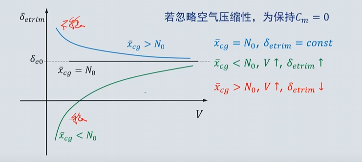
- 空气压缩性影响
  不记了
- 地面效应
  在起飞着陆阶段，地面存在相当于给下洗气流增加了边界，显著改变流线
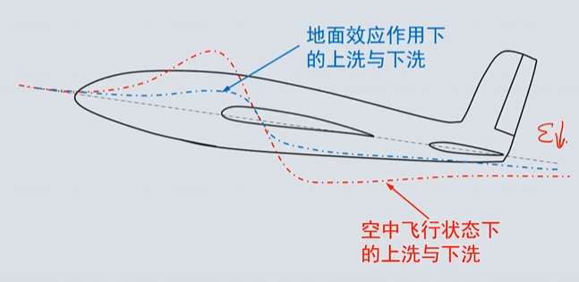
    - 下洗减小的影响：
        - 平尾下洗角减小
        - 平尾升力线斜率$a_t$增加
        - 翼身组合体的升力线斜率增加
    - 结果：
        - 平尾效率增加
        - 机翼升力增加

## 4.4 操纵力   
- 拉杆：$\delta_e$>0，产生抬头力矩
- 推杆：$\delta_e$<0，产生低头力矩
### 4.4.1 铰链力矩
- 如果升降舵安装在一个无摩擦的铰链上，则可在气流的干涉下自由浮动，由作用在升降舵上的气动力造成的关于铰链轴上的力称为铰链力矩
- 升降舵可在气动力作用下自由偏转直到铰链力矩为0，此时升降舵偏角被称为**浮动角**，取决于：
  - 升降舵的气动力
  - 铰链轴与升降舵压心之间的距离
### 4.4.2 气动补偿
- 铰链力矩的值
  - 太大：高度敏感
  - 太小：过于迟钝
### 4.4.3 松杆中性点
- 松浮角： 对于机械操纵飞机，松杆= 升降舵可在气动力作用下偏转直到铰链力矩为0
$$
C_h = C_{h0} + C_{h\alpha} \alpha + C_{h\delta_e} \delta_e = 0
$$
- 松杆中性点：

## 4.5 机动飞行中的稳定性
- 机动飞行中的稳定性：法向过载超过1的飞行轨迹
    - 铅垂面的拉升机动
    - 水平面内的协调转弯

- 确定n过载的升降舵偏角和杆力：
$$
飞机收法向力:L-W = (n-1)W
$$
$$
力平衡：
\begin{cases}
m\frac{V^2}{R}= (n-1)mg \\
V = \Omega R
\end{cases}
$$
$$
\rightarrow \Omega = \frac{(n-1)g}{V}
$$
  - 假设：
  - 前向速度变化很小，可忽略
  - 飞机仅受迎角及过载扰动，扰动很小
  - 在给定速度和高度下，配平升降舵偏角与配平杆力分别为$\delta_{e}$ ,$F_{s}$
  - 同样速度与高度下的拉升运动，升降舵偏角和杆力则为$\delta_{e} +\triangle \delta_e$, $F_{s}+ \triangle F_s$
### 4.5.1. 单位过载升降舵偏角
- 假设平飞与机动飞行间的差别量均为小量，则
$$
\Delta C_L = C_{L\alpha} \Delta\alpha + C_{Lq} \bar{q} + C_{L\delta_e} \Delta\delta_e
$$

$$
\Delta C_m = C_{m\alpha} \Delta\alpha + C_{mq} \bar{q} + C_{m\delta_e} \Delta\delta_e
$$

$$
无量纲角速度： \bar{q}= \frac{q\bar{c}}{2V} 
C_{mq} = \frac{\partial C_m}{\partial \bar{q}}, \quad C_{Lq} = \frac{\partial C_L}{\partial \bar{q}}
$$
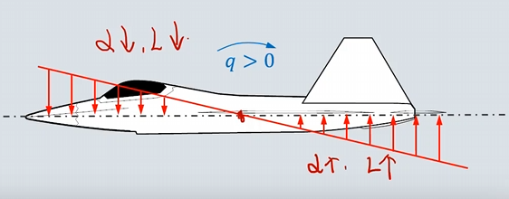
$$
\triangle \alpha_l = \frac{ql_l}{V} 局部迎角改变量
$$
重心之后的部分迎角增大，重心之前的部分迎角减小，可得+q正的无量纲角速度对应-M低头力矩
$$
C_{mq} < 0 ，称为俯仰阻尼力矩
$$
$\triangle L_{aft} > \triangle L_{fore}（重心前机翼面积小于重心后机翼面积）  $,+q产生-M和+L
平尾力臂长，对俯仰阻尼的贡献约占全机的90%
$$
\Delta L_t = a_t \Delta \alpha_t \cdot q_{ct} S_t = a_t \frac{q l_t}{V} \cdot q_{ct} S_t
$$
$$
\dot{\Delta M_t} = -\Delta L_t l_t = -a_t \Delta \alpha_t \cdot q_{ct} S_t l_t = -a_t \frac{q l_t}{V} \cdot q_{ct} S_t l_t
$$
$$
先无量纲化：C_{mqt} = -2 a_t \eta_t \bar{V}_1 \frac{l_t}{\bar{c}}
$$

$$
在对\bar{q}求导C_{Lqt} = 2 a_t \eta_t \bar{V}_1
$$
- 定常拉升机动中：角加速度为0，C_m=0,则：
$$
\begin{cases}
\Delta C_L = C_{L\alpha} \Delta\alpha + C_{Lq} \bar{q} + C_{L\delta_e} \Delta\delta_e \\
0 = C_{m\alpha} \Delta\alpha + C_{mq} \bar{q} + C_{m\delta_e} \Delta\delta_e
\end{cases}
$$

$$
C_W = \frac{W}{qS}
$$

$$
\mu = \frac{2m}{\rho S \bar{c}}
$$

$$
\begin{cases}
(n-1) C_W = C_{L\alpha} \Delta\alpha + C_{Lq} (n-1) \frac{C_W}{2\mu} + C_{L\delta_e} \Delta\delta_e \\
0 = C_{m\alpha} \Delta\alpha + C_{mq} (n-1) \frac{C_W}{2\mu} + C_{m\delta_e} \Delta\delta_e
\end{cases}
$$

$$
\frac{\Delta\delta_e}{n-1} = - \frac{C_W \left[ C_{m\alpha} - \frac{1}{2\mu} (C_{Lq} C_{m\alpha} - C_{L\alpha} C_{mq}) \right]}{C_{L\alpha} C_{m\delta_e} - C_{L\delta_e} C_{m\alpha}}
$$
引入概念：**机动点** : $M_0$
...一堆推导
$$
M_0>N_0
$$

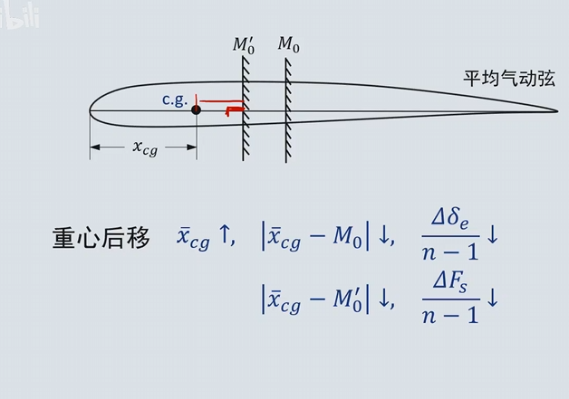
- 最后结论：
**放宽静稳定性可提高机动性**

## 4.6 放宽静稳定性
$$
\frac{\triangle \delta_e}{n-1}
\frac{\triangle F_s}{n-1}
$$
单位过载升降舵偏角和单位过载杆力
- 放宽静稳定性(RSS)
诱导阻力和升力相关，升力小则诱导阻力小
### 4.6.1 纵向增稳器
- 为提高飞机的飞行性能，需放宽纵向静稳定性，对于纵向静稳定不足飞机，需引入$\alpha$反馈对其稳定
> 一张反馈系统图片
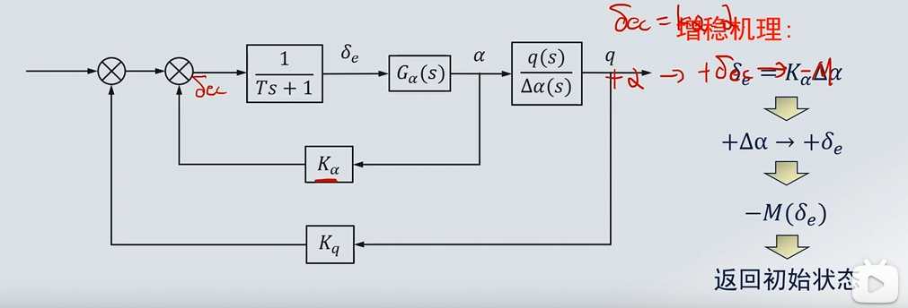
- 由负平尾升力带来的配平阻力增量被称为阻力损失(Drag panelty)
$$
\Delta D = \frac{1}{2} \rho V^2 S \Delta C_D
$$
## 4.7 飞机允许的重心范围
- 从**稳定性**角度考虑，飞机的重心位置应在中性点$N_0$之前
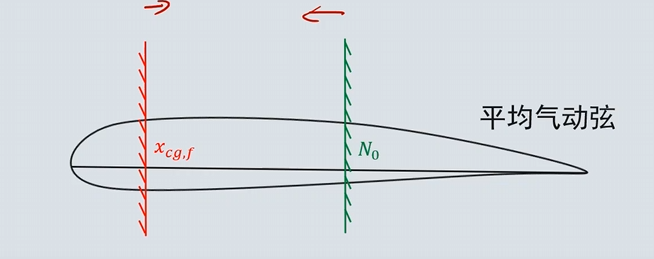
- 重心后限由纵向稳定性和操纵敏感度决定
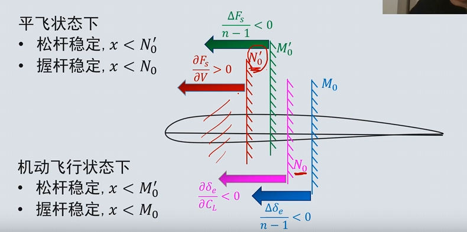
- 重心前限： 处于操纵性考虑
   - $\Delta F_s / (n - 1)$ 不能超过特定值
  - $\partial F_s / \partial V$ 不能超过特定值
  - 着陆杆力 $F_s$ 不能超过特定值
  - 着陆升降舵偏角 $\delta_e$ 不能超过最大上偏角 $\delta_{e,\min}$
  - 离地速度 $V_{L_0}$ 下抬前轮所需升降舵偏角 $\delta_e$ 不能超过最大上 $\delta_{e,\min}$
- 确定重心范围与平尾面积的剪刀图：
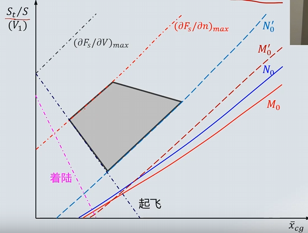

# 5. 航向静稳定性
- 飞机受到侧滑扰动后，如果能产生使**机头指向来流**方向的力矩，抵消侧滑，则飞机航向静稳定
- 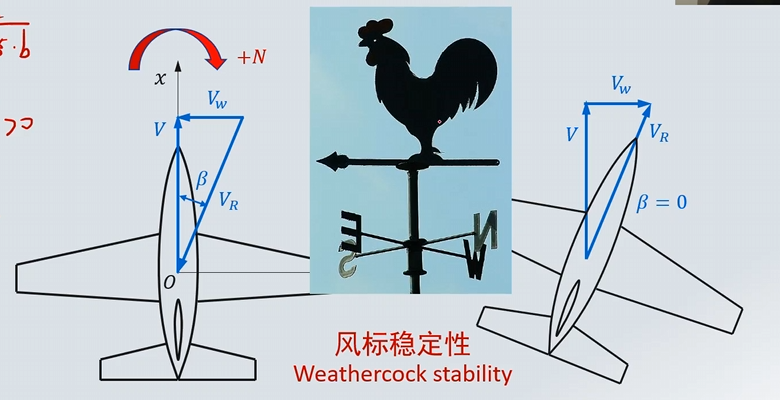
## 5.1 航向静稳定性的组成
- 与纵向静稳定性一样，飞机的航向静稳定性等于各独立部件的贡献之和
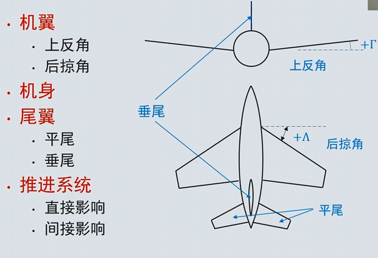
- 机翼：主要关注上反角和后掠角
### 5.1.1 上反角贡献
- 飞行状态$\alpha, \beta, V$的无后略，大展弦比，上反角机翼角度$\Gamma$
- 将来流分解为平行机翼和垂直机翼两个方向 
- 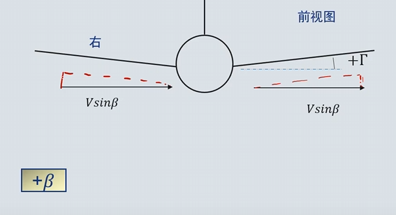
左边迎角增大，升力系数增大，阻力系数增大，右边迎角减小，升力系数减小，阻力系数减小————改变局部迎角
- 垂直于机翼平面的速度分量
**垂直于机翼平面的速度分量**：

$$
V_N = V_0 (\sin\alpha \pm \beta \sin\Gamma),\alpha， \Gamma， \beta 为极小值
$$

$$
V_N = V_0 (\alpha \pm \beta\Gamma)
$$

**弦向速度（影响动压）**：

$$
V_C = V_0 \cos\alpha \approx V_0
$$

**局部迎角**：
$$
\alpha_l = \frac{V_N}{V_C} = \alpha \pm \beta\Gamma
$$
**局部动压**：
$$
q_l = \frac{1}{2} \rho (V_N^2 + V_C^2) \approx \frac{1}{2} \rho V_0^2
$$

小幅降低航向静稳定性
### 5.2.2 后掠角贡献
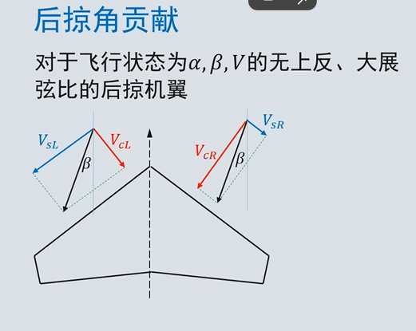
**机翼展向、弦向及垂直方向的速度分量**：
$$
\begin{cases}
V_S = V_0 (\sin\Lambda \cos\alpha \pm \beta \cos\Lambda) \\
V_C = V_0 (\cos\Lambda \cos\alpha \pm \beta \sin\Lambda) \\
V_N = V_0 \sin\alpha
\end{cases}
$$
与上反角不同，后掠角$ \Lambda $不是极小角
$$
\begin{cases}
V_S = V_0 \cos\Lambda (\tan\Lambda \pm \beta) \\
V_C = V_0 \cos\Lambda (1 \pm \beta \tan\Lambda) \\
V_N = V_0 \alpha
\end{cases}
$$
**局部迎角**：
$$
\alpha_l = \frac{V_N}{V_C} = \alpha \sec\Lambda (1 \mp \beta \tan\Lambda)
$$
$$
\alpha_R < \alpha_L
$$
**局部动压**：
$$
q_l = \frac{1}{2} \rho V_0^2 \cos^2\Lambda (1 \pm \beta \tan\Lambda)^2
$$
$$
q_R > q_L
$$

小幅增加了航向静稳定性

### 5.2.3 机身贡献
- 与纵向类似，降低航向静稳定性
- 又臭又长的经验公式：
$$
(C_{n\beta})_{B(W)} = - K_N K_{RI} \left( \frac{S_{B,S}}{S} \right) \cdot \left( \frac{l_f}{b} \right)
$$

### 5.2.4 尾翼贡献
1. 平尾：原理同机翼，可忽略
2. 垂尾：唯一最大来源
   - 贡献取决于$l_v，S_v,AR,\Lambda_v $，后机身几何形状，侧洗角$\sigma $
   - 类比迎角
   - 侧力计算 ：
$$
Y_V = - k \eta_v q a_v (\beta + \sigma) S_v
$$
>$\frac{k}{\eta_v}, \quad \text{经验因子}，\eta_v = \frac{q_v}{q}, \quad \text{动压比}$

$$
(N_V)_{\text{fix}} = -Y_V l_v = k q \eta_v a_v (\beta + \sigma) S_v l_v
$$

$$
(C_{n,V})_{\text{fix}} = k a_v (\beta + \sigma) \eta_v \bar{V}_2 \frac{S_v l_v}{S b}
$$

$$
(C_{n\beta,V})_{\text{fix}} = k a_v \left( 1 + \frac{\partial \sigma}{\partial \beta} \right) \eta_v \bar{V}_2
$$

### 5.2.5 动力系统贡献
- 螺旋桨：直接贡献
  - 拉力系统： 降低稳定性
  - 推力系统： 增加稳定性
- 间接影响：由滑流导致
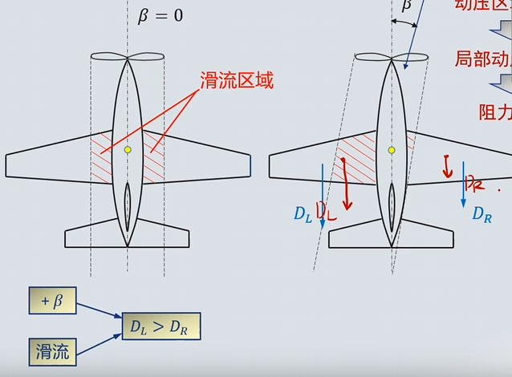
右侧滑流区域变小，左侧滑流区域变大，产生侧向力矩，降低航向静稳定性

### 5.2.6 垂尾与隐身
- 垂尾是侧向RCS的最大来源
- 飞翼式布局一般航向不稳定或者中立稳定，一般用V尾作折中

## 5.2 航向操纵
- 方向舵是航向主要操纵面
- 非常规航向操纵面：
  - 开裂式阻力方向舵（通常用于大展弦比机翼）
  - 差动偏转同侧升降副翼
### 5.2.1 正方向舵偏角产生的偏航力矩
$$
N = -k q \eta_v S_v a_v (\tau_2 \delta_r + \sigma) l_v
$$
**产生或平衡侧滑角 \( \beta \) 所需的方向舵偏角**：

$$
C_{n\beta} \beta + C_{n\delta_r} \delta_r = 0
$$

$$
\delta_r = - \frac{C_{n\beta} \beta}{C_{n\delta_r}}
$$

飞机的航向静稳定度越高，产生给定侧滑所需的方向舵偏角越大。

**\( C_{n\beta} \) 的上限取决于航向的临界操纵要求。**

### 5.2.2 航向操纵面临界条件
- 应满足需求：
  - 不利偏航
  - 侧风起飞/着陆
  - 不对称推力
  - 尾旋改出
- 侧风起飞：起飞着陆阶段，由于前向速度小，侧风造成的侧滑角较大，因此也是一个临界情况
$$
\beta = \sin^{-1} \frac{V_c}{V}
$$
此时方向舵应能抵消侧风带来的偏转力矩
- 不对称推力：
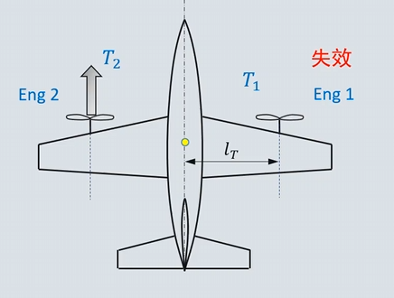

# 6.横向静稳定性
- 主要问题：滚转角扰动$\rightarrow $滚转$\rightarrow $展向重力分量$\rightarrow $侧滑$\rightarrow $恢复滚转力矩
- 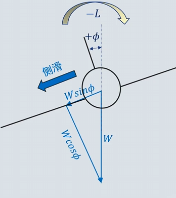
## 6.1 横向静稳定性的组成
- 机翼 机身 尾翼
### 6.1.1 机翼贡献（主要）
- 上反角$\Gamma $
对于无后掠角，大展弦比，矩形机翼，飞行状态为$\alpha, \beta, V$，机翼上反角$\Gamma $
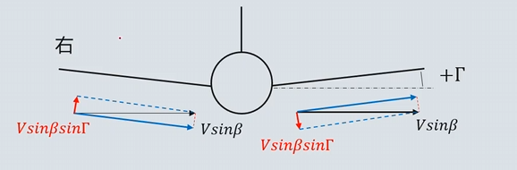
上反角：右侧滑产生左滚力矩，增加稳定性
下反角：右侧滑产生右滚力矩，降低稳定性
**两侧机翼的垂直速度**：
$$
V_N = V_0 (\sin\alpha \pm \beta \sin\Gamma) \approx V_0 (\alpha \pm \beta \Gamma)
$$

**弦向速度**：
$$
V_C = V_0 \cos\alpha \approx V_0
$$

**局部迎角**：
$$
\alpha_l = \frac{V_N}{V_C} = \alpha \pm \beta \Gamma
$$

**局部动压**：
$$
q_l = \frac{1}{2} \rho (V_N^2 + V_C^2) \approx \frac{1}{2} \rho V_0^2
$$

**滚转力矩**：
$$
RM = - (L_R - L_L) \cdot l_y = - C_{L\alpha} \cdot 2\beta\Gamma \cdot qS \cdot l_y
$$

**关于 \( \beta \) 求导**：
$$
\frac{dC_L}{d\beta} = -C_{L\alpha} \cdot \Gamma \frac{l_y}{b}
$$

**上反角对横向静稳定性的贡献与上反角成正比。**

- 后掠角$\Lambda $
    - 提升局部动压，同样可增加稳定性，正比与$\sin{\Lambda} , C_L (\alpha) $

- 安装位置：下单翼，上单翼
### 6.1.2 机身贡献
- 直接影响：忽略
- 间接影响：翼身干扰
### 6.1.3 尾翼贡献
- 平尾
- 垂尾
### 6.1.4 翼身干扰
- 上单翼:  增加稳定性
- 下单翼： 降低稳定性
### 6.1.5 尾翼贡献
- 机理与机翼相同，但尺寸叫小，一般忽略
- 假设飞机受到正侧滑，则垂尾受向左的侧力
- 小迎角增稳。大迎角降低稳定性
## 6.2 横向操纵面
- 滚转力矩的产生有3两种方式：
  - 机翼升力不平衡（首选：副翼）
    - 非常规横向操纵面：Elevon，升降副翼/差动副翼
  - 垂尾侧力

# 7. 动稳定性
- 不想记了，总之是方程和变量太多。只有操纵向量给定，则方程有唯一解。
- 根据初始值和操纵力矩得到姿态，姿态和速度积分得到位置
- 运动方程的解有两种：
  - 自由响应：初始值给定，操纵力矩为0，反映系统瞬态特性和**动稳定性**
  - 强迫响应：操纵力矩不为0，反映系统的稳态响应特性和**动操纵性**
TODO: mooc看运动方程推导
## 7.1 运动方程的线性化
- 运动方程耦合且非线性。很难获得解析解
- 十五个方程，十五个未知数，四个控制方程
### 7.1.1 小扰动理论
- 小扰动假设：飞机受扰动后，所有参数=基准状态量+扰动，可忽略高阶无穷小
### 7.1.2 小扰动符号
所有变量的基准量用下标 0 表示，小扰动量用前缀 \(\Delta\) 表示。
如果基准量为 0，则前缀 \(\Delta\) 可省略。
$$
\begin{aligned}
    & u = u_0 + \Delta u, \quad v = \Delta v, \quad w = \Delta w \\
    & p = \Delta p, \quad q = \Delta q, \quad r = \Delta r \\
    & \phi = \Delta \phi, \quad \theta = \theta_0 + \Delta \theta, \quad \psi = \Delta \psi
\end{aligned}
$$
$$
\begin{aligned}
    & F_x = \Delta F_x, \quad F_y = \Delta F_y, \quad F_z = \Delta F_z \\
    & L = \Delta L, \quad M = \Delta M, \quad N = \Delta N
\end{aligned}
$$
#### 力矩方程
$$
\begin{aligned}
    \dot{p} &= \frac{(I_x \Delta L + I_{zx} \Delta L)}{(I_x I_z - I_{zx}^2)} \\
    \dot{q} &= \frac{\Delta M}{I_y} \\
    \dot{r} &= \frac{(I_x \Delta N + I_{zx} \Delta N)}{(I_x I_z - I_{zx}^2)}
\end{aligned}
$$

#### 角速度方程
$$
\begin{aligned}
    \dot{\theta} &= q \\
    \dot{\phi} &= p + r \tan\theta_0 \\
    \dot{\psi} &= r \sec\theta_0
\end{aligned}
$$

#### 速度方程
$$
\begin{aligned}
    \dot{x}_E &= \Delta u \cos\theta_0 - u_0 \Delta \sin\theta_0 + w \sin\theta_0 \\
    \dot{y}_E &= u_0 \psi \cos\theta_0 + v \\
    \dot{z}_E &= - \Delta u \sin\theta_0 - u_0 \Delta \cos\theta_0 + w \cos\theta_0
\end{aligned}
$$
### 7.1.3 气动力模型
- 作用在飞机上的瞬时气动力/力矩仅与当时瞬时的运动参数有关；
- 气动力/力矩随运动参数线性变化；
- 纵向气动力与力矩 \((F_x, F_z, M)\) 仅与纵向变量 \((u, \alpha, q)\) 相关；
- 横航向气动力与力矩 \((F_y, L, N)\) 仅与横航向变量 \((\beta, p, r)\) 相关。

---- 总之巨他妈长，之后再学

### 7.1.4 运动方程
> 运动方程的解-特征根
动稳定考虑扰动后飞机的时间响应，$x_0不等于0 ,u=0  $
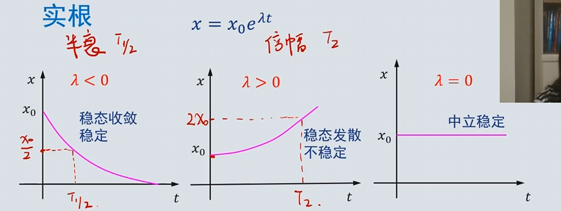
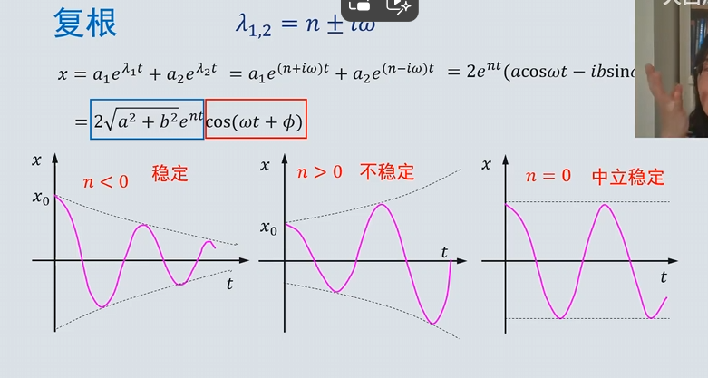
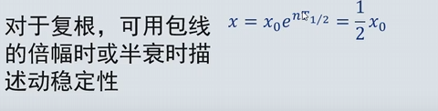
> 状态空间方程的解
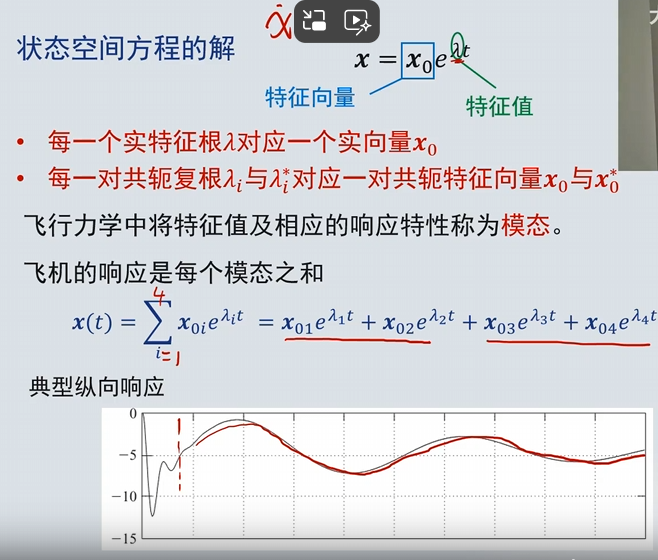
四个实根|两对共轭复根|两个实根+一对共轭复根

- 求解A矩阵特征根可求的该飞机模态
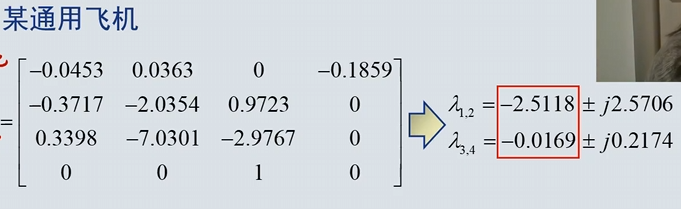
两对共轭复根，每一对描述一个纵向稳定模态
对于该飞机，两对共轭复根均有负实部，表示飞机的自由响应由两个收敛震荡运动相互叠加而成
- 重阻尼，高频率，短周期：**短周期模态**，飞行员无需处理
- 轻阻尼，长周期，**长周期模态**，也称为沉浮模态(phulid)
- | 特征根 | 响应速度 | 主要参数 |
|------|------|------|
| 小实根 | 缓慢 | \(\phi, r\) |
| 大负实根 | 快速 | \(\phi, p\) |
| 中等共轭复根 | 中等 | \(\beta, \phi, r\) |

#####  运动模式
- **螺旋 (Spiral) 模态**
- **滚转收敛 (Roll Subsidence) 模态**
- **荷兰滚 (Dutch roll) 模态**
## 7.2 纵向模态
### 7.2.1 短周期的近似

-- TODO
速度变化率视为0
重心前移阻尼比高，重心后移频率高
- 机理：静稳定：$C_{M\alpha} $作用导致来回摆动的趋势，$C_{Mq} $导致幅值逐渐衰减

#### 飞行品质
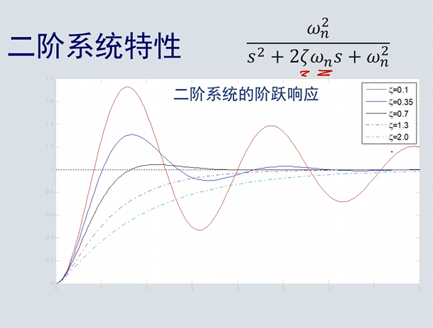
根据二阶系统的响应曲线，幅值峰值等，定义飞行品质

### 7.2.2 长周期的近似
- 原理：势能动能相互转换
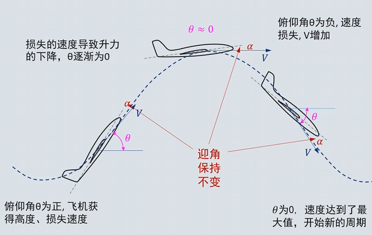
#### 品质要求
长周期阻尼轻，周期长，飞行员可通过纵向操纵消除长周期模态
**不稳定是可接受的**

## 7.3 典型横航向响应
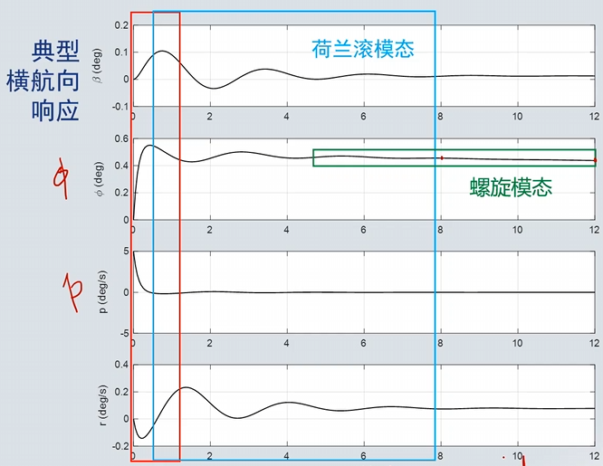
### 7.3.1 滚转收敛模态
机理：滚转过程中两侧机翼的升力不一致
##### 滚转收敛模态近似

横航向扰动之后首先体现的是重阻尼的滚转收敛模态，飞机主要关于 \( x \) 轴滚转，其他参数变化缓慢。

#### 近似假设
- 设 \(\Delta \beta = r = \dot{r} = 0\)
- 忽略侧力与偏航力矩

#### 方程
$$
I_{x1} \dot{p} - C_{lp} b_1 p = C_{l\delta_a} \Delta\delta_a + C_{l\delta_r} \Delta\delta_r
$$
对于自由响应，\(\Delta\delta_a = \Delta\delta_r = 0\)，则方程化简为：
$$
I_{x1} \dot{p} - C_{lp} b_1 p = 0
$$

#### 特征值
$$
\lambda_r = \frac{C_{lp} b_1}{I_{x1}}
$$
由于失速前迎角 \(C_{lp} < 0\)，\(\lambda_r\) 为大负实根。
#### 滚转收敛品质要求：
$T_R = -\frac{1}{\lambda_R}$
$T_R$越小，收敛越快，飞行品质越好

### 7.3.2 荷兰滚模态
- 波动：侧滑角，偏航角速度
#### 荷兰滚模态机理
- 正（右）侧滑$\triangle \beta$> 0导致：
滚转比 一般1-3,滚摆比大会造成难以收敛的荷兰滚震荡
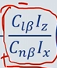
#### 飞行品质
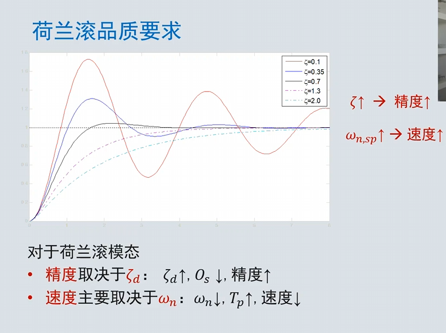

### 7.3.3 螺旋模态机理
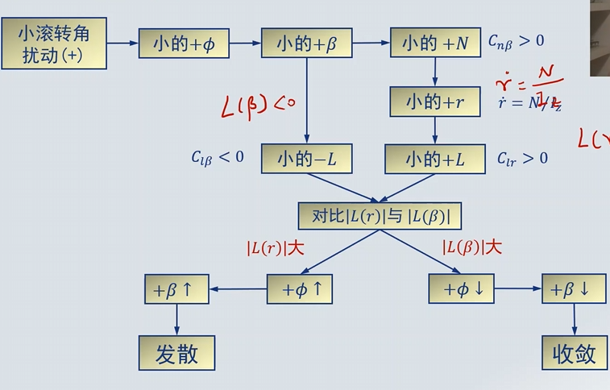
#### 螺旋模态近似
在缓慢螺旋活动：
- 侧滑变化缓慢，$\triangle \dot{\beta}= 0 $，忽略侧力
- 滚转角速度几乎0，假设滚转力矩为0
- 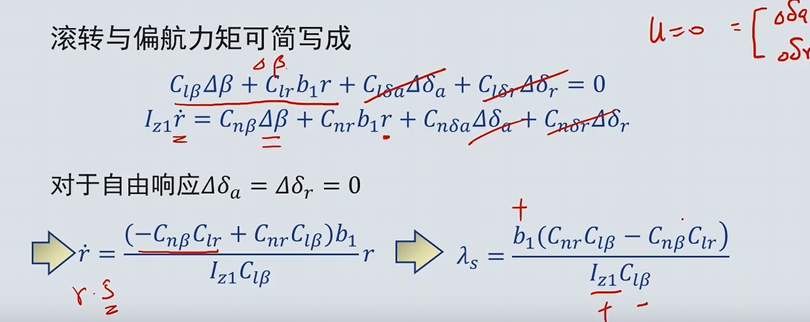
- 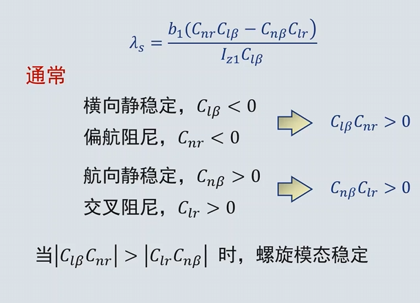
可得螺旋模态和荷兰滚模态稳定性条件相互矛盾，但螺旋模态发展缓慢，即使不稳定，飞行员也能轻易干预，允许不稳定，只要发散不太快
#### 螺旋模态品质要求
- 不稳定是可接受的
- 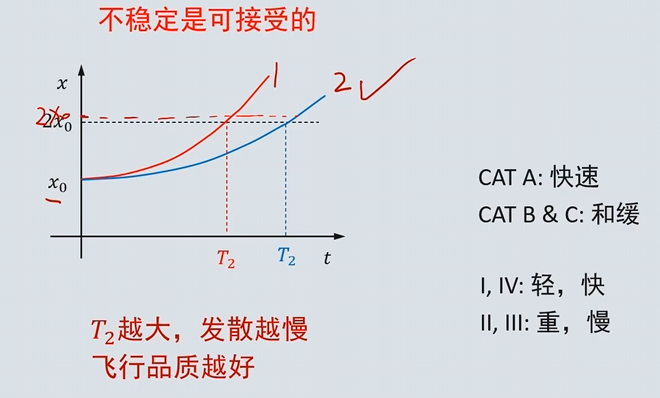

