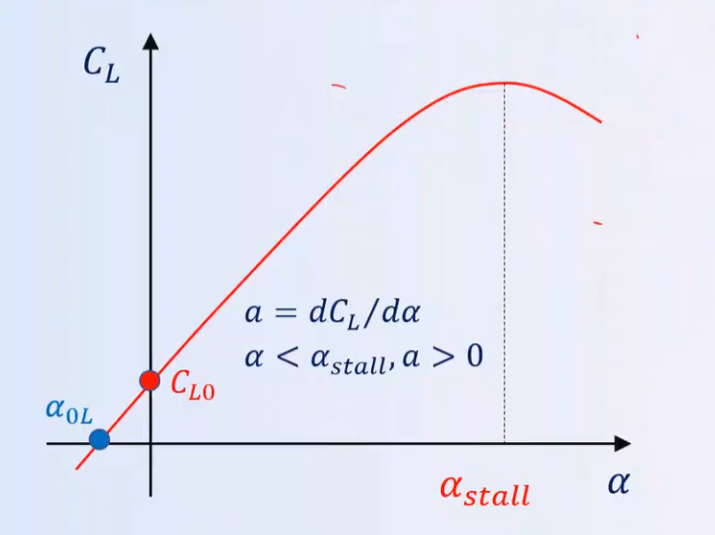

# 1. 基本概念
## 1.1 稳定性
飞机在平衡状态受到扰动（静止或匀速运动）
- 静稳定性 ：有回到初始状态的趋势
- 动稳定性： 时间响应收敛并最终回到初始状态

受力与运动学方程

- $ \gamma $ ：爬升角
- $ \alpha $ ：迎角
- $ \theta $ ：俯仰角
- $ \phi_T $ ：发动机安装角
## 1.2 计算所需数据
1. $m$：飞机质量，计算中取常数
2. 大气数据：$ \rho, a, \mu $
3. 速度
- TAS：真空速，飞机和空气的相对速度，又称 **真速**
- IAS：指示空速，飞机的速度表指示的速度
 > 空速表为一动压表，只有在标准海平面ISA下才等于真空速TAS
 > $\rho_0$ $V_{IAS}^2 = \rho_H V_{TAS}^2$
 不同高度下，平飞和过载飞行需要的TAS不同，但IAS相同
 - CAS：校正空速，IAS校正后的值
 - EAS：矫正空速，当量等效空速，标准大气下的空速
 - GS：地速，飞机相对地面的速度
$\vec{GS} = \vec{TAS} + \vec{V_W}$
## 1.3 推进系统
- 分类：...
### 1.3.1 推力特性的假设：
- **给定高度下，由螺旋桨式发动机产生的功率和推进效率为常数**
  - 可用功率和飞行速度无关
  - 可用功率随高度变化
- **给定高度下，由喷气式发动机产生的推力为常数**

## 1.4 空气动力
- 动压：$q = \frac{1}{2} \rho V^2$
- S: 参考面积,通常取机翼面积
- 升力: $L =  C_LqS $
- 阻力: $D = C_DqS $
- 推力: $T = C_CqS$
### 1.4.1 升力与升力系数
- $C_L = C_L\frac{1}{2} \rho V^2 S$
- $C_L = C_{L0}+ a*\alpha$
> a: 升力线斜率

重要性能参数：法向过载系数 n=$\frac{L}{W}$
### 1.4.2 阻力
#### 1.4.2.1 阻力类型
- 零升阻力：
\[
\left\{
\begin{array}{l}
\text{表面摩擦阻力} \\
\text{压差阻力：气流分离导致的前后压力差减小} \\
\text{波阻：由激波产生} \\
\end{array}
\right.
\]
- 诱导阻力$D_i$由升力产生：又称升致阻力，由翼尖涡产生
#### 1.4.2.2 阻力系数
- $D = D_0+ D_i= C_D \frac{1}{2} \rho V^2 S$
- $C_D =C_{D0} + C_{Di} = C_{D0} + k C_L^2$
> $C_{D0}$: 零升阻力系数
> $C_{Di}$: 升致阻力系数
> $k$: 诱导阻力因子 $k = \frac{1}{\pi e A}$
> >e为奥斯瓦尔德修正因子，椭圆为1

 
 #### 1.4.2.3 升阻比和升阻极曲线
- 升阻比：$\frac{L}{D} = \frac{C_L}{C_D}$
- 升阻极曲线：
  $(\frac{C_D}{C_L})_{min}= 2\sqrt{(kC_{D0})} $
  最大升阻比：
  $\frac{L}{D} = \frac{1}{2\sqrt{kC_{D0}}}$
#### 1.4.2.4 阻力计算

- 低速诱导阻力为主，高速零升为主

**平飞参考速度$V_R$**
- 平飞阻力最小对应的速度
## 1.5 重要的无量纲参数
* 升阻比：$E=\frac{L}{D} = \frac{C_L}{C_D}$
* 过载系数：$n = \frac{L}{W}$
* 无因次速度：$u = \frac{V}{V_R}$
* 无因次推力：$z = \frac{TE_m}{W}$

# 2. 飞行性能指标
* 按加速度分：
  1. 静性能（零加速度）
  2. 动态性能（有限加速度）
## 2.1 滑翔（静性能）
损失高度的无动力下滑飞行
### 2.1.1 滑翔时的受力与方程

- $\gamma$ 航迹角
- $\alpha$ 迎角
- $\theta$ 俯仰角
$$
\left\{
\begin{array}{l}
\text{升力}：L = W \cos \gamma \\
\text{阻力}：D + W \sin \gamma=0 \\
\end{array}
\right.
$$
$$
\Rightarrow 
\text{滑翔时航迹角较小}
\left\{
\begin{array}{l}
\text{升力}：L = W \\
\text{阻力}：D = W \gamma \\
\end{array}
\right.
\Rightarrow
$$
$$ \gamma = \frac{D}{W} = -\frac{1}{\frac{L}{D}} = \frac{C_D}{C_L}$$
- 滑翔角与升阻比相关， $E_m$对应最平缓滑翔，滑翔角最小，巡航距离最远

#### 航程：
$R = $
$$
-\int_{h_i}^{h_f} E \, dh
$$
$E_m$对应最平缓滑翔，滑翔角最小，航程最大
$$
R_{max}=E_m \triangle h = \frac{\triangle h}{2\sqrt{kC_{D0}}} 
$$ 
滑翔比：在静止空气中，滑翔比等于升阻比
#### 下降率:
$$
\left\{
\begin{array}{l}
\dot h = \frac{dh}{dt}=V\sin \gamma\approx V\gamma \\
D+W\gamma =0 \\
\end{array}
\right.
$$
#### 续航时间：
$$
\dot h = \frac{dh}{dt} = V\gamma = -\sqrt{\frac{2W}{\rho S}} (\frac{C_D}{C_L^{3/2}})
$$
$$
\Downarrow
\text{不考虑大气密度的变化}
$$
$$
t=\sqrt{\frac{\rho S}{2W}}(\frac{C_L^{3/2}}{C_D})(h_i-h_f)
$$
#### 滑翔性能总结
- 最大航程：
  $R_max =E_m \triangle h= \frac{\triangle h}{2\sqrt{kC_{D0}}}$
- 最大航时
  $t_{max} = \sqrt{\frac{\rho S}{2}}\sqrt[4]{\frac{C_L}{C_D}}\frac{(h_i-h_f)}{4}$
  > 航程和载荷无关，航时与载荷有关
  > 减小k和$C_{D0}$对航程航时都有利
## 2.2 最大最小速度
- 喷气式飞机，用推力计算
- 螺旋桨式飞机，用功率计算
- 对比$V_{min}和V_{stall}$确定最小速度
## 2.3 爬升性能
- 爬升率：$V_z = \frac{dh}{dt}$
- 最快爬升：最大爬升率
- 最陡爬升：最大爬升角
  
# 3.机动性
- 铅垂面内的机动
- 水平面内的机动
- 空间机动
## 3.1 铅垂面内的机动

## 3.2 盘旋
- 定常盘旋
- 一般盘旋

> 偏航角$\psi$：机头与正北方向的夹角
> 航向角$\psi_s$：速度矢量与正北的夹角
### 3.2.1 盘旋受力分析

$$
\text{动力学方程}
  \left\{
  \begin{array}{l}
  L\cos \phi = W \cos \gamma \\
  T \cos \phi -D -\omega \sin r= 0 \\
  T \sin \beta +L \sin \phi - \frac{W}{g}\frac{V^2\cos^2 r}{R} = 0 \\
  \end{array}
  \right.
$$
对于水平定常盘旋，$\gamma = 0$
### 3.2.2 侧滑影响
- 侧滑对推力分量的影响

- 沿速度矢量方向：
\[ T\cos\beta - D - W\sin\gamma = 0 \]
平衡阻力的推力分量减少
- 垂直于速度矢量方向：
 \[T\sin\beta + L\sin\phi - \left( \frac{WV^2\cos^2\gamma}{gR} \right) = 0 \]
推力分量也提供了向心力

- 协调盘旋，侧滑角为0

$ n = \frac{L}{W} = \frac{1}{\cos\phi} \Rightarrow \cos\phi = \frac{1}{n} \Rightarrow \tan\phi = \sqrt{n^2 - 1} $

$ R = \frac{V^2}{g\tan\phi} = \frac{V^2}{g\sqrt{n^2 - 1}} $

$ \omega = \frac{V}{R} = \frac{g\tan\phi}{V} = \frac{g\sqrt{n^2 - 1}}{V} $

$ t_{2\pi} = \frac{2\pi}{\omega} = \frac{2\pi V}{g\sqrt{n^2 - 1}} $

给定速度下，过载越大：
- 盘旋半径越小
- 盘旋角速度越大
- 盘旋一周时间越短
  
为提高机动性，应增大$C_L$
> 脱体涡可提高升力，延后失速角度

# 妈的，飞行力学不是飞行动力学
